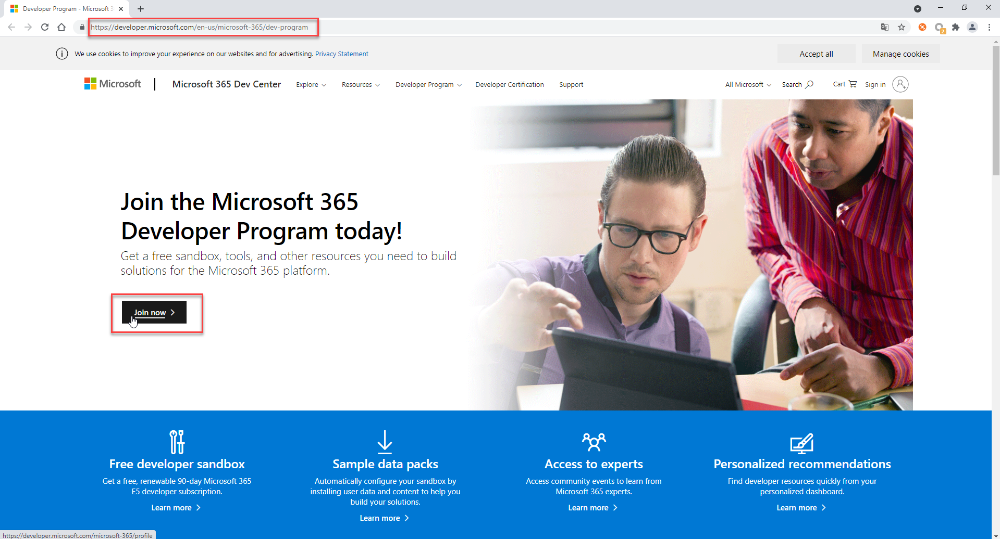
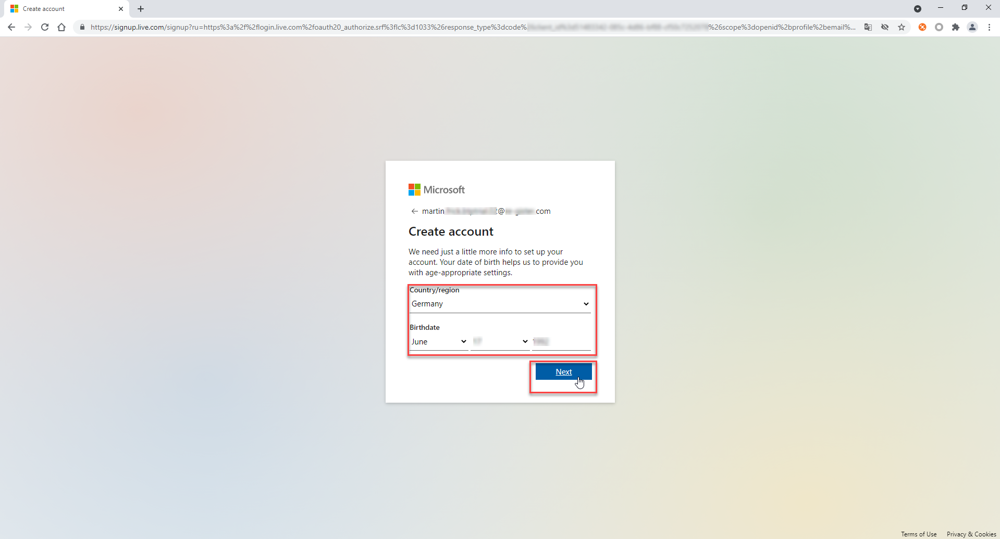
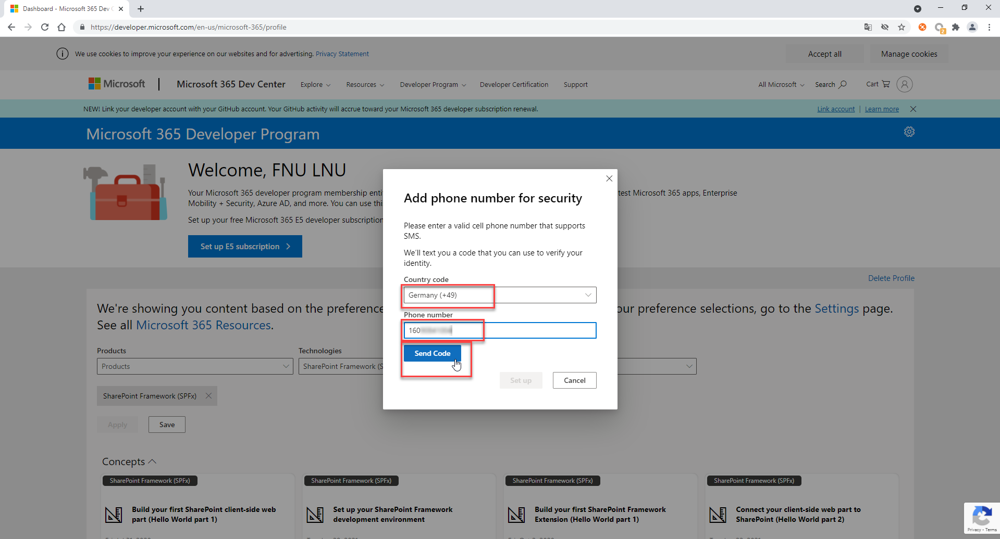
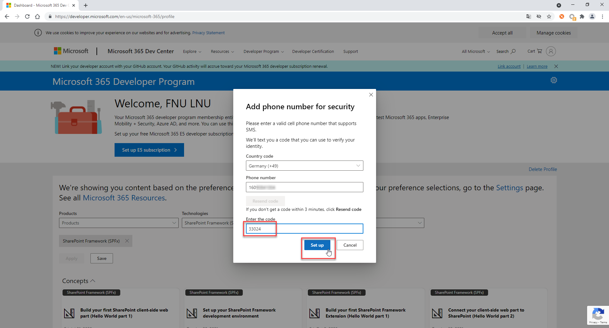

# Setup Free Microsoft Azure Account

The objective of this part is to create a free Microsoft Azure subscription that you will use throughout this usecase for various tasks. 

Additionally, you are going to add the Microsoft365 Dveloper account as an administrator to the Azure subscription. With the Microsoft365 Developer Account you have access to Microsoft Teams but to use the Microsoft Bot channel (that's coming with the Azure trial subscription) a Azure subscription is necessary. 

**Do not use your corporate email address for this usecase, as you may have limited permissions in the associated Subscription or Azure Active Directory Tenant.**

Important: There are no costs involved! Even if your credit card information is required, it will only be used to verify your identity and to check whether you have already received Free Credits before. Your credit card will not be charged!

## Step 1 - Create a new Azure Account

1.1 Visit <https://azure.microsoft.com/en-us/free/> and click the **Start free** button.

1.2 Register for a new account. If you already have a Microsoft account (e.g. Outlook.com), just log on with this user. Otherweise hit **Create one!** to create a new account.

1.3 Use your **personal** (e.g. outlook.com, gmail.com) mail adress and proceed through the next steps where you will be asked to define a password and provide your birth date.

**IMPORTANT: Using your corporate mail address will most likely cause issues later on when it comes to permissions in the Azure Active Directory your company might already have in place. That's why we highly recommend using your personal accounts!**

## Step 2 - Provide Personal Information

2.1 You will then be redirected to a page where more information about you is requested in four sections. Enter the following mandatory information and click on Next:
- Country
- First name
- Last name
- email address
- Phone

2.2 Entering the mobile phone number enables the mandatory multi-factor authentication at a later date. Make sure that the data is correct and click either **Text me** or **Call me** to get the corresponding verification code. This will ensure that your number will be used for multifactor authentication later on.

2.3 Enter the verification code (e.g. 3570 in this demo case) and hit **Verify Code**. 

2.4 set the check mark at 'I agree to the customer agreement and privacy statement'. 

2.5 Select **Next** after you have succesfully finished the phone number verification. 

## Step 3 - Credit Card Verification

In the following your credit card information is requested. As already mentioned, this information is only used to ensure that you only receive Azure Free Credits once and cannot benefit from the offer more than once. Your credit card will not be charged!

3.1 Enter the information for your credit card. 

3.2 Finish the registration with **Sign up**. 

3.3 Go to <https://portal.azure.com> and log in with the mail address you have used in the previous steps. 

## Step 4 - Create a Microsoft365 Developer Account

To get access to Microsofts365 Office products for free, you need to sign up for their Microsoft365 Developer program.

---

4.1 Go to [Microsoft 365 Dev Center](https://developer.microsoft.com/en-us/microsoft-365/dev-program) and click on **Join now** to create a new account.

4.2 Enter a private mail address (the one that you have also used to create a free Microsoft Azure Account) and click on **Next**.

4.3 Enter a password of your choice and click on **Next**.

4.4 Select your country/region, enter your birth date click on **Next**.

4.5 You should have received a confirmation mail for the mail address you recently provided. Within this mail you can find a security code. **Copy** this security code for the next step of the process. 

4.6 **Paste** the copied security code into the respective field, to verify your mail address. Then click on **Next**. 

4.7 You might be asked to solve a challenge like a puzzle, to verify you're not a robot. Click on **Next** to proceed with the next step afterwards. 

## Step 5 - Provide details for the Microsoft Developer Program

After creating your Microsoft profile, you're asked to provide some further information to join the Microsoft 365 Developer program. 

---

5.1 Select your country/region, enter a company name and decide your preferred language. Accept the Terms & Conditions and click on **Next** afterwards.

5.2 Decide for the primary purpose of using the respective Developer program subscription. Click on **Next**.

5.3 Select the areas of Microsoft 365 development, which you're personally most interested in (e.g., SharePoint Framework). Click on **Save** to finish the process.

5.4 You will see a message, that you have successfully joined the Microsoft 365 Developer Program. You can close this message to see your profile page.

You have successfully joined the Microsoft 365 Developer Program. 

## Step 6 - Add a Microsoft 365 E5 subscription to your Developer account

You can now add a free Microsoft 365 E5 subscription to your account, which allows you to work with latest Microsoft 365 apps like **SharePoint** and **Azure AD**.

---

6.1 To do so, click on **Set up E5 subscription**.

6.2 <a name="domain"> Enter a username and decide for a domain. This is required to setup your subscription and a subdomain will be created in the **\<domain\>.onmicrosoft.com** environment. Decide for a password and click on **Continue**.</a>

6.3 You need to provide a phone number in the following screen, which will be verified by an SMS which is sent you, once you click on **Send Code**. Make sure, that you provide your phone number **without the country code and without a leading 0**.

6.4 Enter the code which you received via SMS, to verify your phone number. Click on **Set up** afterwards.

Your Microsoft 365 E5 subscription will be set up. 

6.5 <a name="microsoft365">Once the subscription is set up, you will see your profile, showing the remaining days of the subscription. You have successfully added the required Microsoft 365 E5 subscription to your Developer account.</a>

**!!!IMPORTANT:** The mail shown in your dashboard (combination of your username & domain) is your Microsoft365 Developer mail address that you will need throughout many of the exercises. 

### Step 7 - Add Microsoft365 Developer Account as Co-Administrator in your Azure Trial subscription

We now want to invite the Microsoft365 developer account to the Azure Trial account so that you can carry out all activities with your Microsoft365 developer account in the further stages of this usecase and do not have to work with several login information.

---

7.1 Open the [Azure Portal](http://portal.azure.com) with your **Azure account** (the one you have created in [Week 1, Unit3](../../Week1/Unit3/README.md)) and search for Azure Active Directory in the search bar. Click on the corresponding entry to navigate there.

7.2 Choose **Users** in the side menu. 

7.3 Select **New user**. 

7.4 Select the option **Invite User** to prepare an invitation to your Microsoft65 developer account. Provide the right mail address of the Microsoft365 developer account (*<youruser@yourdomain.onmicrosoft.com*, you can find it [here](#microsoft365)) and provide a name for the user in the Azure Active Directory, which will be displayed at certain views.

7.5 To ensure that the user then also has the appropriate permissions, you can add them in the same view. Click on **User** (next to Roles).

7.6 You should then get a list of available administrator roles for your Azure Active Directory tenant. Select **Global Administrator** and continue with **Select** on the bottom of the page.

7.7 Send out the invitation mail to the user by clicking on the **Invite** button.

Your Microsoft365 account will now receive a mail with an activation link.

7.8 Go to [https://outlook.com](outlook.com) in order to accept the Azure Active Directory invitation. 

7.9 **Login** with your Microsoft365 Developer account (*youruser@yourdomain.onmicrosoft.com*). 

7.10 You should have received a mail with the subject 'Default Directory invited you to access applications within their organization'. Open the mail and click on **Accept invitation**.

7.11 The Azure Active Directory of your Azure Trial account is asking for permissions to read information of your Microsoft365 developer account. Click on **Accept** to finish the invitation process.

7.12 You should get forwarded to a page with an overview of apps of that recently joined Azure Active Directory you where you have access. There are no apps yet, so that's all fine.

**Continue with your Azure account here**
---

7.13  Open the [Azure Portal](http://portal.azure.com) with your **Azure account** (the one you have created in [Week 1, Unit3](../../Week1/Unit3/README.md)) and search for Subscription in the search bar. Click on the corresponding entry to navigate there.
 
 
7.14 Select the Subscription that you are using. (in case you are using the Azure Free Trial, the subscription should be called _Free Trial_)
 

7.15 Select Access Control (IAM)
 

7.16 Select Add Co-Administrator
 

7.17 Now search for your Microsoft 365 Developer account and click on add to add this user as Co-Administrator. From now on, always use the Microsoft 365 Developer account to log on to your Azure subscription. 
 

## Summary

Congratulations! You should now have a free Azure subscription. 

