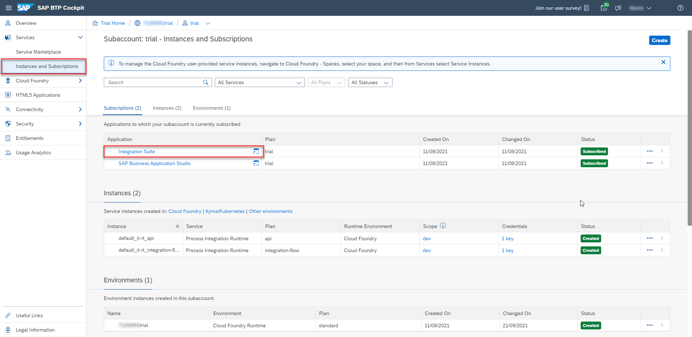
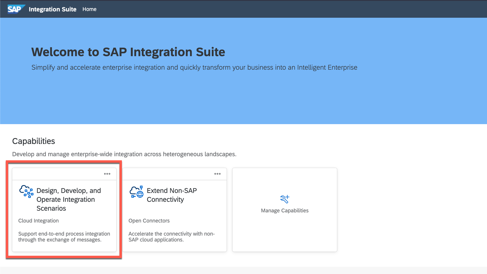
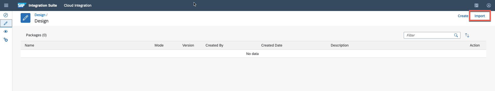
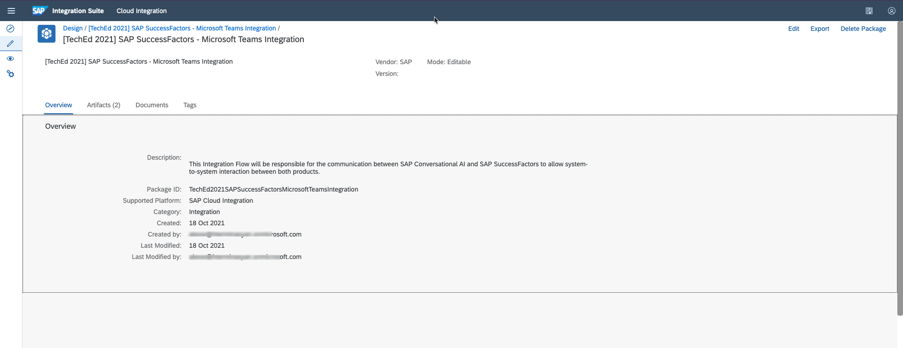
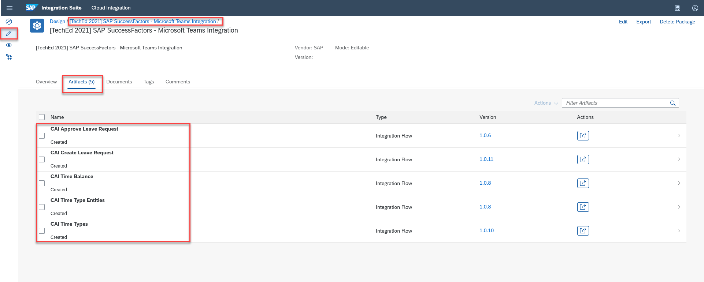

# Setting up Cloud Integration

SAP Cloud Integration will be the integration layer for the communication between SAP Conversational AI (integrated with Microsoft Teams) and SAP SuccessFactors to allow system-to-system interaction between both products. In this part of this mission, you will import the relevant Integration Flows into your SAP Cloud Integration tenant. You can use these Integration Flows as provided (except of providing some configuration parameters before deployment).

## Step 1 - Import your Integration Flows

**Prerequisite:** Please make sure you've successfully set up your SAP Integration Suite tenant before starting with this part of the mission. You can find a respective tutorial in the Tutorial Navigator [(click here)](https://developers.sap.com/tutorials/cp-starter-isuite-onboard-subscribe.html). Don't forget to run the Booster at the end of the tutorial. Further information on how to set up SAP Integration Suite manually can be found at SAP Help [(click here)](https://help.sap.com/viewer/368c481cd6954bdfa5d0435479fd4eaf/Cloud/en-US/302b47b11e1749c3aa9478f4123fc216.html)

In this step, you will import an Integration Flow into SAP Cloud Integration. This Integration Flow will be responsible for the communication between SAP Conversational AI and SAP SuccessFactors to allow system-to-system interaction between both products. It contains a major part of your extension logic and gives you a first impression of the advanced features provided by the Integration Suite. As SAP Cloud Integration is a very powerful tool with a lot of features and configuration options, make sure you read all instructions carefully before development. This prevents you from missing any detail, which might cause you analysis effort in the end.

1.1 Go to your SAP BTP subaccount. Select the **Instances and Subscriptions** section on the left and click on your SAP Integration Suite application subscription. This will open the SAP Integration Suite Launchpad in a new browser tab.

 

1.2 In the SAP Integration Suite Launchpad please click on the SAP Cloud Integration capability. This will open the required component in the same window.

 

1.3 Download the *Integration Content Package* from [here](https://github.com/SAP-samples/btp-extend-workflow-cai-msteams/blob/advance-scope/Part1-CloudIntegration/files/integrationcontent.zip)

1.4 From the SAP Cloud Integration workspace, Navigate to Design tab, click **Import** to import an integration package. Select the downloaded package from previous step to import.

 

1.5. After successful import you will find **"[TechEd 2021] SAP SuccessFactors - Microsoft Teams Integration"** content package in your SAP Cloud Integration.

 

1.6 Go to the  **"Artifacts"** tab where you can find five Integration Flows. One will be used for creating a leave request and the second iFlow is will be used for approving the leave request. The three other Integration Flows are required to read time types and balances from SAP SuccessFactors. 

 

1.7 Please **hesitate the desire to deploy the Integration Flows** right now. This will lead to a **deployment error** at this state of the tutorial, as the credential configuration for SAP SuccessFactors and and the SMTP Server has not been done yet. 

>The **SMTP Server credentials** will be configured in Part 2 of the tutorial, and the **SAP SuccessFactors credentials** will follow in Part 3. This is also the place where the **actual deployment** will be done! 

Congratulations, you successfully imported required Integration Flows. In next parts you will configure the iFlows based on your systems and access credentials.
