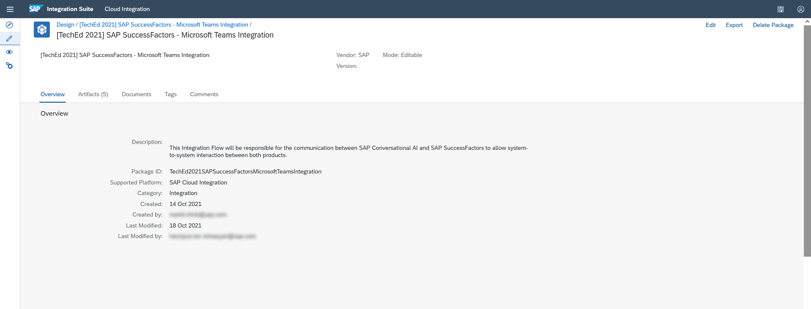

# Setting up Cloud Integration

SAP Cloud Integration will be the integration layer for the communication between SAP Conversational AI (integrated with Microsoft Teams) and SAP SuccessFactors to allow system-to-system interaction between both products. In this part of this mission, you will import the relevant integration flows into your Cloud Integration tenant. You can use these integration flows as provided (except of providing some configuration parameters before deployment).

## Step 1 - Import your Integration Flow
In this step, you will import an Integration Flow into SAP Cloud Integration. This Integration Flow will be responsible for the communication between SAP Conversational AI and SAP SuccessFactors to allow system-to-system interaction between both products. It contains a major part of your extension logic and gives you a first impression of the advanced features provided by the Integration Suite. As SAP Cloud Integration is a very powerful tool with a lot of features and configuration options, make sure you read all instructions carefully before development. This prevents you from missing any detail, which might cause you analysis effort in the end.

1.1. Go to your BTP subaccount. Select the Instances and Subscriptions menu on left and click on your Integration Suite application subscription. This will open the Integration Suite Launchpad in a new browser tab.

 

1.2 In the Integration Suite Launchpad please click on the Cloud Integration capability. This will open the required component in the same window.

 

1.3. Download the *Integration Content Package* from [here](https://github.tools.sap/btp-use-case-factory/btp-extend-workflow-cai-msteams/raw/cloudintegration/Part1-CloudIntegration/files/integrationcontent.zip)

1.4 From the Cloud Integration workspace, Navigate to Design tab, click **Import** to import an integration package. Select the downloaded package from previous step to import.

 

1.5. After successful import you will find **"[TechEd 2021] SAP SuccessFactors - Microsoft Teams Integration"** content package in you cloud integration.

 

1.6. Go to **"Artifacts"** Tab where you can find 2 integration flows. One will be used for creating a leave request and the second iFlow is will be used for approving the leave request.

First open the "CAI Create Leave Request" iFlow

 

1.7. Click on **Deploy** to deploy the iFlow and confirm with "Yes".

 
 

1.8. Go back to content package where you can find the second iFlow "CAI Approve Leave Request" and open it

 

1.9. Click on **Deploy** to deploy the iFlow and confirm with "Yes". 

 
 

Congratulations, you successfully imported required integration flows. In next parts you will configure the iFlows based on your systems and access credentials.