# Setting up API Management & Enable Actionable Messages

In this part we are going to register the Approval Endpoint (from SAP Cloud Integration) from previous part, to expose it for a usage from Adaptive Card on Microsoft Outlook.

By default all SAP Cloud Integration APIs which we prepared for this scenario are secured, that's why in SAP API Management we are going to apply **policies** to them and expose without any client credentials and allowing access by providing the UUID of the workflow to approve or reject the request. This is required to trigger the API from Adaptive Card on Microsoft Outlook. 

###  Step 1 - Create  the API Endpoint

1.1 Open your **SAP Integration Suite** from the BTP cockpit in section **Instances and Subscriptions**

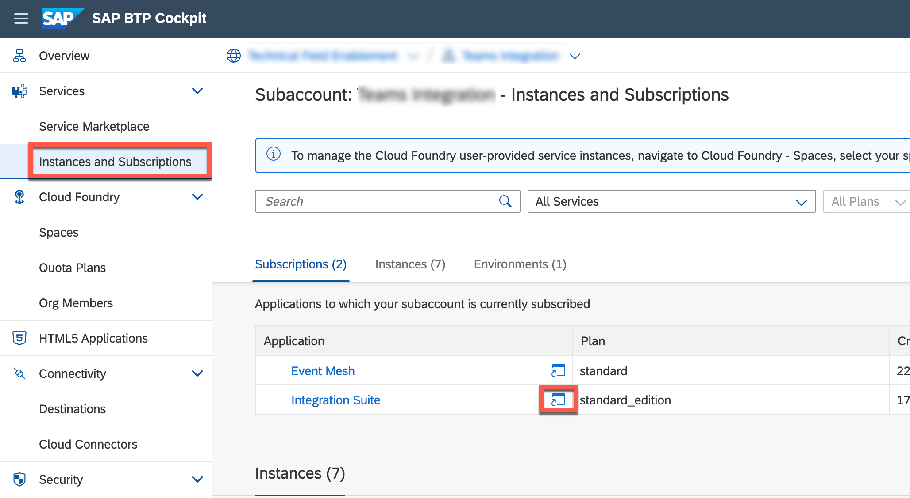 

1.2 Open **API Management** 

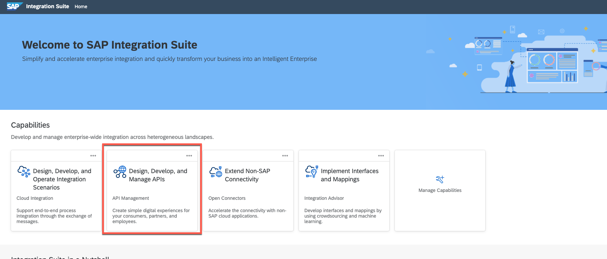 

1.3 Go to **Configure** Tab and Click **Create** to create new API Provider

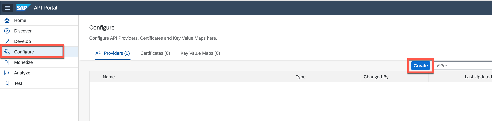 

1.4 Provide The name "CloudIntegration" in Overview Tab

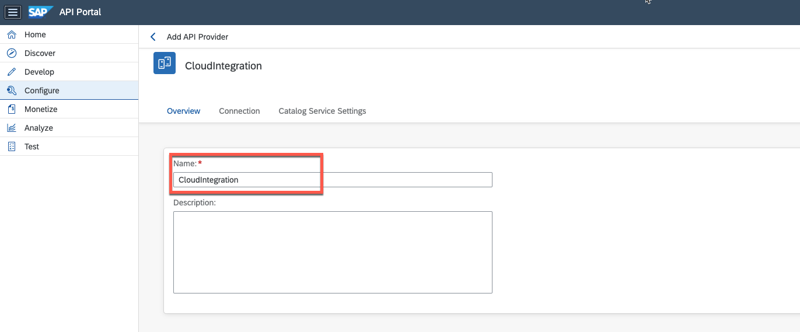 

1.5 Switch to **Connection** Tab

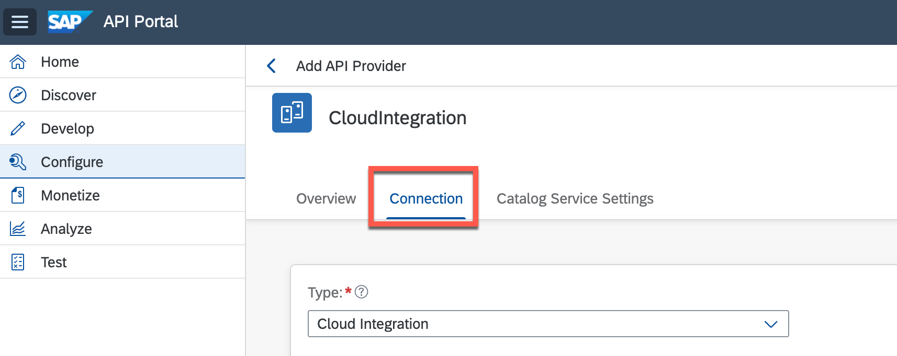 

1.6 Select "Cloud Integration" as **Type** and provide the Cloud Integration Management Host

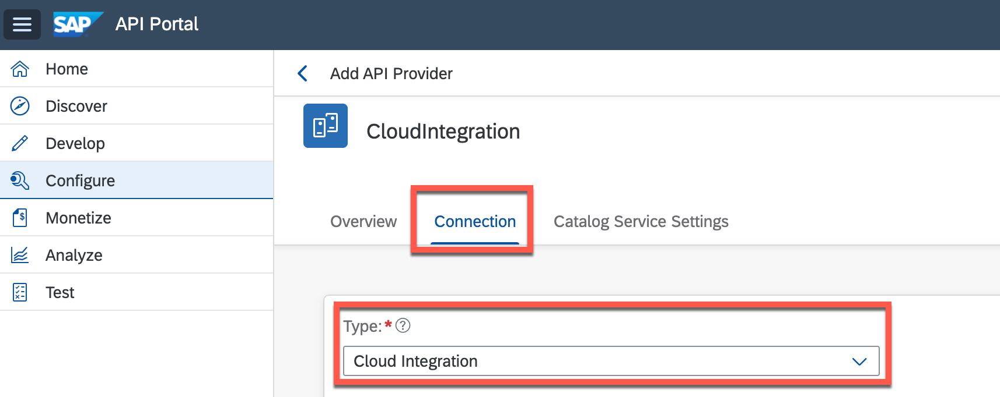 

1.7 To get the credentials for SAP Cloud Integration go to the BTP Cockpit and open **Instances and Subscriptions**

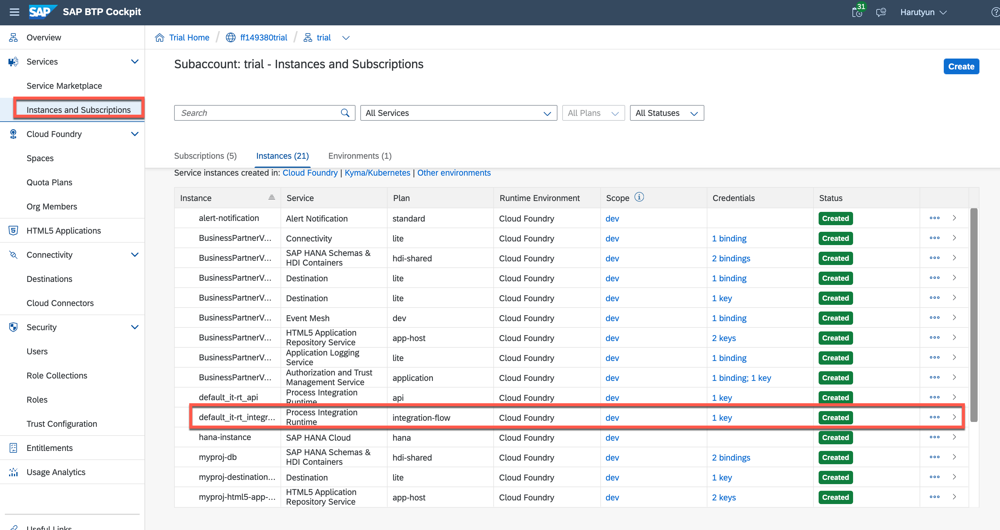 

1.8 Find the service instance of the Process Integration Runtime (it-rt) and open the default service key. Click on "View" from **Actions**. If there is no service key yet, create a new service key by clicking **Create** and naming the new service key e.g. **defaultKey**

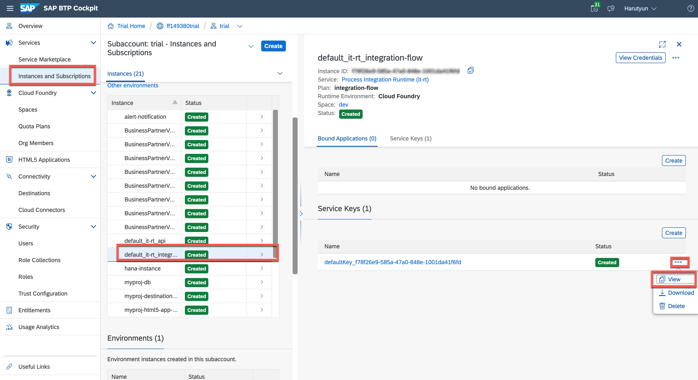 

If there is no instance of the Process Integration Runtime yet, you probably did not use the Booster for setting up your SAP Integration Suite tenant. Please check the following Tutorial [(click here)](https://developers.sap.com/tutorials/cp-starter-isuite-onboard-subscribe.html) or SAP Help [(click here)](https://help.sap.com/viewer/368c481cd6954bdfa5d0435479fd4eaf/Cloud/en-US/302b47b11e1749c3aa9478f4123fc216.html) to learn how to setup this type of required service instance. 

1.9 Note down the **clientid**, **clientsecret**, **url** and **tokenurl** which is required for the next step

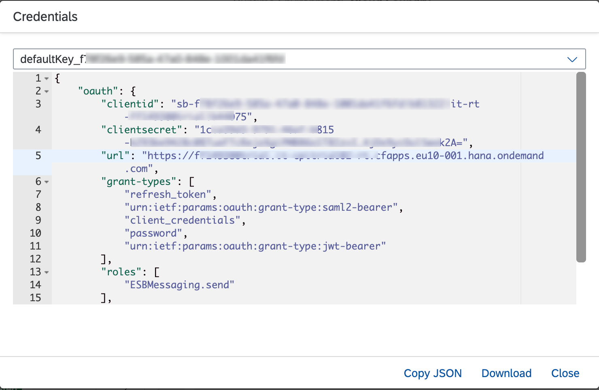 

1.10 Fill the **Cloud Integration Management Host**, **Client ID**, **Client Secret** using the values from the previous step and **Save** it

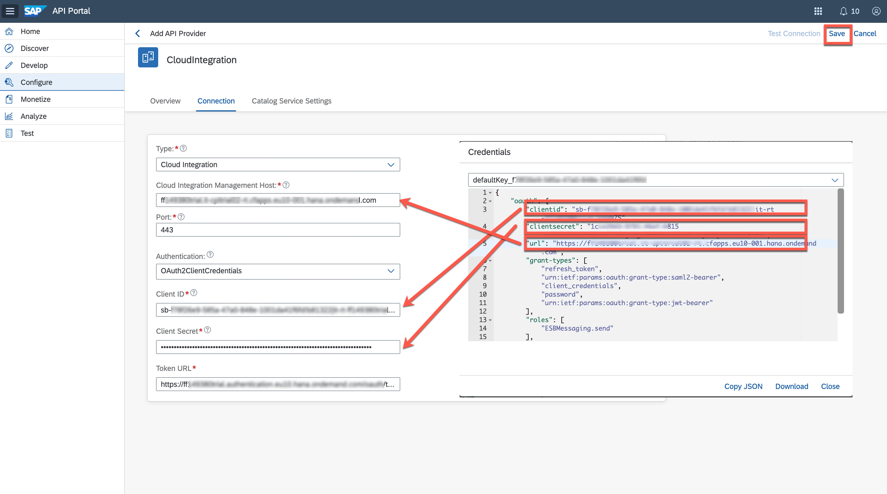 

1.11 Click **Test Connection** to test if the system is reachable

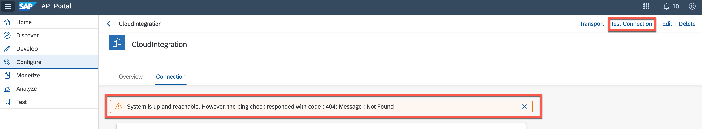 

1.12 Download the API Package from [here](https://github.com/SAP-samples/btp-extend-workflow-cai-msteams/blob/advance-scope/Part2-APIManagement/files/approveLeaveRequest.zip)

1.13 Go to **Develop** Tab then click **Import API** and upload the package you downloaded from GitHub.

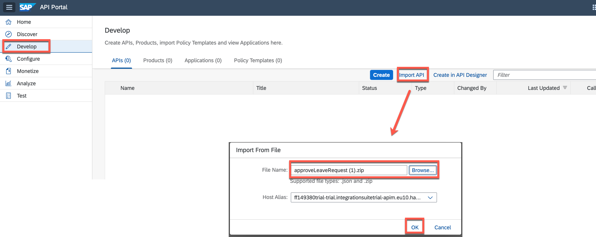 

Now the API for approving the leave request is successfully imported and deployed.

1.14 Only minor changes are needed to add the right credentials to the Policies. Open the **approveLeaveRequest** API

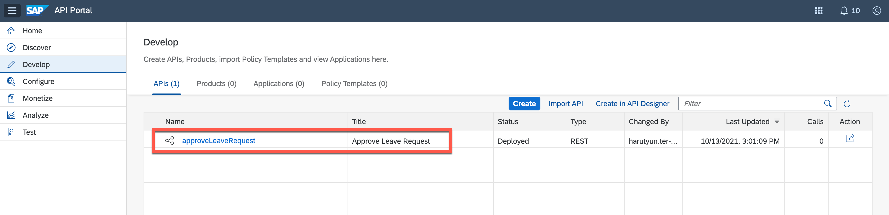 

1.15 Open the **Policies**

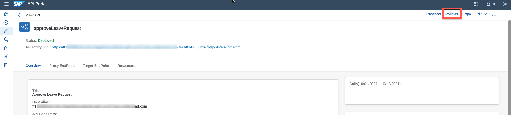 

1.16 Find the **PreFlow** in **TargetEndpoint** and change to *Edit* mode

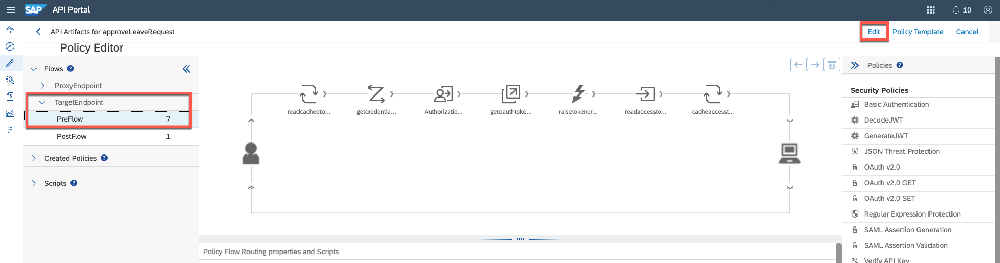 

1.17 Basically here you can find a policy which is using the SAP Cloud Integration credentials to make the API call to the SAP Cloud Integration API for approving the leave request.

1.18 Click on **getcredential** step and update the *clientid* and *clientsecret* which you noted down in step 1.9.

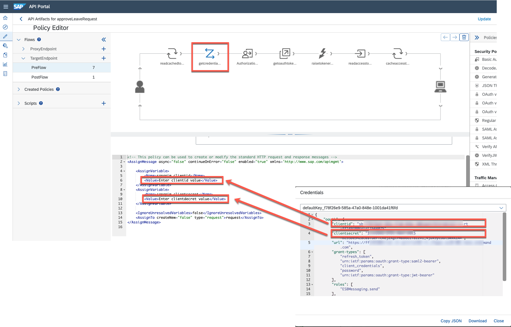 

1.19 Click on **getoauthtoken** step and update the Oauth *tokenurl* which you noted down in step 1.9.

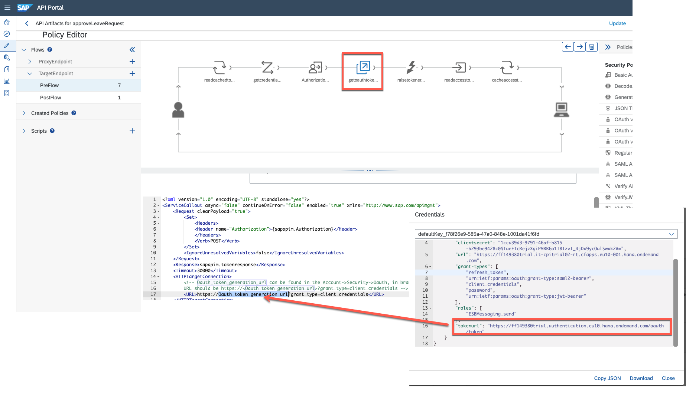 

1.20 **Update** the policy

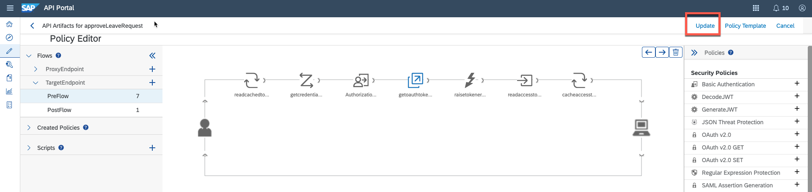 

1.21 **Save** the API

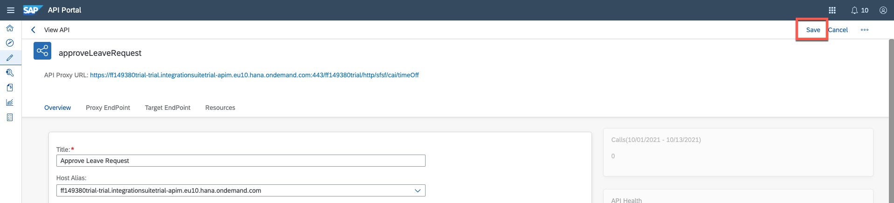 

1.22 And as a last step **deploy** the API

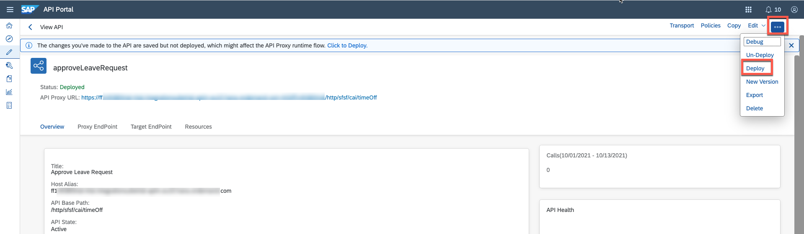 

1.23 This API will be used in an Adaptive Card when we send the Card as a mail in a SAP Cloud Integration Flow


###  Step 2 - Enable Actionable Messages (Adaptive Cards)

Adaptive Cards can render an incoming message and also allow the user to perform actions (like approving a workflow). In order to do this, we need to enable Adaptive Cards in Outlook. This can be done at an organizational level or -- like in our case -- on a case by case basis. This is especially good in a development scenario where you do not have (and need) global Exchange admin permissions.

To enable and publish actionable messages, we need to register a new provider in **Actionable Email Developer Dashboard**

---

2.1 Go to the [Actionable Email Developer Dashboard](https://outlook.office.com/connectors/oam/publish) and logon with your **Microsoft365 Developer account**. 

2.2 Create a **New Provider**. 

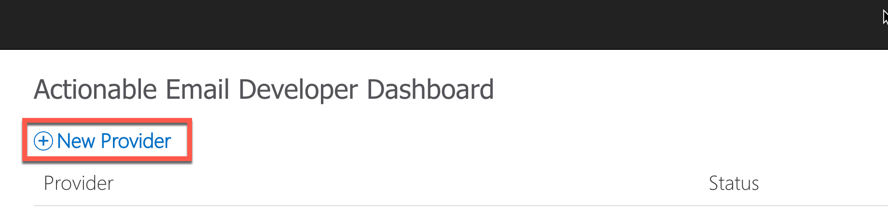

2.3 Enter a name, e.g "APIMNGTEAMS" and note down the Provider ID - originator (e.g. 20f0a203-xxxx-xxxx-xxxx-7de1e1bdffd5) 

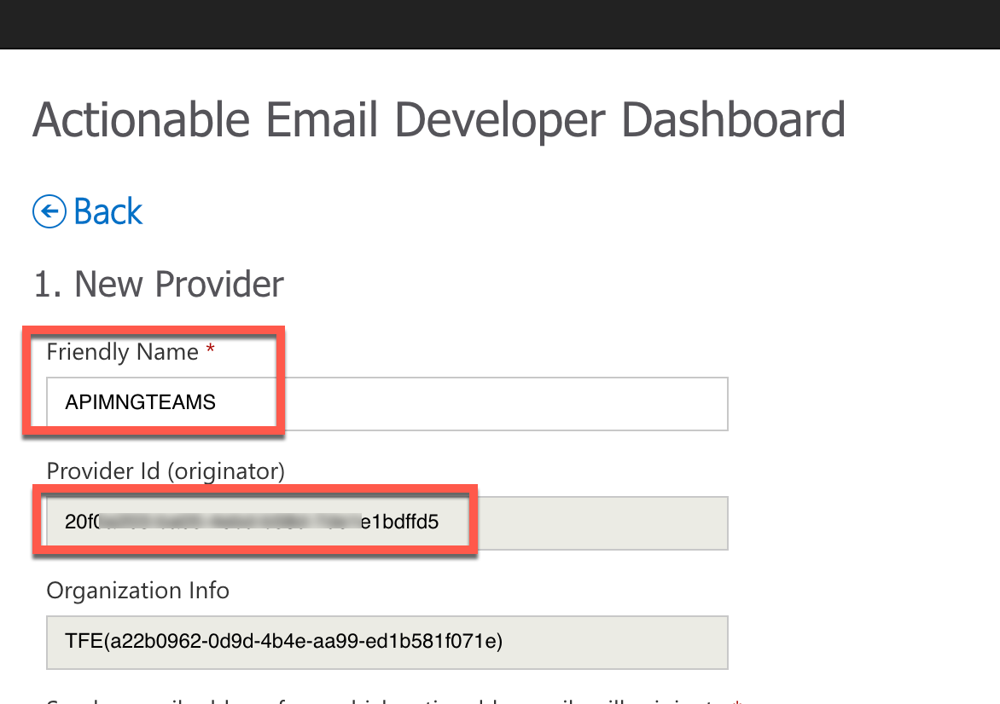

2.4 Outlook needs to know the sender beforehand in order to trust the incoming actionable message. Enter here the **Microsoft 365 Developer Account** or the e-mail address from your SMTP provider.

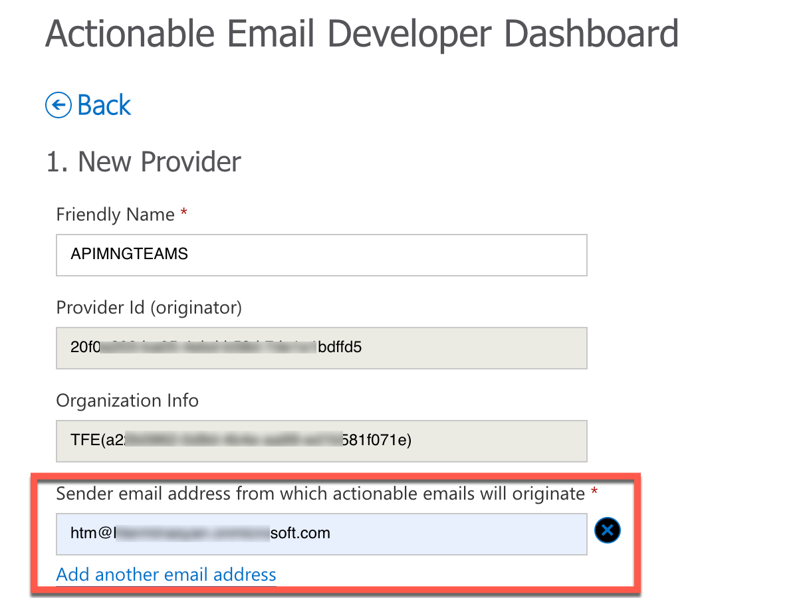

2.5 The Target URL is the URL of a API Management API Proxy URL, which we configured in previous step. 

You can remove the port **:443** and add **/*** at the end.

A resulting URL could look like this: e.g. 
```
https://ff149380trial-trial.integrationsuitetrial-apim.eu10.hana.ondemand.com/ff149380trial/http/sfsf/cai/timeOff/*
```

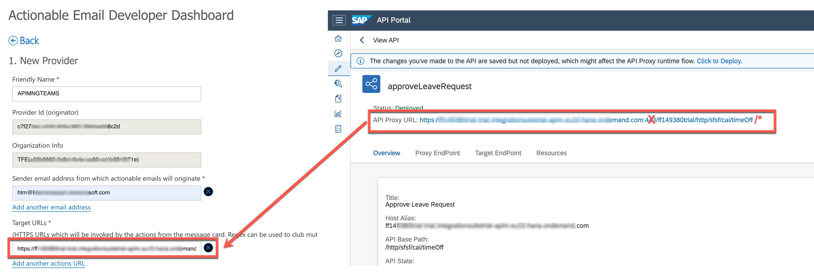


2.6 Scroll further down (you do not need to specify a Public Key) and select **Test Users (Test your provider on users from same tenant, auto-approved)**

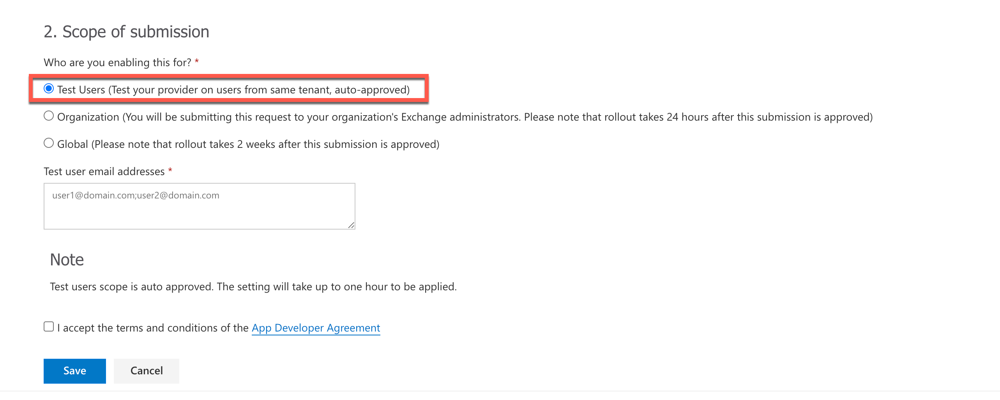

2.7 Finally enter a list of all e-mail recipients (this can be the same as the sender) or the e-mail of the Manager who is going to approve the request. Enter one of more of your Office 365 users, select the Terms and Conditions and click on Save. 

> **IMPORTANT:** In this scenario, the sender and receiver of the actionable messages is your Microsoft365 Developer account. Make sure that at least the managers e-mail address is part of the test user list. 

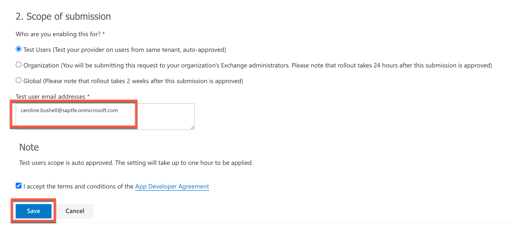

2.8 As a result you should see your new registered Provider with the status **Approved**. 

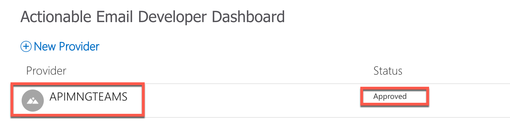


###  Step 3 - Configure the SAP Cloud Integration Flow

We need to configure the SAP Cloud Integration Flow with the respective mail server to send the adaptive cards to the Manager for approval.

3.1 Go to the SAP Cloud Integration, click on **Artifacts** and open the "CAI Create Leave Request" iFlow

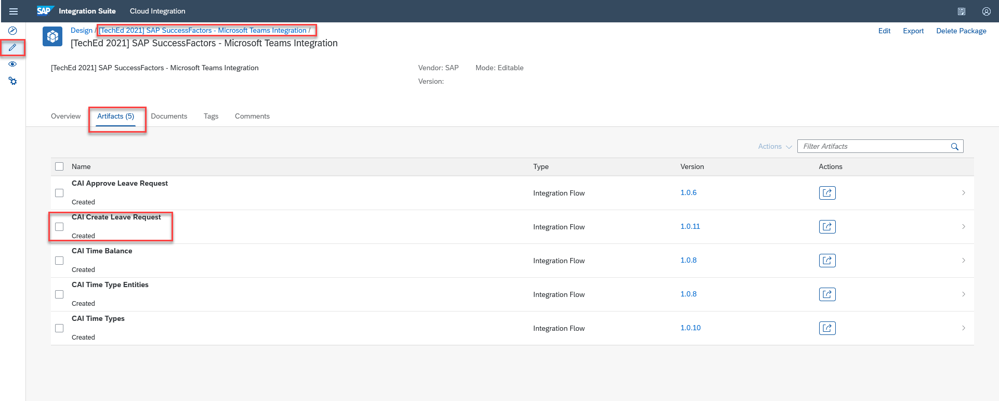

3.2 Click on **"Configure"** to configure the Mail Server parameters

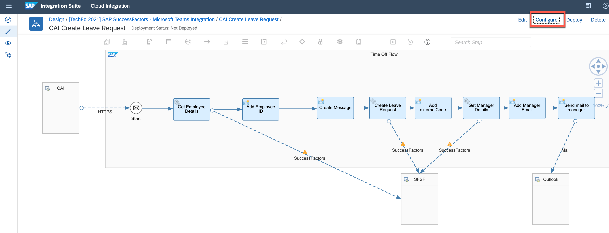

3.3 Select the **Receiver "Outlook"**

3.4 Provide the **host** and **port** of your SMTP server in **"Address"**

e.g. ``` smtp.office365.com:587  ```

3.5 Provide the credential name placeholder **"SMTP_SERVER"** which we will create in step 3.14.

3.6 Provide an E-Mail which will be used for sending the E-Mail  with Adaptive Card in field **From**

3.7 Enter the noted down Provider ID (Originator) from step 2.3  

e.g ``` (e.g. 20f0a203-xxxx-xxxx-xxxx-7de1e1bdffd5)  ```

3.8 Finally add the API management URL for approving and rejecting the request  **apimngURL_A**, **apimngURL_P** both parameters have same value.

Copy the URL of the API Management - API Proxy URL from step 2.5.

You can remove the port **:443** and add **/approveLeaveRequest** at the end.

A resulting URL could look like this: e.g. 
```
https://ff149380trial-trial.integrationsuitetrial-apim.eu10.hana.ondemand.com/ff149380trial/http/sfsf/cai/timeOff/approveLeaveRequest
```

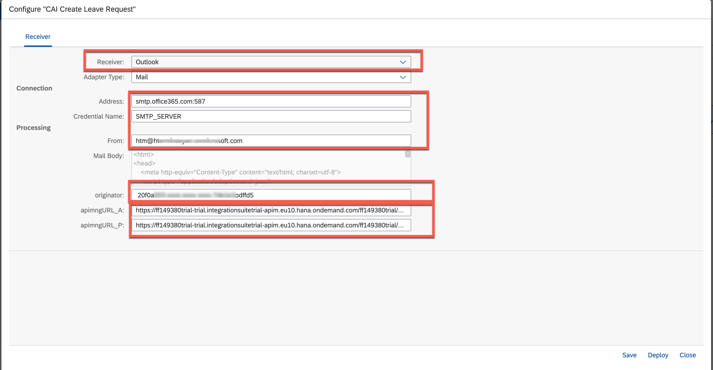

3.9 Save the Changes

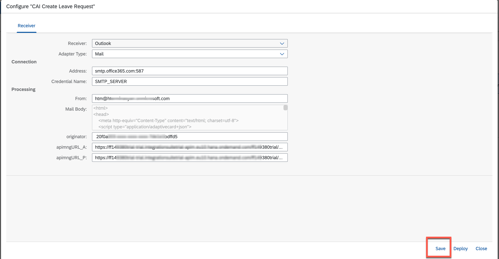

3.10 Please still **hesitate the desire to deploy the Integration Flows**. This will still result in a **deployment error** at this state of the tutorial, as the credential configuration for SAP SuccessFactors and and the SMTP Server has not been defined yet. 

>The **SMTP Server credentials** will be configured right now, and the **SAP SuccessFactors credentials** will follow in Part 3 of this tutorial. This is also the place where the **actual deployment** will be done! 

3.11 To configure the credentials of your SMTP Server, please go to **Monitor** and open the **Security Material** in SAP Cloud Integration Cockpit

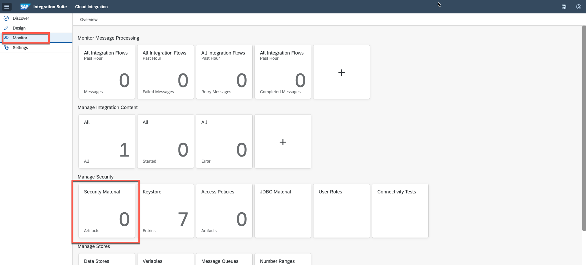

3.12 **Create** new **User Credential**

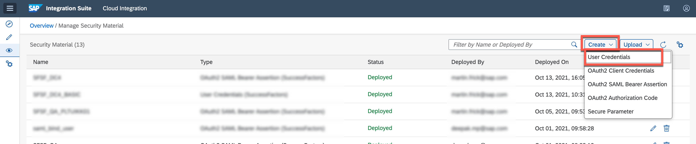

3.13 Provide the Name: **SMTP_SERVER** , user and password of the SMTP server and press **Deploy**

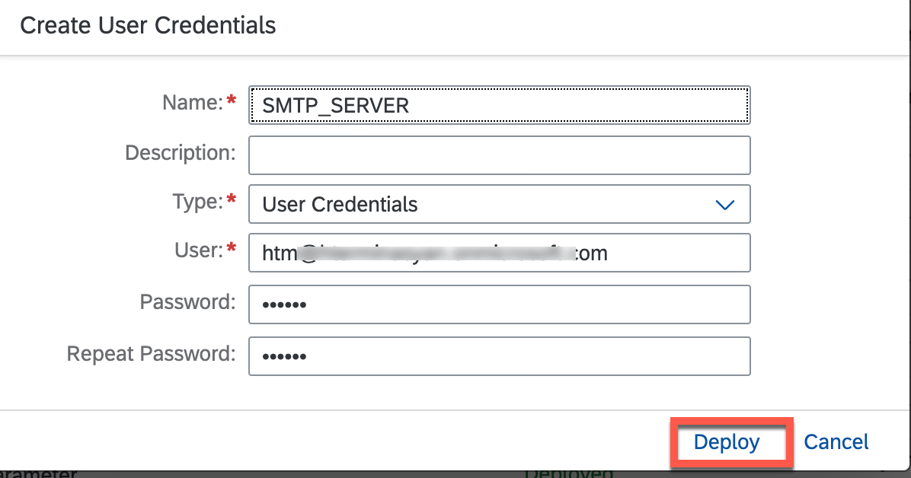

You successfully configured the API Management and Adaptive Cards.
