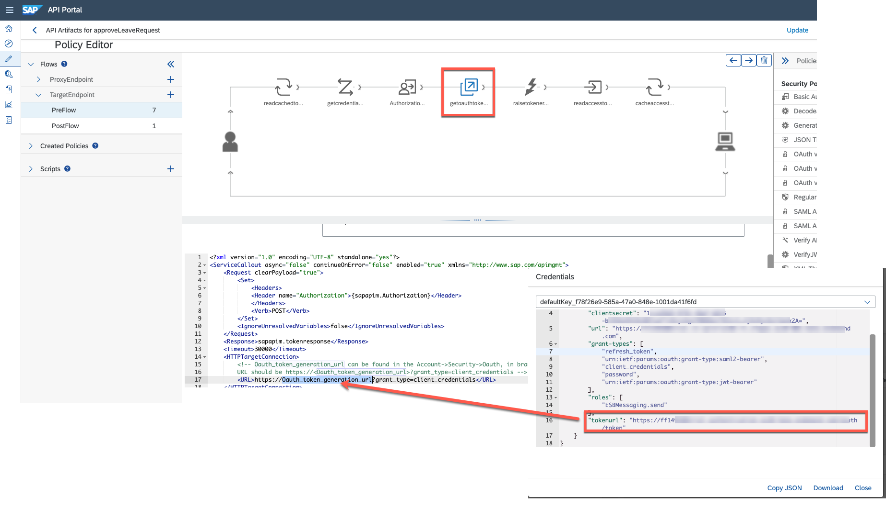
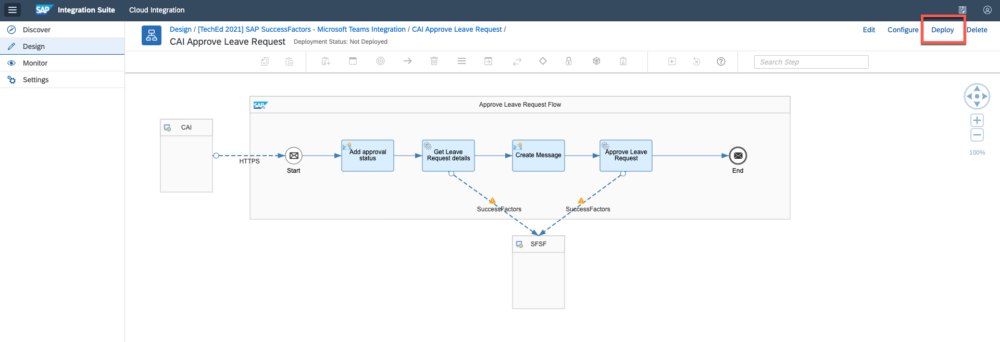

# Setting up API Management & Enable Actionable Messages

In this part we are going to register the Approval Endpoint (from Cloud Integration) from previous part, to expose it for a usage from Adaptive Card on Microsoft Outlook.
By default all Cloud Integration APIs which we prepared for this scenario are secured, that's why in API Management we are going to apply **policies** to them and expose without any client credentials and allowing access by providing the UUID of the workflow to approve or reject the request. This is required to trigger the API from Adaptive Card on Microsoft Outlook. 

###  Step 1 - Create  the API Endpoint

1.1. Open your SAP Integration Suite from BTP cockpit in section "Instances and Subscriptions"

 

1.2. Open API Management 

 

1.3. Go to Configure Tab and create new API Provider

 

1.4. Provide The name "CloudIntegration"  in Overview Tab

 

1.5. Switch to Connection Tab

 

1.6. Select Cloud Integration as a Type and provide th Cloud Integration Management Host

 

1.7. To get the credentials for Cloud Integration go to BTP Cockpit and open "Instances and Subscriptions"

 

1.8. Find the service instance of the Process Integration Runtime (it-rt) and open the default service key. Click on "View"

 

1.9. Note down the **clientid**, **clientsecret**, **url** and **tokenurl** which is required for the next step

 

1.10. Fill the **Cloud Integration Management Host**, **Client ID**, **Client Secret** using the values of previous step and save it

 

1.11. Test if the system is reachable

 

1.12. Download the API Package from [here](https://github.tools.sap/btp-use-case-factory/btp-extend-workflow-cai-msteams/raw/cloudintegration/Part2-APIManagement/files/approveLeaveRequest.zip)


1.13. Go to Develop Tab and **Import API** by uploading the package you downloaded from github.

 

Now the API for approving the leave request is successfully imported and deployed.

1.14. Only little change is  needed to add the right credentials to the Policies. Open the **approveLeaveRequest** API

 

1.15. Open the Policies

 

1.16. Find the  **PreFlow** in **TargetEndpoint** and change to *Edit* mode

 

1.17. Basically here you can find a policy which is using the Cloud Integration credentials to make the API call to the Cloud Integration API for approving the leave request.

1.18. Click on **getcredential** step and update the *clientid* and *clientsecret* which you noted down in step 1.9.

 

1.19. Click on **getoauthtoken** step and update the Oauth token URL which you noted down in step 1.9.

 

1.20. Update the policy

 

1.21. Save the API

 

1.22. And as a last steep deploy the API

 

1.23. This API will be used in Adaptive Card when we send the Card as a mail in Cloud Integration flow


###  Step 2 -  Enable Actionable Messages (Adaptive Cards)

Adaptive Cards can render an incoming message and also allow the user to perform actions (like approving a workflow). In order to do this, we need to enable Adaptive Cards in Outlook. This can be done at an organizational level or -- like in our case -- on a case by case basis. This is especially good in a development scenario where you do not have (and need) global Exchange admin permissions.

To enable and publish actionable messages, we need to register a new provider in **Actionable Email Developer Dashboard**

---

2.1 Go to the [Actionable Email Developer Dashboard](https://outlook.office.com/connectors/oam/publish) and logon with your **Microsoft365 Developer account**. 

2.2 Create a new Provider. 


2.3 Enter a name, e.g "APIMNGTEAMS" and note down the Provider ID - originator (e.g. 20f0a203-xxxx-xxxx-xxxx-7de1e1bdffd5) 


2.4 Outlook needs to know the sender beforehand in order to trust the incoming actionable message. Enter here the **Microsoft 365 Developer Account** or the mail address from you smtp provider.  


2.5 The Target URL is the URL of a API Management API Proxy URL, which we configured in previous step. 

You can remove the port **:443** and add **/*** at the end.

A resulting URL could look like this: e.g. 
```
https://ff149380trial-trial.integrationsuitetrial-apim.eu10.hana.ondemand.com/ff149380trial/http/sfsf/cai/timeOff/*
```


2.6 Scroll further down (you do not need to specify a Public Key) and **select Test Users (Test your provider on users from same tenant, auto-approved)**


2.7 Finally enter a list of all the Email Recipients (this can be the same as the sender) or the email of the Manager who is going to approve the request. Enter one of more of your Office 365 users, select the Terms and Conditions and click on Save. 

> **IMPORTANT:** In this scenario, the sender and receiver of the actionable messages is your Microsoft365 Developer account. Make sure that at least the managers mail address is part of the Test Users list. 


2.8. As a result you should see your new registered Provider with the status Approved. 


###  Step 3 -  Configure the Cloud Integration Flow

We need to configure the Cloud Integration Flow with the respective Mail Server to send the adaptive cards to the Manager for approval.

3.1. Go to the Cloud Integration and open the "CAI Create Leave Request" iFlow


3.2. Click on **"Configure"** to configure the Mail Server parameters


3.3. Select the **Receiver "Outlook"**

3.4. Provide the **host** and **port** of you smtp server in **"Address"**

e.g. ``` smtp.office365.com:587  ```

3.5. Provide the credential name **"SMTP_SERVER"** which we will create in step 3.14.

3.6. Provide an E-Mail which will be used for sending the E-Mail  with Adaptive Card in field **From**

3.7. Enter the noted down Provider ID (Originator) from step 2.3 

e.g ``` (e.g. 20f0a203-xxxx-xxxx-xxxx-7de1e1bdffd5)  ```

3.8. Finally add the API management URL for approving and rejecting the request  **apimngURL_A**, **apimngURL_P** both parameters have same value.

Copy the URL of a API Management  - API Proxy URL from step 2.5.

You can remove the port **:443** and add **/approveLeaveRequest** at the end.

A resulting URL could look like this: e.g. 
```
https://ff149380trial-trial.integrationsuitetrial-apim.eu10.hana.ondemand.com/ff149380trial/http/sfsf/cai/timeOff/approveLeaveRequest
```


3.9. Save the Changes


3.10. Deploy the iFlow by clicking "Deploy"



3.11. As as final step you need to configure the Credentials of your SMTP Server  

3.12. Go to **Monitor** and open the **Security Material** in Cloud Integration Cockpit


3.13. Create new **User Credential**


3.14. Provide the Name: **SMTP_SERVER** , user and password of the smtp server and press Deploy


You successfully configured the API Management and Adaptive Cards.