# SAP Workflow Management: create leave request workflow

The objective of this part is to create leave request workflow, deploy and run it on SAP BTP. Also understand the basic concepts how it works.


## Step 1 - SAP Business Application Studio getting started

### 1.1. Launch SAP Business Application Studio from SAP BTP cockpit
   
   

### 1.2. Run the Workflow Development space created in previous part
   
   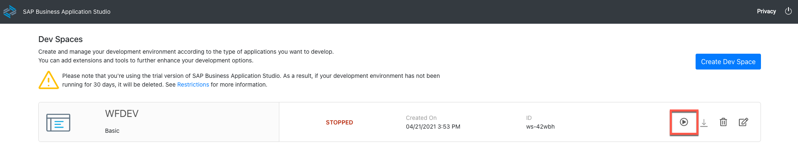

### 1.3. Open the space. SAP Business Application Studio will initiate all necessary tools
   
   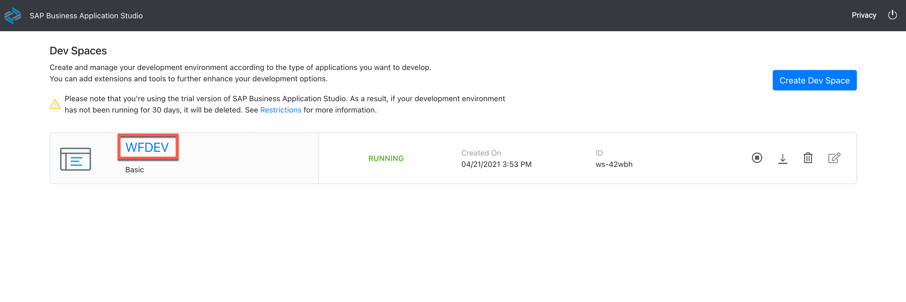

### 1.4. IDE is now ready for development
   
   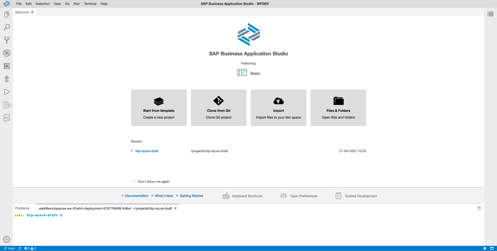


## Step 2 - Clone the Workflow project from GitHub and get familiar with it

### 2.1. Clone following project from GitHub into your SAP Business Application Studio workspace. Clone the project using either the Terminal in SAP Business Application Studio and *git* CLI or SAP Business Application Studio Github tools. Checkout the branch "basic-scope".

   ```bash/Shell
   git clone https://github.com/SAP-samples/btp-extend-workflow-cai-msteams.git
   
   cd btp-extend-workflow-cai-msteams/
   
   git checkout basic-scope
   ```
### 2.2. Workflow project you can find in **sample-coding/btp-workflow** folder.
   Project has following structure:

   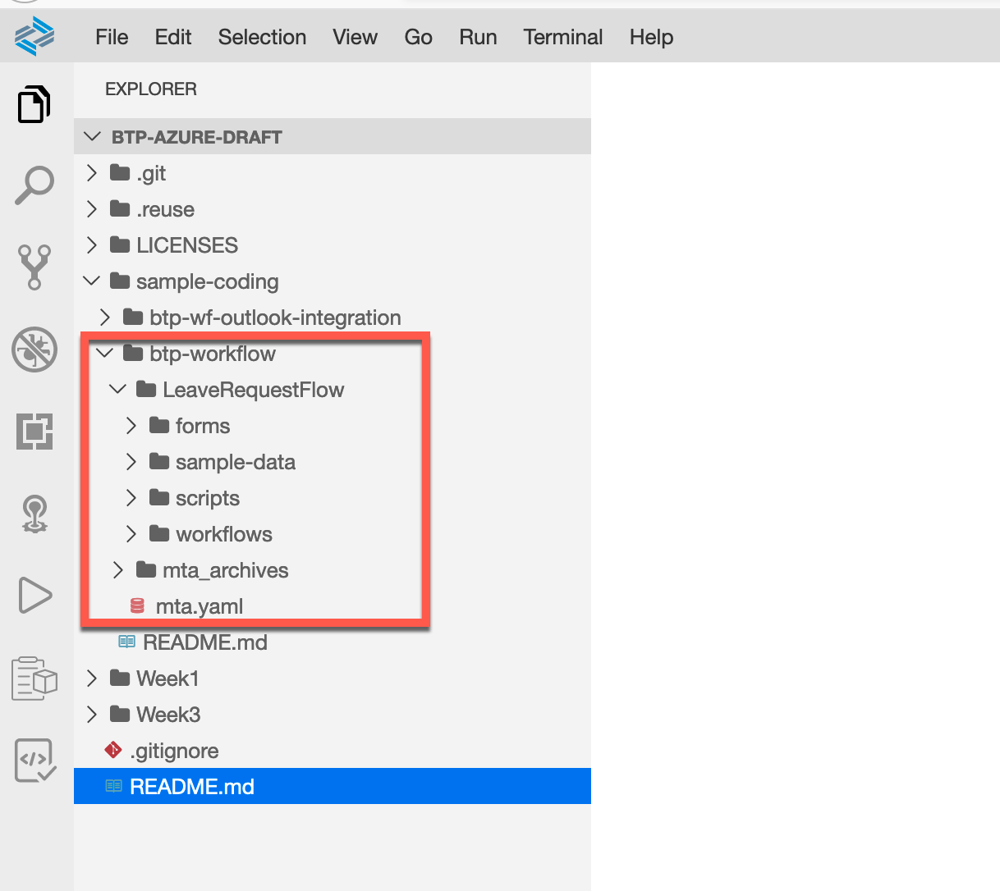

### 2.3. Leave request workflow is defined in
   
   ```
   workflow
   └── EmployeeLeaveRequest.workflow
   ```

   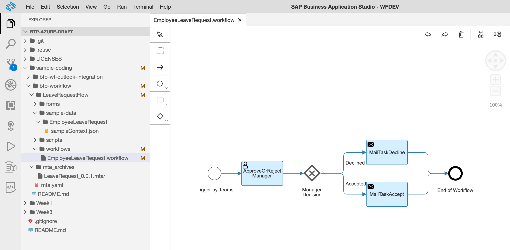

    Leave request workflow definition consist of following tasks:
   * **User Task:** A flow object that illustrates a task that a human performs. User tasks appear e.g. in My Inbox where the processor of the task can complete the task instance, and view its description.
   * **Mail Task:** A flow object that you configure to send e-mails to one or more recipients.
  
   >If you are interested in further task types, please refer to following  [documentation]([https://link](https://help.sap.com/viewer/e157c391253b4ecd93647bf232d18a83/Cloud/en-US/a855a4f8898547bd8a5aa04bf7ecaa40.html))

   As a **User Task** (ApproveOrRejectManager) we defined all the fields and forms necessary for manager to approve or reject the leave request.

   **Mail Task** (MailTaskAccept, MailTaskDecline) we use to send the leave requester the approval status.

### 2.4. Form definition for User Task is defined in
      
   ```
   forms
   └── EmployeeLeaveRequest
       └── ManagerApproval.form
   ```

   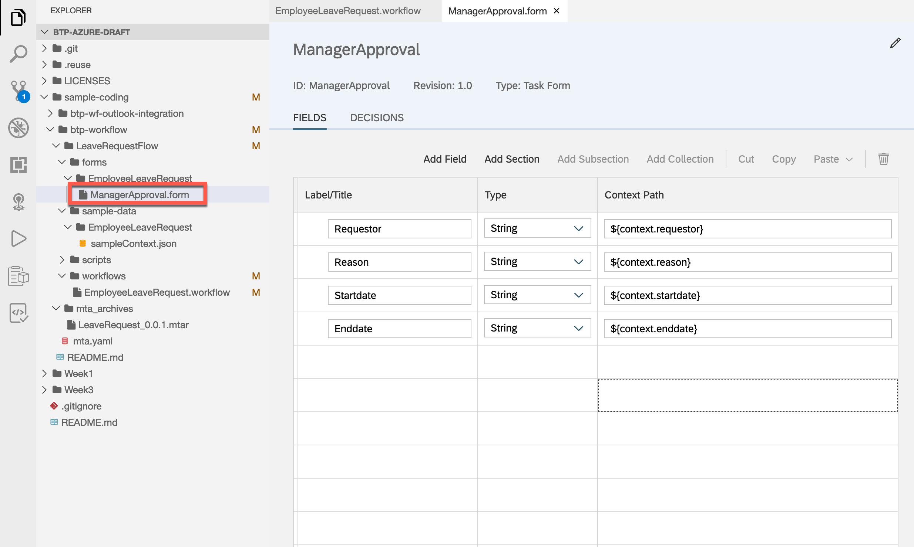

   End users can interact with a workflow through user interface with forms and in this example Manager can see the request form in MyInbox and approve or reject the request.

### 2.5. To test the leave request workflow we defined sample data which can be used for testing purpose during workflow development
   
   ```
   sample-data
   └── EmployeeLeaveRequest
       └── sampleContext.json
   ```
   
   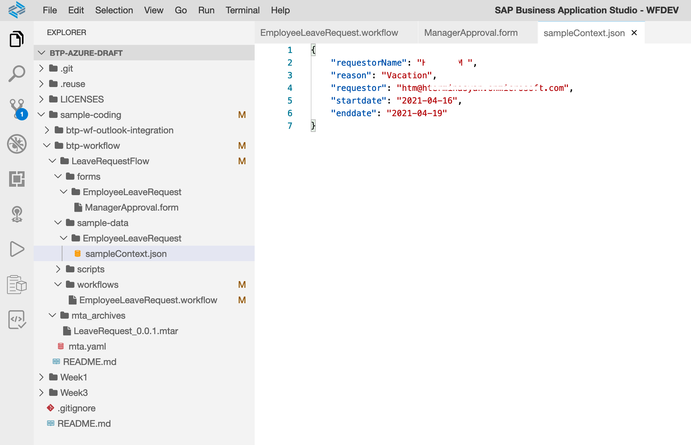

   ```json
   {
    "requestorName": "Requestor Name",
    "reason": "Vacation",
    "requestor": "Requestor E-Mail (Use the address used in BTP)",
    "startdate": "2021-12-16",
    "enddate": "2021-12-19"
   }
   ```

   >Note, To keep the exercise simple, you will take the role of manager and approve or reject the leave request created by you. 
   
## Step 3 - Build and deploy the Workflow in your SAP BTP trial account

Now after exploring the leave request workflow definition, you can build and deploy it in your SAP BTP trial account.

### 3.1. Make sure that you are loged in your SAP BTP account
   ```
      cf login -a <API Endpoint>
   ```
### 3.2. Right click on mta.yaml and **"Build MTA Project"**
   
   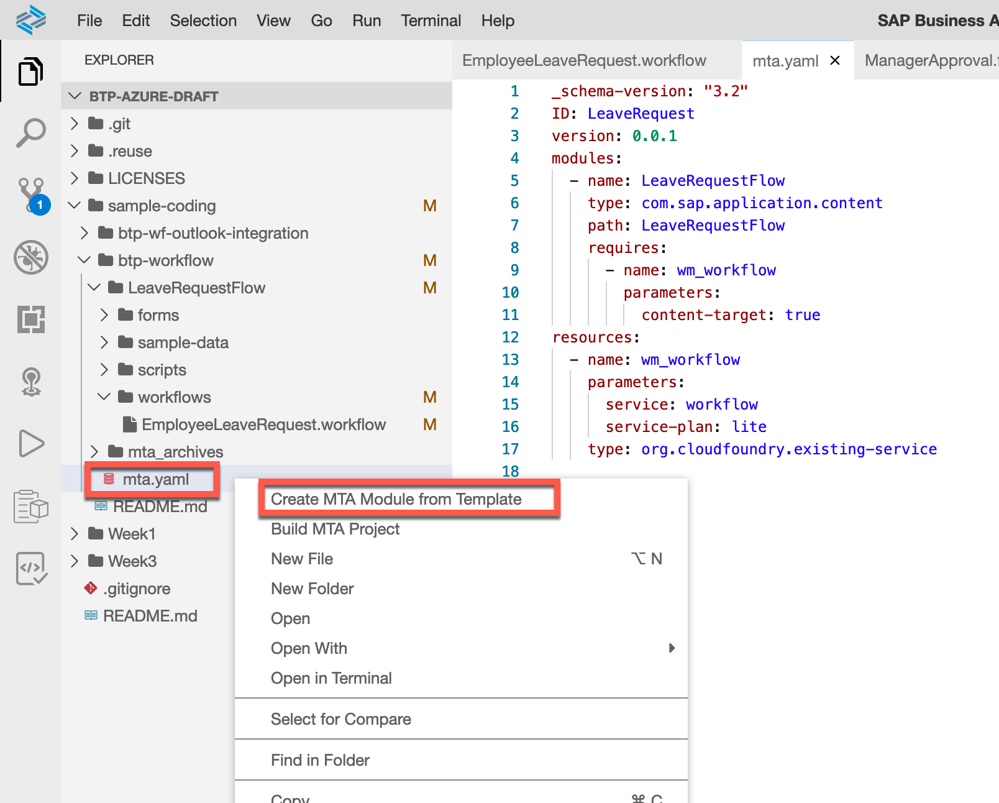

   > mta.yaml is the Multitarget Application development descriptor

### 3.3. The deployable archive file you can find in  

   ```
   mta_archives
   └── LeaveRequest_0.0.1.mtar
   ```

   Right click on the archive file and **"Deploy MTA Archive"**
   
   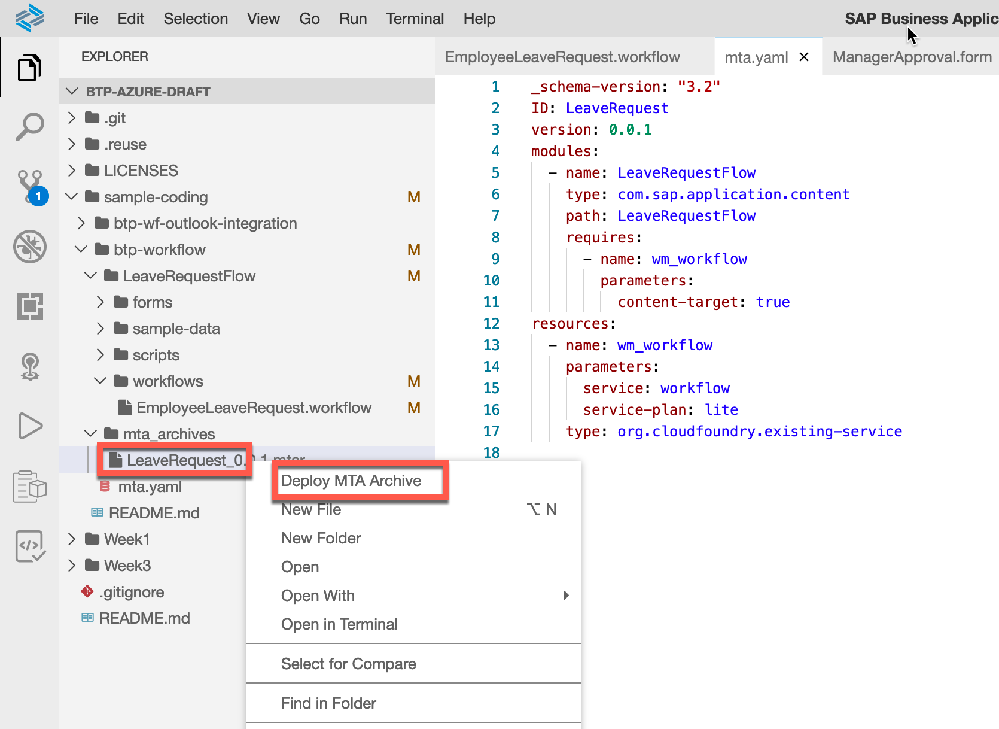

## Step 4 - Define the Mail Destination used in Mail task to send the approval status

To be able to send approval or rejection email from Mail Task, we need to configure mail destination with SMTP credentials.


### 4.1. Download the **"bpmworkflowruntime_mail"** destination from your SAP Business Application Studio workspace.
   
   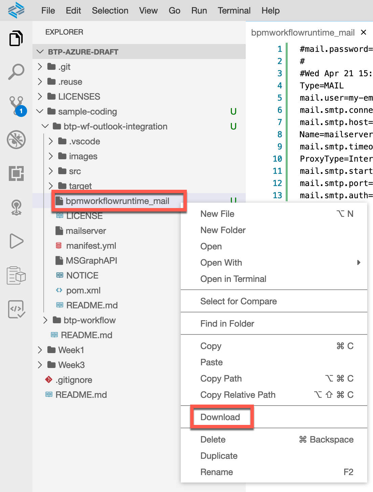

   ```
   sample-coding
   └── btp-wf-outlook-integration
       └── bpmworkflowruntime_mail
   ```


### 4.2. Open a new tab and go to your **dev** space in the SAP BTP cockpit. **Import** the downloaded mail destination.

   
   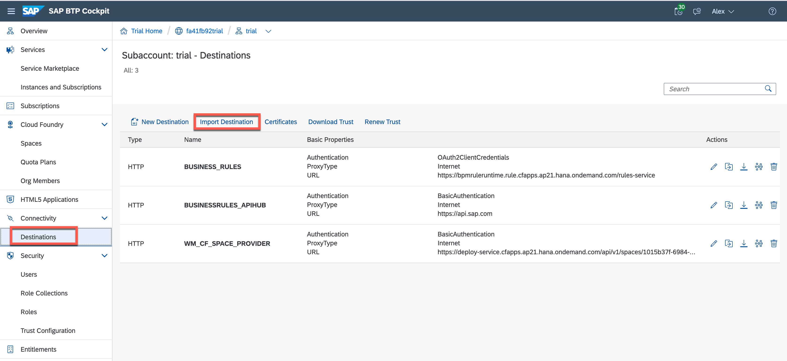

### 4.3. Replace <your M365 mail address> with the mail address of your Microsoft365 developer account.
   
   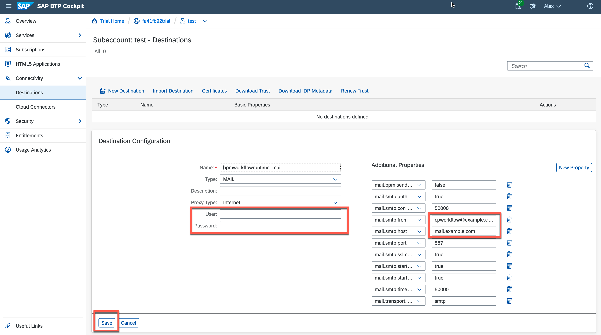


   **IMPORTANT**: Make sure that Multifactor Authentication (MFA) is not active in your Microsoft365 developer account, it'll cause issues while using SMTP Destination. In general we recommend using MFA but, not for this unit. You can find in [Troubleshooting](#troubleshooting) section how to deactivate it, in case you already activated it.   

   
   **IMPORTANT**: Do not change the Destination name! The destination name bpmworkflowruntime_mail is reference in other artifacats later on. 

   ```
      Type=MAIL
      Name=bpmworkflowruntime_mail
      ProxyType=Internet

      mail.user=
      mail.password=
      
      mail.smtp.host=mail.example.com
      mail.smtp.port=587
      mail.transport.protocol=smtp
      mail.smtp.starttls.required=true
      mail.smtp.starttls.enable=true
      mail.smtp.connectiontimeout=50000
      mail.smtp.timeout=50000
      mail.smtp.auth=true
      
      mail.smtp.from=cpworkflow@example.com
      mail.smtp.ssl.checkserveridentity=true
      
      mail.bpm.send.disabled=false

   ```
   >Replace the SMTP host *mail.smtp.host* and *mail.smtp.from* also provide the credentials of SMTP Server.

## Step 5 - Test the workflow definition 

After successful deployment of leave request workflow we can see the deployment and test it with sample leave request

### 5.1. Go to SAP BTP Cockpit and navigate to **"Instances and Subscriptions"** and run the **"Workflow Management"** using the highlighted icon
   
   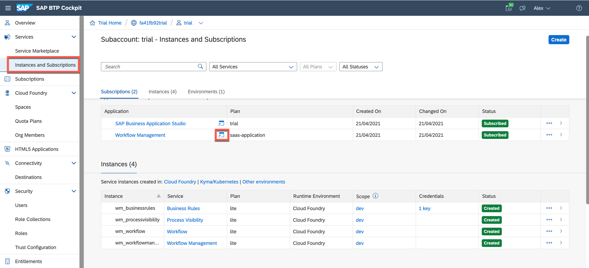
   
   It will open Workflow Management launchpad

### 5.2. In launchpad under Monitoring tools you can find the "Workflow Monitoring - Workflow Definition" tile. Open the application
   
   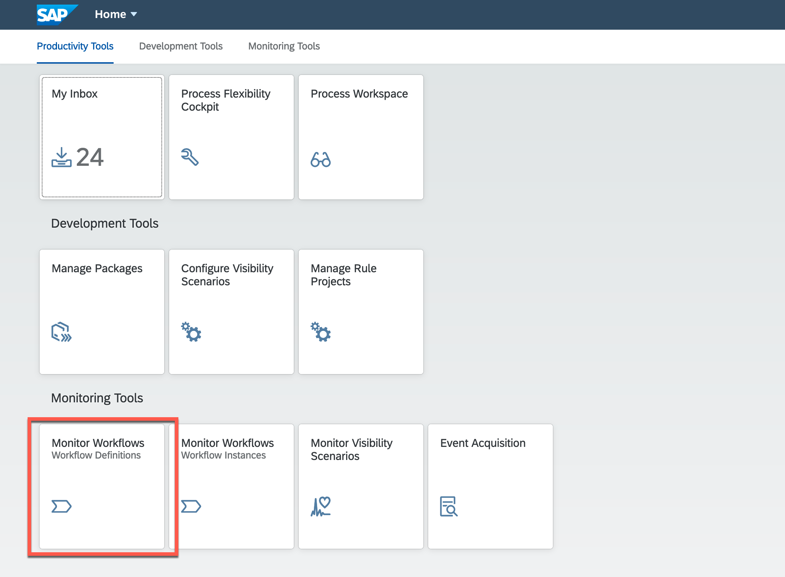

### 5.3. Here you can find the Employee Leave Request Workflow deployed in previous steps
   
   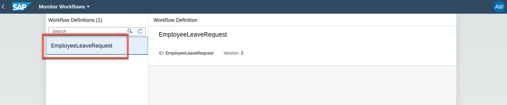

### 5.4. Now you can trigger new Leave Request Workflow by clicking on **"Start new instance"** and using the sample data we defined in earlier steps.

   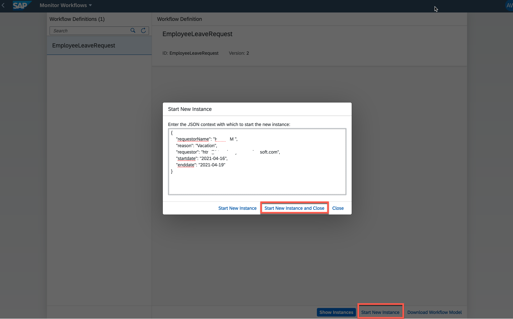

   >Note, later in upcoming Part the leave request workflow will be triggered by API call from SAP Conversation AI chatbot

### 5.5. Go back to Workflow Management launchpad and open "Workflow Monitoring - Workflow Instances" tile

   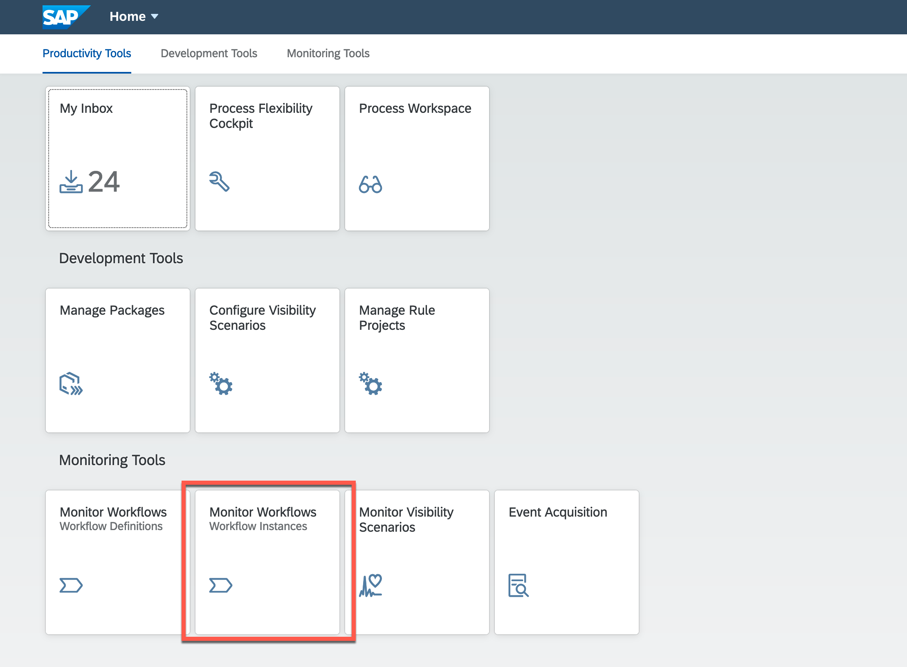

### 5.6. Here you can find the running instance of triggered workflow

   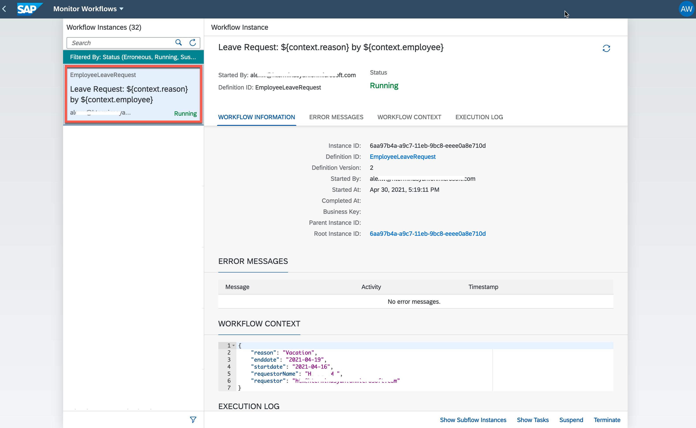

   You can find detailed information about the triggered workflow, see the workflow context and also analyse execution log if necessary.
   
   In Execution log you can see that leave request task was created and the manager can find it in MyInbox application.

   To keep the exercise simple, you will take the role of manager and approve or reject the leave request created by you.

### 5.7. Go back to launchpad and launch **"My Inbox"** application
   
   

### 5.8. In My Inbox you will find the triggered leave request and you can "self" approve or reject it.

   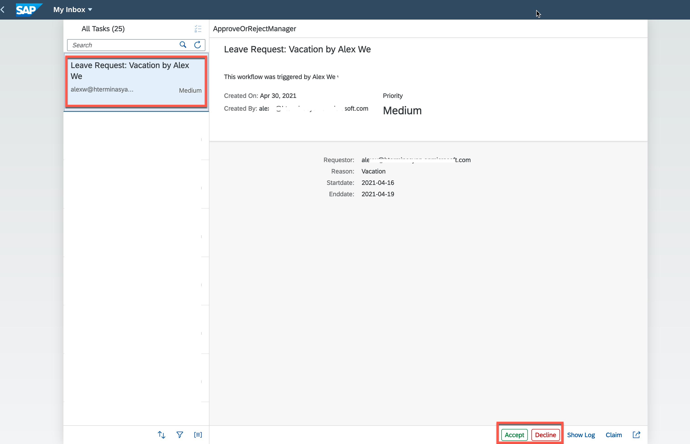

### 5.9. After approval or rejection you will receive confirmation/rejection E-Mail

   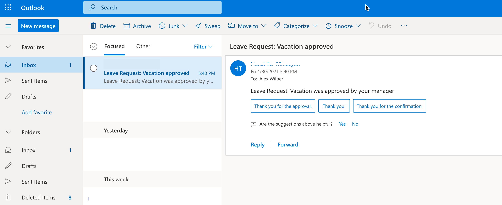
    
### 5.10. In Workflow Monitoring under Execution Log you can see that all steps were successfully finished.
    
   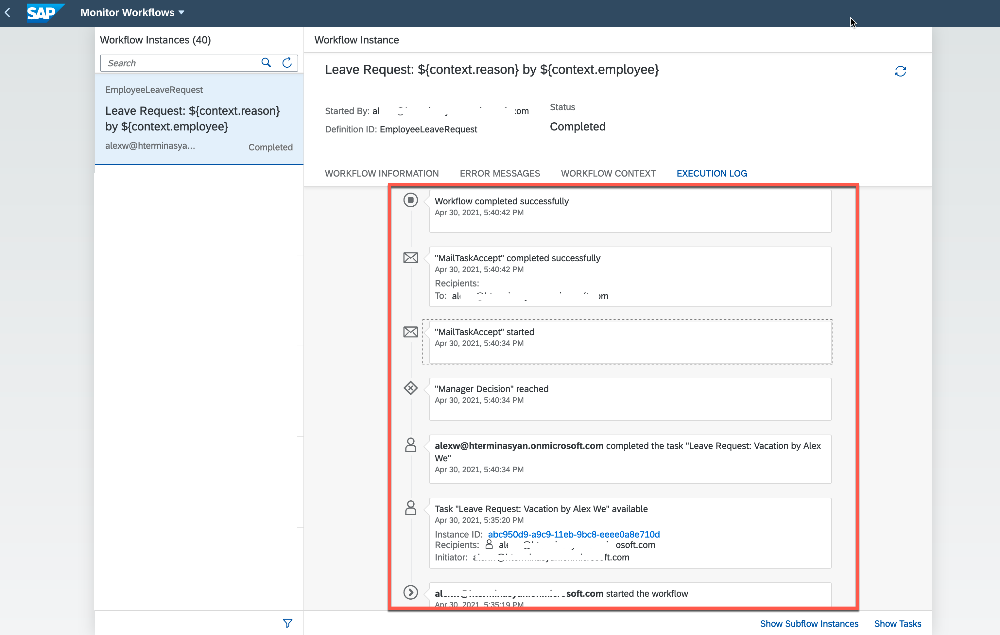


## Troubleshooting   

>Note: Misconfiguration of the **"bpmworkflowruntime_mail"** destination may cause some issues while trying to send the emails. 

Using the **Monitor Workflow (Workflow Instances)** tools of the Workflow Management you can analyse and see the  cause of the issue.
   
   

For example in Execution Log you can see the details of the issue in detail.

Often SMTP servers are having additional security protections activated, which may cause the issue below, that the smtp credentials could not be validated. 

```Could not send email: The server 'smtp.office365.com' could be reached, but the login with the given credentials failed. Verify that the credentials are valid for the server.```

This issue occurs in case you have activated the Multifactor Authentication (MFA) in your Microsoft365 developer account.

 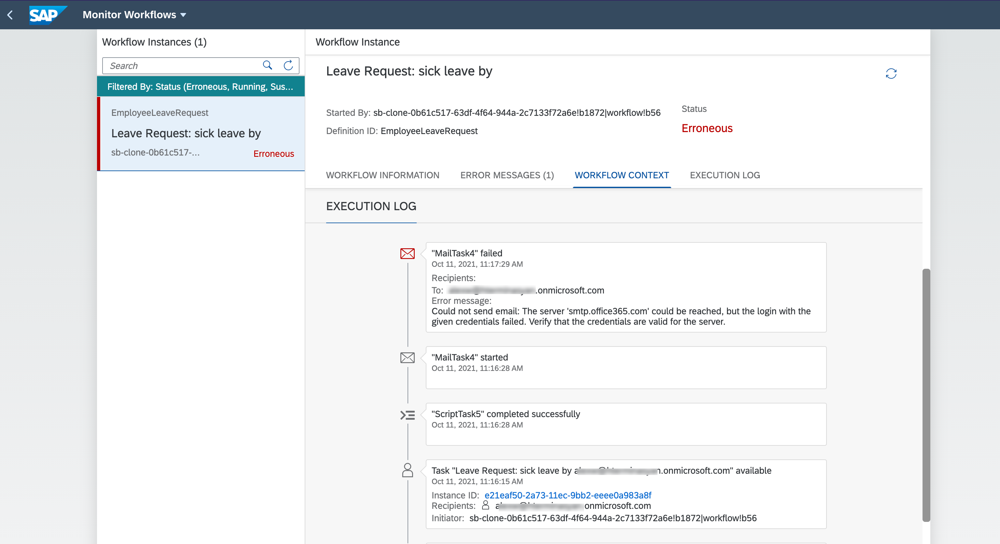

 ### Deactivate Multifactor Authentication (MFA) in your Microsoft365 developer account.

With this we definitely don't want to tempt you to deactivate multi-factor authentication in general and always. MFA is good and should be used as far as possible! Nevertheless, there are always reasons why a global MFA cannot be used. In this case, here are the instructions.

Go to [Microsoft 365 admin center](https://portal.office.com/adminportal/home) and open Azure Active Directory.

We may have to log in again and we are logged in to the Azure AD Admin Portal. Here we can manage the security standards via Azure Active Directory -> Properties.

 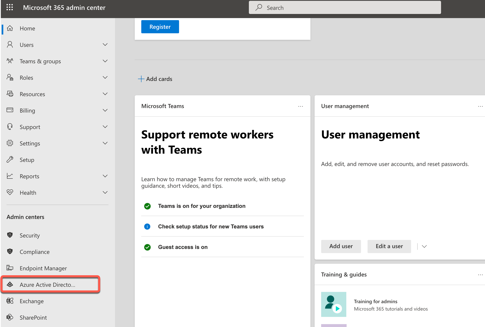

In this menu we can now switch off the standards defined by Microsoft.
You will be asked briefly why you are doing this, after which there will no longer be a request for a mandatory MFA.

 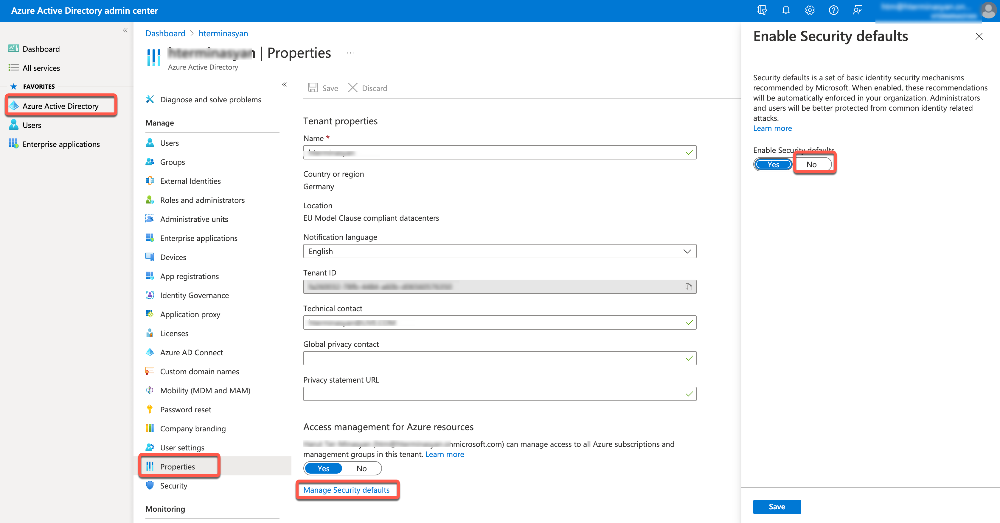

# Summary

Congrats! You successfully build and deployed the leave request workflow. You also simulated the workflow request process using the Monitoring tools provided by SAP Workflow Management.
