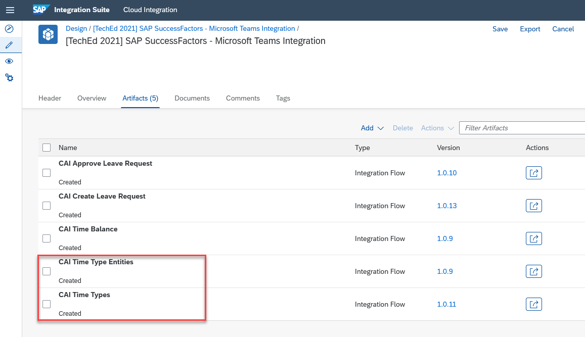

# SuccessFactors

As SAP Cloud Integration will be the integration layer for the communication between SAP Conversational AI and SAP SuccessFactors, we will need to configure the respective user credentials to allow system-to-system interaction between both products. 

In the first part of this tutorial, you've already imported the relevant integration flows into your SAP Cloud Integration tenant. You can use these integration flows as provided (except of providing some configuration parameters before deployment). One of these configuration parameters is the name of the credential configuration within SAP Cloud Integration. This credential configuration will be done within the following part of the tutorial.

This tutorial section is based on the following SAP Blog post, published in March 2021. It describes in a comprehensive way, how the OAuth2 SAML Bearer authentication can be implemented with a fixed user.

https://blogs.sap.com/2021/03/26/sap-cloud-integration-oauth2-saml-bearer-x.509-certificate-authentication-support-in-successfactors-connector/

The OAuth2 SAML Bearer authentication between SAP Cloud Integration and SAP SuccessFactors is required, as the Basic Authentication will be deprecated from SAP SuccessFactors side in one of the upcoming releases. 

 

### Step 1 - Create a (technical) API user in SAP SuccessFactors

1.1 In this simplified integration approach, we're using a technical user for the communication between SAP Cloud Integration and SAP SuccessFactors. As SAP Cloud Integration acts as an integration layer between SAP Conversational AI and SAP SuccessFactors, the end-users will never get in touch with this technical user. They are restricted in calling endpoints provided by SAP Cloud Integration, fulfilling exactly the purpose the end-user is supposed to use.

1.2 As SAP SuccessFactors will retire the usage of Basic Authentication in the upcoming releases, we will make use of the OAuth2 SAML Bearer authentication approach in this case. Before you begin to go through the steps described in the SAP Blog, please create a technical API user in SAP SuccessFactors, which you can use for this scenario. For simplification reasons, in our sample scenario we've used a super admin user like **sfadmin** (see below). 

1.3 A technical SAP SuccessFactors API user for this scenario, must be allowed to access the OData APIs of SAP SuccessFactors using OAuth2. Furthermore, he must be allowed to create and modify the EmployeeTime records of all users in the system. Last but not least, the user needs to read basic user information of all users (like the direct manager of an employee, the employee id or e-mail addresses). Please ensure, that your technical API user fulfills these requirements. 

**Important**: Using a user with wrong authorizations may result in missing privileges to call APIs but also to situations. Furthermore scenarios might occure, in which leave requests will be approved automatically. Based on our development experiences, we want to share the following findings with you: 

- If a leave request is created by an API user with **HR Admin privileges** and no workflow is configured for Admin users, the leave request is approved automatically. Please see the following KBA for further information: https://launchpad.support.sap.com/#/notes/0002548343

- If the selected API user has very powerful privileges on the **MDF OData API**, this can lead to situations in which leave requests are automatically confirmed. This has not been validated yet, but if you're facing situations in which your leave requests (created from SAP Microsoft Teams) are automatically approved, also check the following KBA for further information: https://launchpad.support.sap.com/#/notes/2396714 

>**Hint**: In this tutorial, a new super admin user was created for the API communication purpose (for further information see KBA https://launchpad.support.sap.com/#/notes/2186617). Please discuss with your SAP SuccessFactors administrator, as the super admin user approach taken in this tutorial, might not be suitable for a productive scenario. In this case a more restricted API user might be required! 

 

### Step 2 - Create a Key-Pair in SAP Cloud Integration

Follow Step 1 of the linked [SAP Blog post](https://blogs.sap.com/2021/03/26/sap-cloud-integration-oauth2-saml-bearer-x.509-certificate-authentication-support-in-successfactors-connector/), to create a Key-Pair for your technical user.

If your technical API user is e.g. **sfadmin**, you need to provide **sfadmin** as the **Common Name - CN** when creating the certificate. As described in the blog, please download the certificate of the Key-Pair on your local device. You will need it when configuring the OAuth2 client within SAP SuccessFactors. Also note down the name which you've given your Key-Pair. You will need it in a later step. 

> **Hints**: Give your Key-Pair a meaningful name which you can easily recognize. 

 

### Step 3 - Create an OAuth client in SAP SuccessFactors

Follow Step 2 of the linked [SAP Blog post](https://blogs.sap.com/2021/03/26/sap-cloud-integration-oauth2-saml-bearer-x.509-certificate-authentication-support-in-successfactors-connector/), to create an OAuth2 client within SAP SuccessFactors, in which you store the certficate, you just downloaded in Step 2. 

You **do not** have to bind this OAuth2 client to a specific user but please give it a meaningful name, which tells other administrators, that this OAuth2 client is used by your SAP Cloud Integration instance. 

The Application Url in the configuration can be freely chosen and has no influence on this tutorial. You can e.g. take the url of your SAP Cloud Integration instance.

> **Hints**: Make sure you only copy the certificate value between the  —–BEGIN CERTIFICATE—– and —–END CERTIFICATE—– delimiters. 

> Don't forget to note down the API key of your OAuth2 client which you just created. You will need it in the next step. The API key is generated, after you've saved your OAuth2 client configuration for the first time. 

 

### Step 4 - Create a credential configuration in SAP Cloud Integration

Follow step 3 of the linked [SAP Blog post](https://blogs.sap.com/2021/03/26/sap-cloud-integration-oauth2-saml-bearer-x.509-certificate-authentication-support-in-successfactors-connector/), to create the OAuth2 SAML Bearer credential configuration within your SAP Cloud Integration instance. 

Give your credential configuration a meaningful name (e.g. in this case SFSF_DC4 as we're connecting to an SAP SuccessFactors instance running in datacenter 4). The required **Token Service Url** should resemble the following format:

https://\<SAP SuccessFactors API endpoint\>/oauth/token

> Sample for SAP SuccessFactors Salesdemo DC4 landscape:
> https://apisalesdemo4.successfactors.com/oauth/token

The latest SAP SuccessFactors landscape API endpoints can be found in the following KBA:
https://userapps.support.sap.com/sap/support/knowledge/en/2215682

Make sure that for the Key-Pair alias, the identifier/name of the Key-Pair from step 2 is used. A sample of the credential configuration (in this case for an SAP SuccessFactors Salesdemo tenant in datacenter 4) could look similar to this. 

 

Please make sure you replace the respective values with your own settings as described in this mission and the blog post. Once finished, please note down the **Name** which you've given your configuration. You will need it in the next step. 

 

### Step 5 - Replace the credential configuration in your integration flows

Once you've created your personal SAP SuccessFactors credential configuration in Step 4, you have to integrate it into your integration flows, which you've imported in part 1 of this tutorial. 

5.1 Therefor, please open the integration flows one after another and perform the following steps. 

5.2 If you e.g. open the **Approve Leave Request** integration flow, please click on **Configure** in the read-only mode. This allows you to set custom variables, which are embedded in the integration flow and require your customer specific landscape settings. 

 

5.3 From the **Receiver** dropdown, please select SFSF (if dropdown is enabled) and select the Adapter Type **SuccessFactors**. 

**Important**: Please be aware, that there might be multiple Adapter Type instances called **SuccessFactors** (as seen in the screenshot)! If this is the case, please go through all available instances and check if the relevant configuration (see next step) has been updated automatically. If not, please adjust the other instances manually. 

 

5.4 In the provided sample integration flows, a dummy value has been set for the **Address** and **Credential Name** field. Please replace these values with your customer specific **SAP SuccessFactors API endpoint** and the **name** of your **credential configuration**, which you noted down in step 4. 

Once you've set the respective field values for **all SFSF Adapter Types**, first **Save** and then **Deploy** the Integration Flow to your SAP Cloud Integration tenant. When deploying the **CAI Create Leave Request** Integration Flow, please also check your **Mail** configuration once again (you have done the configuration in Part 2 of this tutorial). 

 

A sample of how such a configuration could look like for an SAP SuccessFactors Salesdemo instance running in datacenter 4, can be seen below. 

 

5.5 Repeat the steps 5.1 - 5.4 with all integration flows of your imported SAP Cloud Integration package. 

* CAI Approve Leave Request
* CAI Create Leave Request
* CAI Time Balance
* CAI Time Type Entities
* CAI Time Types

 

You've successfully updated and finally **deployed** your Integration Flows to establish a secure technical user communication between SAP Cloud Integration and SAP SuccessFactors. 