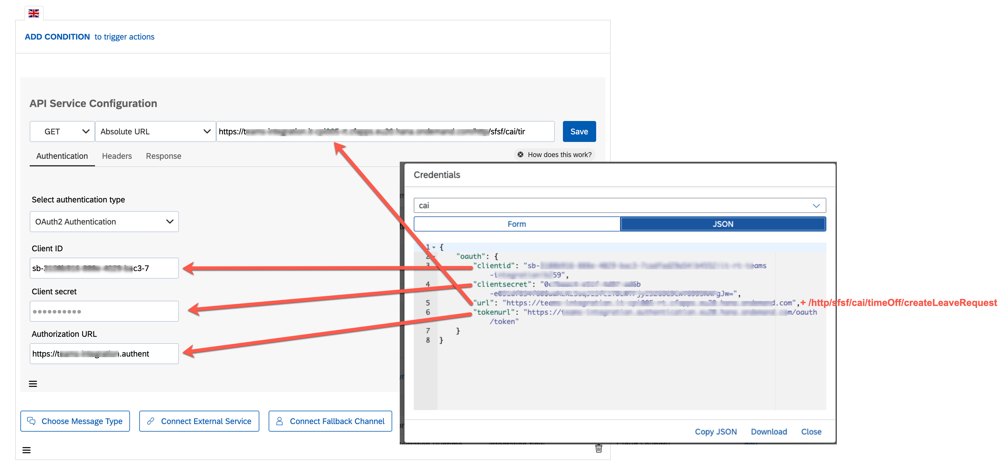
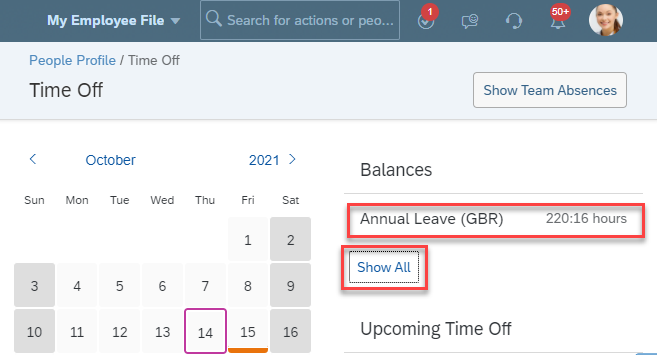

# Build Leave Request bot with SAP Conversational AI

In this part,you learn how to create an SAP Conversational AI Bot and understand how to trigger an SAP Cloud Integration instance from a SAP Conversational AI bot. 

## Step 1 - Create an account for SAP Conversational AI and get started

In this step you'll register for the SAP Conversational AI Community Edition and get used to the basic wording of SAP Conversational AI. 

---

1.1 If you haven't signed up for SAP Conversational AI so far, go to <https://cai.tools.sap/> and click **Sign Up** in the upper-right corner.
   
   > Use the same mail/account that you have used to sign up for the SAP BTP account to simplify the Identity authentication.

   Follow the instructions to create an account. 

   

   You will get an email with a link to validate your account.

1.2 In case you have already signed up for SAP Conversational AI or if you have already activated your account, use one of the login options on the start page. 

   

1.3 Open the following [URL](https://cai.tools.sap/harutyunter-minasyan/leaverequest/train/intents) in a new tab and **fork the bot** into your account.
   
   

1.4 Now go back to your own [SAP Conversional AI environment](https://cai.tools.sap/). You get a list of your bots. 

1.5 Click on the name of the bot to open the details. 

1.6 You have forked a predefined and trained bot with LeaveRequest intents (Intents are what the user intends to express when entering text in the chat) from another user that has made his bot public. 

   

1.7 Understand the 4 stages of a bot's life. The 4 phases are represented in the bot project by the 4 tabs.
   (Click on the corresponding tabs to see what the tab contains - no changes or concrete tasks from your side needed at this stage)
   
   
   
   There are 4 stages in your bot’s life:

   * **Train**: Teach your bot what it needs to understand.

     Here we defined the intents – ideas your bot will recognize – using expressions that the bot should recognize coming from the user. (e.g. Hi, I want to take leave request)

     

     For LeaveRequest bot we defined 3 intents: leave-request, greetings, goodbye

   * **Build**: Create your conversational flow with Bot Builder tool. Here you give your bot skills it can perform.

     Here we created skills – things the bot can do – and defined when they will be triggered. The skills are defined by triggers, requirements (information your bot must collect), and the actions.

     

     >Bot Builder helps you construct the conversation flow of your bot.

     In the next step we will configure the actions which will trigger the leave request workflow from *leave-request* skill 

     >Each skill represents one thing that your bot knows how to do.

   * **Connect**: Ship your bot to one or several messaging platforms.
     
     Here we integrate ConversationalAI bot with Microsoft Teams (next Part)

   * **Monitor**: See how users are communicating with your bot, check if the bot is understanding users correctly, and make updates to the bots intents/entities. Monitoring also lets you see what your users want, and gives you ideas of what additional capabilities you could add to the bot.

## Step 2 - Configure the Action to trigger Leave Request 

Let's adjust the forked bot to your needs and connect it to your instance of SAP Cloud Integration which will make the SAP SuccessFactors API call.

---

2.1 Go to the **Build** tab of your bot and open the **leave-request** skill.
    
   

   The **leave-request** skill – like all skills – has 4 tabs:

   * *README*: A description of the purpose of  skill
   * *Triggers*: The conditions that must occur – generally the intents (leave request) that the user must express – for the skill to be executed
   * *Requirements*: Information that must be collected in order for the skill to be executed (start/end date, leave type, etc.)
   * *Actions*: The action to take (trigger workflow service)
   
   

2.2 Go to **Actions** to configure the how the bot should call SAP Workflow Management to trigger the leave request workflow.
   
   

2.3 Open the SAP BTP Cockpit in a new tab and navigate to **Instances and Subscriptions** in your dev space. 

2.4 Find the Process Integration Runtime service instance **integration-flow** and click on **keys** to get the credentials.  

   Here you can find all necessary credentials *(url, tokenurl, clientid, clientsecret)* that are needed for the next step. Keep this tab open to make it easy to copy&paste the values. 

   

2.5 Go back to the SAP Conversational AI tab. Find the **API Service Configuration** and **edit** it.
   
   

2.6 Replace the actual target URL you want to call with the the **url** value of the cloud integration key that you have opened in a seperate tab recently.

2.7 Add **/http/sfsf/cai/timeOff/createLeaveRequest** to the end of the target URL in the API service configuration. 

2.8 Copy & paste the value of **clientid** to **ClientID** in the API Service configuration. Do the same for **clientsecret**  to **Client secret** in the API Service configuration. 

2.9 Copy & paste the value of **url** (uaa) to the **Authorization URL** in the API Service configuration. 
   
   

   
2.10 After updating API, save the API configuration
   
   

2.11 As a final step click on Train to train the bot once
   

You have now configured the bot in a way that it triggers a cloud integration flow in your own SAP BTP environment once the bot has fulfilled all requirements. 

>NOTE: The bot is trained to support following Time Types from SuccessFactors System: **Annual Leave (GBR-ANNL, DEU-ANNL)**, **Sick Leave (GBR-SICK, DEU-SICK)**, **Maternity Leave (DEU-MAT)**. For all further Time Types please train the bot accordingly.

When handling employee times in SAP SuccessFactors, an employee typically has assigned multiple so called Time Types (like Sick Leave, Vacation, Jury Duty or many more). These Time Types might vary from country to country (e.g. GBR-SICK, DEU-SICK, BRA-SICK), so the list of available Time Types in a SuccessFactors system can grow huge! Some of the Time Types may also have balance restrictions, like for vacation, where a user can only request a certain amount of hours for this Time Type. 

2.12. Use the Time Types of your Test User to further train the CoversationalAI Bot, by adding additional Requirements and Intents:

Please check the APPENDIX to see how to find the Time Types.

### APPENDIX

## Getting the correct Time Types for your test user

As of today there is no public SAP SuccessFactors API available, allowing to retrieve the TimeTypes and respective balances of a SAP SuccessFactors user. Such an API might follow in one of the future SAP SuccessFactors releases. Until a potential implementation of such an API is available, please identify the relevant Time Types for your test user by getting the relevant information from the SAP SuccessFactors system yourself. To do so, please follow the steps below:

1 Get the test user's Time Types and Balances\
2 Get the relevant Time Type Id

## 1 Get the test user's Time Types and Balances

1.1 Login to SuccessFactors with your desired test user (e.g. in this case Claire Penderey) 

1.2 Being on the Home screen, click on the **Time Off** tile. 

1.3 Click on **Create Absence** to get an overview of the available Time Types for your user.

1.3 Click the dropdown to see the available Time Types of the user (e.g. Sick Leave (GBR)) and choose a reasonable type like Sick Leave or Annual Leave. Note down the descriptive text 

1.4 In case you select a Time Type which requires a remaining balance (like Annual Leave), make sure that you've still got sufficient balance for this user and the specific Time Type

## 2 Get the relevant Time Type Id

2.1 To get the relevant **technical id** of the Time Type required when communicating with the Bot, please login with an SFSF **administrative user** or a user who has access privileges to the **Time Management Configuration Search** app. 

2.2 In this app, please select the **Employees** section and change the **Search by** dropdown to **Time Type**.

2.3 In the **Time Type** dropdown now search for the text of the Time Type which you've identified in Step 1 (e.g. Sick Leave (GBR))

2.4 Once identified, you should see the **technical id** of the respective Time Type right after the text (e.g. for Sick Leave (GBR) it is **GBR-SICK**). Note down that technical id to use it when creating a new Leave Request from the bot. You can also check the users which are assigned to the respective Time Type on the right side of your screen. 
