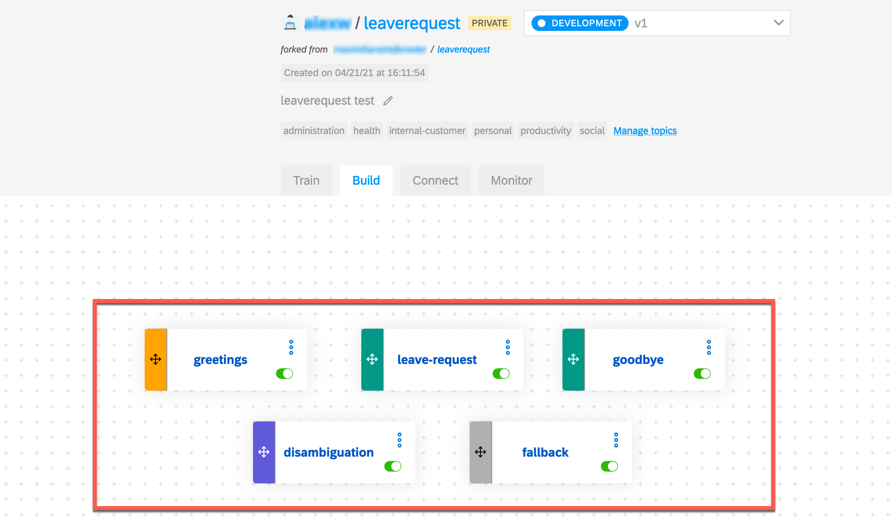
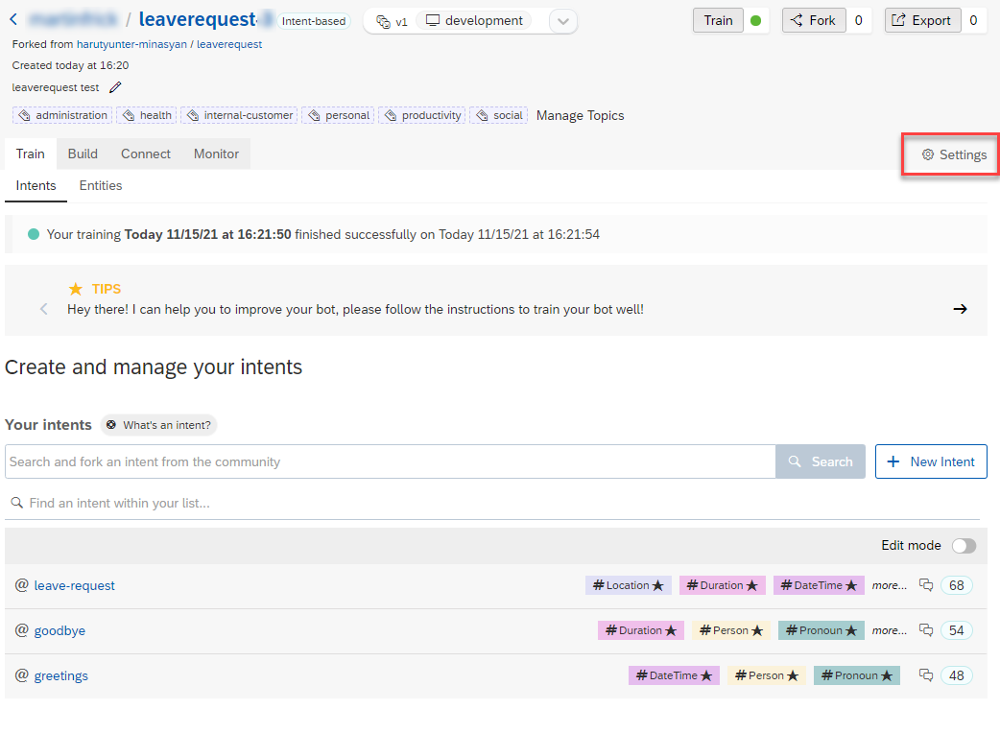
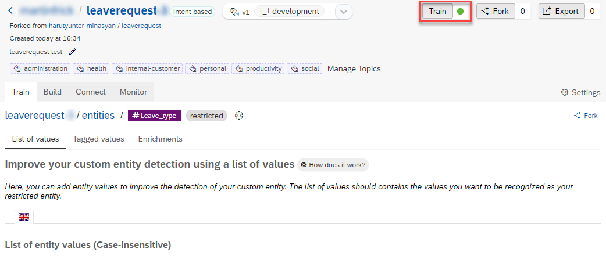

# Build Leave Request bot with SAP Conversational AI

In this part, you learn how to create an SAP Conversational AI Bot and understand how to trigger an SAP Cloud Integration instance from a SAP Conversational AI bot. 

### Step 1 - Create an account for SAP Conversational AI and get started

In this step you'll register for the SAP Conversational AI Community Edition and get used to the basic wording of SAP Conversational AI. 

---

1.1 If you haven't signed up for SAP Conversational AI so far, go to <https://cai.tools.sap/> and click **Sign Up** in the upper-right corner.
   
   > Use the same mail/account that you have used to sign up for the SAP BTP account to simplify the Identity authentication.

   Follow the instructions to create an account. 

   

   You will get an email with a link to validate your account.

1.2 In case you have already signed up for SAP Conversational AI or if you have already activated your account, use one of the login options on the start page. 

   

1.3 Open the following [URL](https://cai.tools.sap/harutyunter-minasyan/leaverequest/train/intents) in a new tab and **fork the bot** into your account.
   
   

1.4 Now go back to your own [SAP Conversional AI environment](https://cai.tools.sap/). You get a list of your bots. 

1.5 Click on the name of the bot to open the details. 

1.6 You have forked a predefined and trained bot with LeaveRequest intents (Intents are what the user intents to express when entering text in the chat) from another user that has made his bot public. 

   

1.7 Understand the 4 stages of a bot's life. The 4 phases are represented in the bot project by the 4 tabs. (Click on the corresponding tabs to see what the tab contains - no changes or concrete tasks from your side needed at this stage)
   
   
   
   There are 4 stages in your bot’s life:

   * **Train**: Teach your bot what it needs to understand.

     Here we defined the intents – ideas your bot will recognize – using expressions that the bot should recognize coming from the user. (e.g. Hi, I want to take leave request)

     

     For the LeaveRequest bot we defined 3 intents: leave-request, greetings, goodbye

   * **Build**: Create your conversational flow with Bot Builder tool. Here you give your bot skills it can perform.

     Here we created skills – things the bot can do – and defined when they will be triggered. The skills are defined by triggers, requirements (information your bot must collect), and the actions.

     

     >Bot Builder helps you construct the conversation flow of your bot.

     >Each skill represents one thing that your bot knows how to do.

   * **Connect**: Connect your bot to one or several messaging platforms.
     
     In this tutorial we integrate our SAP Conversational AI bot with Microsoft Teams (next part).

   * **Monitor**: See how users are communicating with your bot.
   
      Allows you to check if the bot is understanding users correctly, and make updates to the bots intents/entities. Monitoring also lets you see what your users want, and gives you ideas of what additional capabilities you could add to the bot.

### Step 2 - Configure the bot environment and add your SAP Cloud Integration credentials 

Let's adjust the forked bot to your needs and connect it to your instance of SAP Cloud Integration, which will finally trigger the SAP SuccessFactors API calls. The required SAP Cloud Integration credentials can be maintained in the environment section of your bot settings. You will now learn how this can be done in a very simple approach!

---

2.1 Go to the **Setting** of your forked bot.
    
   

2.2 Jump to the **Environments** section of your bot settings.
   
   

2.3 Open the [BTP Cockpit](https://cockpit.eu10.hana.ondemand.com/cockpit) in a new browser tab and navigate to **Instances and Subscriptions** in your development subaccount. Make sure you're using the subaccount in which also your SAP Cloud Integration instance is running.  

2.4 Find your Process Integration Runtime service instance like (in our case called **integration-flow**) and click on **keys** to open the service keys. If there is no service key yet, create a new service key by selecting the service instance, clicking on **Create** within the **Service Keys** section and naming the new service key e.g. **cai**.

If there is no instance of the Process Integration Runtime yet, you probably did not use the Booster for setting up your SAP Integration Suite tenant. Please check the following Tutorial [(click here)](https://developers.sap.com/tutorials/cp-starter-isuite-onboard-subscribe.html) or SAP Help [(click here)](https://help.sap.com/viewer/368c481cd6954bdfa5d0435479fd4eaf/Cloud/en-US/302b47b11e1749c3aa9478f4123fc216.html) to learn how to setup this type of required service instance. 

   > Here you can find all necessary credentials *(url, tokenurl, clientid, clientsecret)* that are needed for the next step. Keep this tab open to make it easy to copy&paste the values. 

   

2.5 Go back to the SAP Conversational AI browser tab. In the **Environments** section of you bot settings, toggle the details of the **development** environment. 
   
   

2.6 In the **development** environment, you can now provide details for the connection to **SAP Cloud Integration**. Therefor please toggle SAP Cloud Integration in the **System Alias Configuration** section.

   

2.7 In the URL field, paste the runtime URL of your SAP Cloud Integration instance, which is the **url** value of the service key that you opened in the seperate BTP tab recently (see step 2.4).

   

2.8 Copy & paste the value of **clientid** to the **Client ID** field. Do the same for **clientsecret** and paste it to the **Client secret** field in the System Alias Configuration. 

   

2.9 In a final step, Copy & paste the value of **tokenurl** to the the **Authorization URL** field of the System Alias Configuration. Double check, that you've mapped the correct fields once again. 
   
   
   
2.10 After updating the environment details, save the System Alias Configuration.
   
   

2.11 As a final step click on **Train** to train the bot a first time. 
   

You have successfully configured the bot to trigger an SAP Cloud Integration Flow in your own BTP environment, once the bot has fulfilled all requirements. 

 

### Step 3 - Sync your SAP SuccessFactors time types with your Leave Type entity

When handling employee times in SAP SuccessFactors, an employee typically has assigned multiple so called time types (like Sick Leave, Vacation, Jury Duty or many more). 

These time types can vary from country to country (e.g. GBR-SICK, DEU-SICK, BRA-SICK), so the list of available time types in an SAP SuccessFactors system can grow huge! Some of the time types may also have balance restrictions, like the time type Vacation, for which a user can only request a certain amount of hours. 

In this step, you will import the available time types from your SAP SuccessFactors system. This is required, as your bot needs to recognize, once a user decides for an available time type. A selected time type is one of the prerequisites which needs to be fulfilled, before a Leave Request can be created.  

3.1 To enrich the **Leave Type** entity with the corresponding time types of your SAP SuccessFactors system, please go to the **Train** tab of your bot. Here select the **Entities** tab and click on the custom entity **#Leave_type**.

3.2 You can see that this entity is already prepopulated with a list of **entity values**. These values are loaded from an SAP SuccessFactors demo instance and might not be suitable for your environment. Therefor please click on **Fetch** to get the respective entity values from your personal SAP SuccessFactors instance.

3.3 A dialog will open, which is calling an SAP Cloud Integration endpoint, to fetch the entity values from your SAP SuccessFactors instance. As you've configured your personal bot environment in one of the previous steps, you can click on **Fetch** straight away. SAP CAI will fetch the values from your custom SAP Cloud Integration instance. 

3.4 Please wait, while CAI is fetching the entity values from your SAP SuccessFactors instance. 

3.5 Once the data is loaded, please check that the **Transformation** was successful and a time type array is generated (as it can be seen in the following screenshot). Make sure you select **Replace** as import option and click on **Import** to update your custom entity values. 

3.6 The entity value list of your **#Leave_type** entity should now contain the time types of your SAP SuccessFactors instance. 

3.7 As a final step click on **Train** again, to train the bot once again! 

   

You have successfully updated the entity values of your custom entity **#Leave_type** based on the time types of your SAP SuccessFactors instance. 

### Step 4 - Testing your SAP Conversational AI bot

Please be aware, that your SAP Conversational AI bot cannot be tested from within SAP CAI at this moment. As the bot requires an e-mail address of the current user context, you will probably run into issues when testing the bot within SAP CAI. Once the bot is connected to Microsoft Azure and you're starting it with a test user from Microsoft Teams, this context is available. 

   
