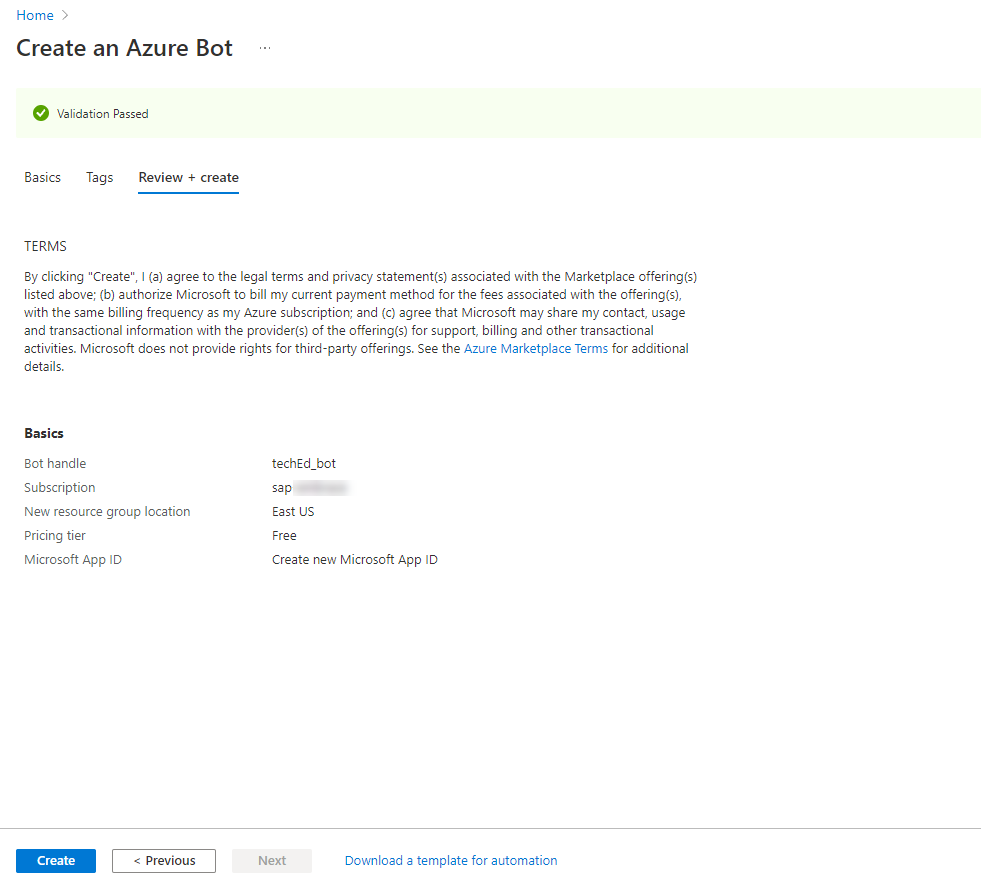
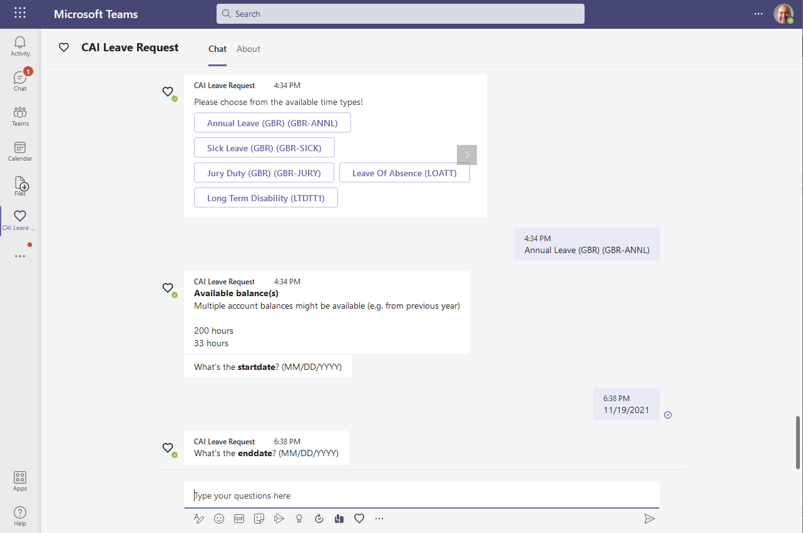

# Azure Bot

To be able to use your SAP Conversational AI Bot within MS Teams, you will need a so called Bot Channel registration within Microsoft Azure. A channel is a connection between a communication application like MS Teams, Alexa or Slack and the actual bot. To create a new Bot Channel in your Azure Active Directory please follow the following steps.

- 1 Login to your MS Azure account
- 2 Create an Azure Bot Channel
- 3 Get your app ID and create a secret
- 4 Connect SAP Conversational AI to MS Teams
- 5 Test your bot in Microsoft Teams

## 1 Login to your MS Azure trial account

1.1 Login into [MSAzureBot](https://portal.azure.com/#home) with your **Azure AD trial user**. 

1.2 For this exercise please make sure, you're within the **Default Directory** created with your Azure trial account.

## 2 Create an Azure Bot Channel

2.1 Go to the Azure Portal [MSAzureBot](https://portal.azure.com/#home)

2.2 Search for **Azure bot** and select the corresponding offering from the Marketplace.

2.3  Fill in the registration form as follows.

> Make sure you select the F0 free Pricing tier, unless you want to use it in production.

| Field Name       | Input Value                                                                                                                                                                          |
| ---------------- | ------------------------------------------------------------------------------------------------------------------------------------------------------------------------------------ |
| Bot handle       | A unique display name for the bot (which will appear in channels and directories – this can be changed later)                                                                        |
| Subscription     | Your Azure subscription (in  trial, only one)                                                                                                                                        |
| Resource Group   | Select a resource group. If you don’t have one yet,  then create a new one (A resource group is a collection of resources that share the same lifecycle, permissions, and policies.) |
| Location         | Choose a location near where your bot is deployed                                                                                                                                    |
| Pricing Tier     | F0 (10K Premium Messages)                                                                                                                                                            |
| Microsoft App ID | **Create new Microsoft App ID**                                                                                                                                                      |

2.4 Click on **Review and Create**. **Validation passed** should appear on the next screen.

2.5 Continue with **Create**. 

2.6 Wait until the deployment has finished. Click on **"Go to Resource"**

## 3 Get your app ID and create a secret

3.1 Open **Configuration in a new tab**.

3.2 <a name="appid">Note down the **Microsoft App ID**.</a> You will need this later on in SAP Conversational AI to establish the connectivity.

3.3 Select **Manage** to navigate to the secrets section of the application.

3.4 Select **New Client secret**, give the secret a name and finish the secret creation with **Add**.

3.5 <a name="secret">Note down the **Client Secret**.</a> You will need this later on in SAP Conversational AI to establish the connectivity.

## 4 Connect SAP Conversational AI  to MS Teams

4.1 Open a new tab and, go to [SAP Conversational AI](https://cai.tools.sap/) and open your bot.

4.2 Go to **Connect** tab and select Microsoft Teams via Microsoft Azure.

4.3 Provide the **App ID** ([in Azure known as **Microsoft App Id**, Step 3.2](#appid)) and **Password** ([in Azure known as Secret, Step 3.5](#secret)). You have noted down these values in the previous steps. 

4.4 Click on **Connect**.

4.5 Copy the Messaging endpoint.

4.6 Go back to one of the tabs that should still be open, where you have previously jumped off to create the secret. There you should have the Azure Bot configuration.   
**Paste** the messaging endpoint from SAP Conversational AI into the corresponding Input field in the Configuration form.

4.7 **Apply** the changes.

4.8 Connect your bot to channels.

4.9 Go to **Channels** and select the **Microsoft Teams** icon.

4.10 **Save** the Channel without any further adjustments.

## 5 Test your bot in Microsoft Teams

5.1 Go to **Channels (Preview)** and open your bot in Microsoft Teams.

5.2 You'll most likely get asked if you want to use your Desktop or Web app. **Make sure you are using the webapp**. 

   > For the sake of simplicity we are using the web app of Microsoft Teams, where you can easily log in with your Microsoft365 user and don't get any overlaps with already logged in accounts in your Desktop app. 

5.3 If you are asked to log in, use your **Microsoft365 developer account**!

5.4 You can now have a conversation with the Chatbot within Microsoft Teams. 

