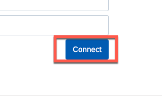

# Microsoft Azure Bot

To be able to use your SAP Conversational AI Bot within Microsoft Teams, you will need a so called Bot Channel registration within Microsoft Azure. A channel is a connection between a communication application like Microsoft Teams, Alexa or Slack and the actual bot. To create a new Bot Channel in your Azure Active Directory please make use of the following steps.

 

### Step 1 - Microsoft Azure & Microsoft365 Developer account

1.1 Create a Microsoft Azure (trial) account

This step of the tutorial requires an active **Microsoft Azure** account. In case you don't have access to an enterprise Azure subscription, you can create a Microsoft Azure **trial account** yourself. Therefor, please follow the steps described in the **Basic scope** of this scenario.

[Setup Free Microsoft Azure Account](https://github.com/SAP-samples/btp-extend-workflow-cai-msteams/blob/basic-scope/Part0/README.md)

1.2 Create a Microsoft365 Developer account

Please make sure, you're also subscribing to a **Microsoft365 Developer account** and add a respective Microsoft Office365 user to your **Azure AD**. This user will be required in a later step of this tutorial to test your chatbot within Microsoft Teams. The process is also described in the **Basic scope** of this scenario. In case you're using an entprise Microsoft Azure subscription, make sure you also comply with this requirement. 

[Setup Microsoft365 Developer Account](https://github.com/SAP-samples/btp-extend-workflow-cai-msteams/blob/basic-scope/Part0/README.md#step-4---create-a-microsoft365-developer-account)

**IMPORTANT:** For successfull testing, you need to ensure, that your Microsoft365 user which you are using for testing purposes, needs to have the same e-mail address as your dedicated SAP SuccessFactors user. Otherwise a mapping between Microsoft and SAP environment is not possible! 

 

### Step 2 - Login to your Microsoft Azure (trial) account

2.1 Login to [Microsoft Azure Portal](https://portal.azure.com/#home) with your personal **Azure AD** (trial) user. 

2.2 In case you're using an Azure trial environment - Please make sure, you're within the **Default Directory** created with your Azure trial account.

 

### Step 3 - Create an Azure Bot Channel

3.1 Go to the Azure Portal [Microsoft Azure Portal](https://portal.azure.com/#home) (if not yet there).

3.2 Search for **Azure Bot** and select the corresponding offering from the Marketplace.

3.3 Fill in the service detail form as follows.

| Field Name       | Input Value                                                                                                                                                                          |
| ---------------- | ------------------------------------------------------------------------------------------------------------------------------------------------------------------------------------ |
| Bot handle       | A unique display name for the bot (which will appear in channels and directories – this can be changed later)                                                                        |
| Subscription     | Your Azure subscription (in  trial, only one)                                                                                                                                        |
| Resource Group   | Select a resource group. If you don’t have one yet, then create a new one (A resource group is a collection of resources that share the same lifecycle, permissions, and policies.) |
| Location         | Choose a location which is close to you, where your bot is deployed                                                                                                                                    |
| Pricing Tier     | F0 (10K Premium Messages)                                                                                                                                                            |
| Microsoft App ID | **Create new Microsoft App ID**                                                                                                                                                      |
> Make sure you select the F0 free pricing tier, unless you want to use it in production.

3.4 Click on **Review and Create** to be guided to the next step. Here the message **Validation passed** should appear on the screen.

3.5 Continue with **Create**. 

3.6 Wait until the deployment has finished. Then click on **"Go to Resource"**

You have sucessfully created your first Azure bot channel. 

 

## Step 4 - Get your app ID and create a secret

4.1 Open the section **Configuration** in a new browser tab.

4.2 Note down the **Microsoft App ID**. You will need this later within SAP Conversational AI to establish the connectivity.

4.3 Select **Manage** above your **Microsoft App ID** to navigate to the secrets section of the application registration.

4.4 Select **New Client secret**, give the secret a name and finish the secret creation with **Add**.

4.5 Note down the **Client Secret**. Like the Microsoft App ID, you will need it later within SAP Conversational AI to establish the connectivity.

 

## Step 5 - Connect SAP Conversational AI to Microsoft Teams

5.1 Open a new browser tab, go to [SAP Conversational AI](https://cai.tools.sap/) and open your bot.

5.2 Go to the **Connect** tab and select Microsoft Teams via Microsoft Azure.

5.3 Provide the **App ID** ([in Azure known as **Microsoft App Id**, see Step 4.2](#appid)) and **Password** ([in Azure known as Secret, see Step 4.5](#secret)). As recommended, you have propably noted down these values in the previous steps. 

5.4 Click on **Connect**.

5.5 Copy the Messaging endpoint which you can see on your screen. 

5.6 Go back to the browser tab in which you've started the Azure bot channel configuration. Here you should see a section called **Configuration**. **Paste** the **Messaging endpoint** of SAP Conversational AI into the corresponding Input field of the Configuration form.

5.7 **Apply** the changes.

5.8 The complete the connection setup between your SAP CAI bot and Microsoft teams, switch to the **Channels** section and select the **Microsoft Teams** icon.

5.9 **Save** the Channel configuration without any further adjustments.

 

### Step 6 - Test your bot in Microsoft Teams

6.1 Switch to **Channels (Preview)** and open your bot in Microsoft Teams.

6.2 You'll most likely be asked if you want to use your Microsoft Teams Desktop or Web app. **Make sure you are using the Web app**. 

   > For the sake of simplicity we are using the Web app of Microsoft Teams, where you can conveniently login with any Microsoft365 user. Using the Desktop app, there might be overlaps with already logged in accounts like your Microsoft Teams office profile. 

6.3 If you are asked to log in, use your **Microsoft365 developer account**!

6.4 You can now have a conversation with the Chatbot within Microsoft Teams. 

