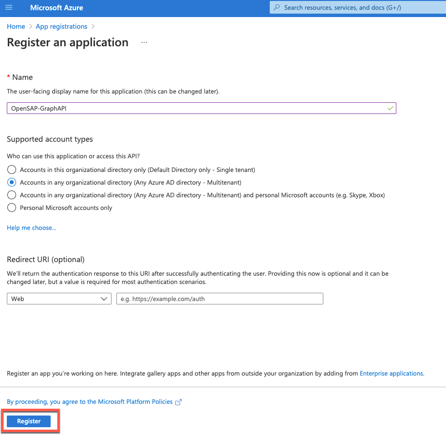
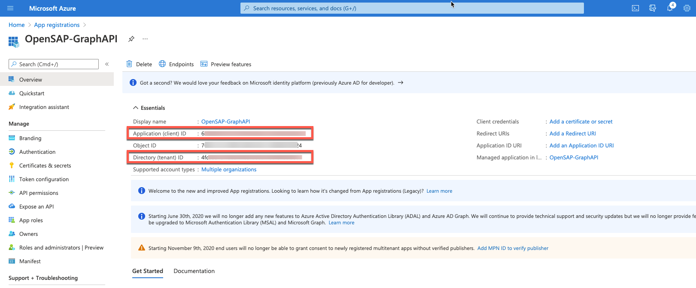
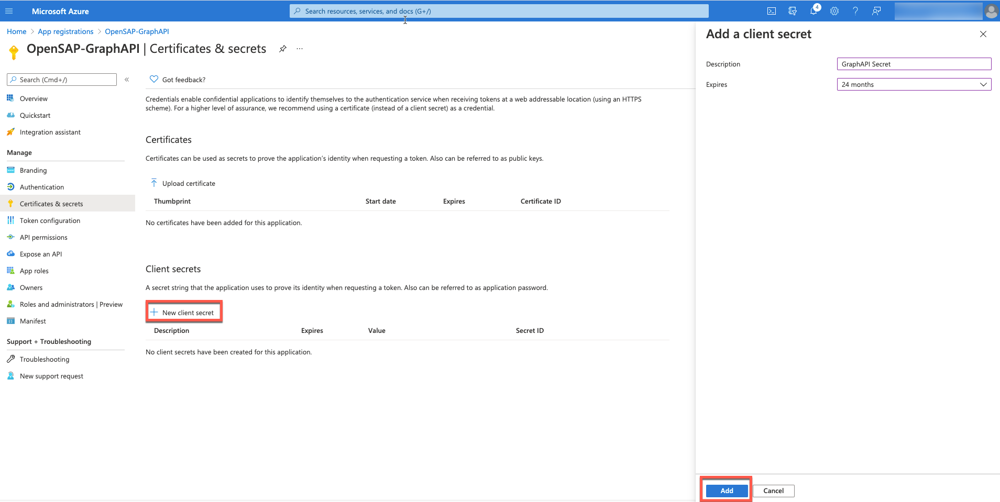
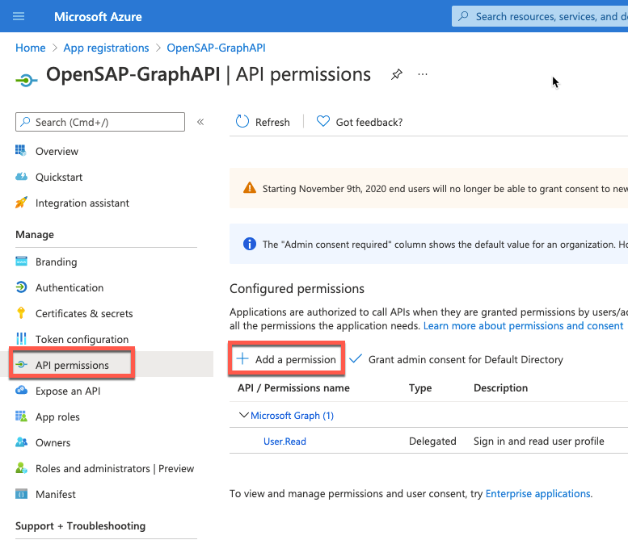
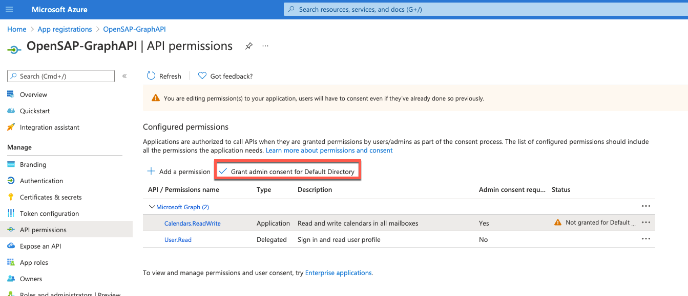
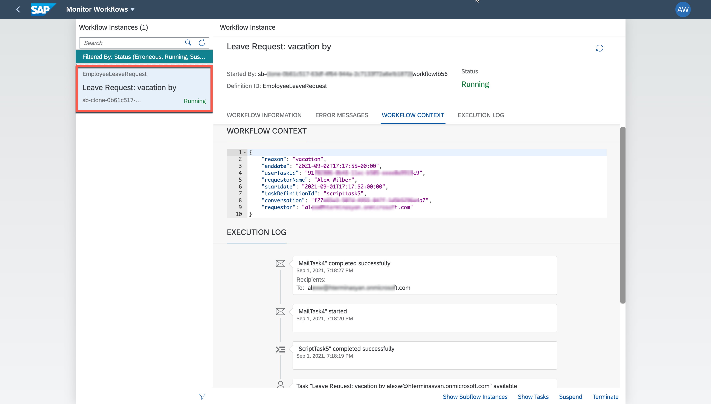
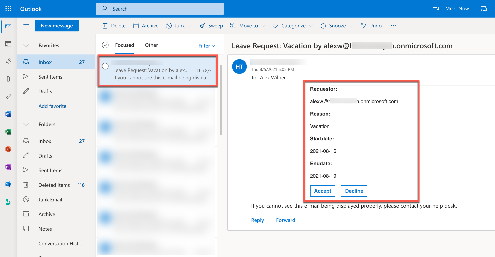
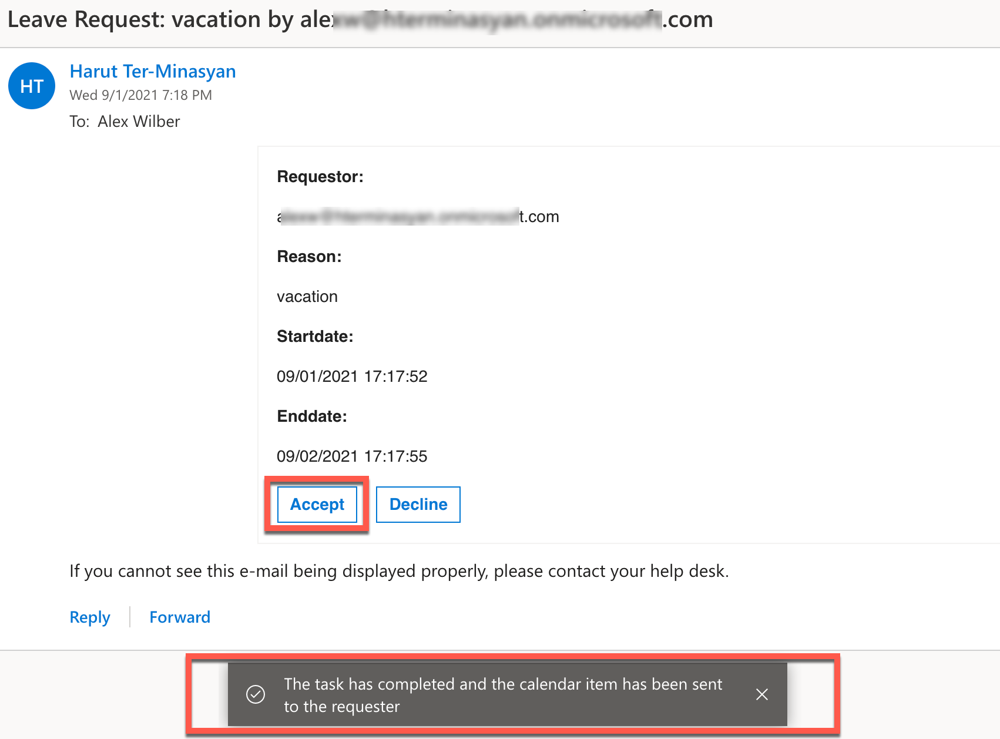
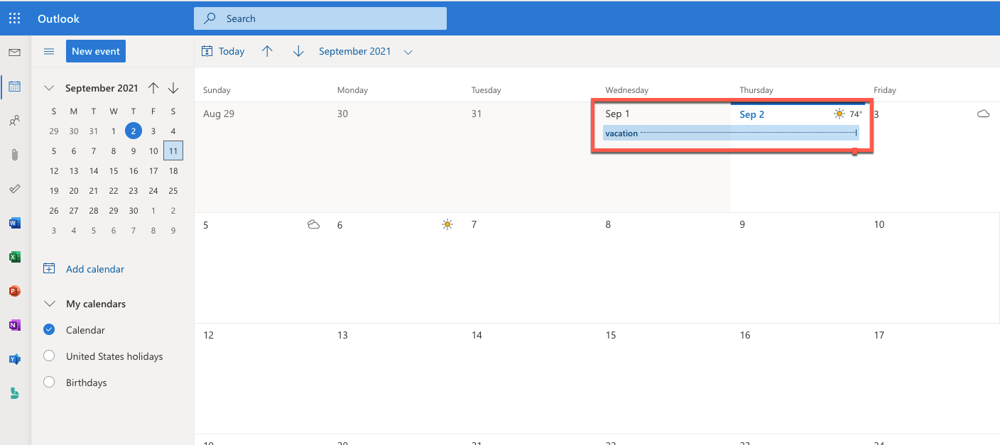

# Create calendar entry using Microsoft Graph

As a final step, after sending adaptive cards we continue the workflow from Microsoft Outlook and create a Calendar entry triggered via API call from SAP BTP using Microsoft Graph APIs. 

Microsoft Graph provides a central endpoint with access to data and services of Microsoft 365. To test the available APIs you can use [Microsoft Graph Explorer](https://graph.microsoft.com) as a playground to test.

## Step 1 - Register an App in Azure Active Directory

In this step we need to create an application in Azure Active Directory to grant the Graph API permissions.

### 1.1. Sign-in in you [Azure Portal](https://portal.azure.com/) with your **Microsoft 365 User**

### 1.2. Search and open the "App registrations"

### 1.3. Create "New Registration"

* Provide the Application Name e.g. "OpenSAP-GraphAPI"
* Select the account type - "Accounts in any organizational directory (Any Azure AD directory - Multitenant)" 
* Click on "Register"

### 1.4. Note down following details required for the next step

* Application (client) ID
* Directory (tenant) ID

### 1.6. Go to "certificates & secrets" and create "New client secret"

The application will use this secret to prove its identity when requesting a token.

### 1.7. Note down the secret value for the next step

### 1.8. Add the API Permissions for Microsoft Outlook Calendar

* Go to permissions and "Add a permission"
  
* Select Microsoft Graph > Application permissions (where the application runs as a background service or daemon without a signed-in user)
* Add the permission **Calendars.ReadWrite** which is required for creating Calendar entry in Outlook.
 

 ### 1.9. Grant admin consent for Default Directory 

 

## Step 2 - Configure SAP BTP destination for Microsoft Graph

The custom Java app uses the SAP BTP destination service to interact with Microsoft Graph.
For authentication, OAuth2ClientCredentials needs to be selected and the Client ID & Secret from the previous app registration is set.

### 2.1. Download following [Destination Configuration](https://github.com/SAP-samples/btp-extend-workflow-cai-msteams/blob/basic-scope/sample-coding/btp-wf-outlook-integration/MSGraphAPI)

### 2.2. Open SAP BTP Cockpit and navigate to Connectivity/Destinations and "Import Destination" from previous step

 

### 2.3. Update the *Client ID, Client Secret and Directory (tenant) ID* from **Steps 1.4 & 1.7** and save it

Use the Client ID, Client Secret and Directory (tenant) ID from Azure app registration and update the destination

 

## 3 - Test the scenario End to End

### 3.1. Open Microsoft teams and request a leave

### 3.2. We can go to SAP Workflow Management and open Workflow Instance Monitor, to validate that the task was successfully created. 
    

You can see that the task is created and is running.

### 3.3. After confirmation that the workflow task was successfully triggered, open your Outlook

>Note, in this demo example the requestor and approver are the same person

In your Outlook Inbox you will find an email from your employee requesting leave with the necessary information including **"Accept"** and **"Reject"** buttons to directly approve or reject the request from outlook. The Email is rendered as an Adaptive Cards and allows you to perform actions.

### 3.4. Now when you Accept or Decline the request, the workflow task will be completed accordingly and  calendar item has been sent to the requestor

Click on **Accept**, you should get a confirmation that task has completed

### 3.4. Open Microsoft Calendar, where you will find a calendar entry for the approved days of leave

# Summary

Congratulations! you successfully completed the Part 5 where you learned how to create a calendar entry using Microsoft Graph and SAP BTP. Moreover you should  now know how to explore the APIs using Microsoft Graph Explorer, register an app in Azure Active Directory, finally configure a destination in SAP BTP.

This is end of scenario. You learned how to extend your business workflow with Microsoft Teams and Microsoft Outlook using SAP Business Technology Platform and Microsoft Azure.
Now you know how to trigger an SAP workflow from an SAP Conversational AI bot,
integrate SAP Conversational AI with Azure Bot and Microsoft Teams. Moreover you learned how to transform SAP Workflow Forms into Microsoft Adaptive Card format 
and send adaptive cards from an SAP workflow. Finally do a quick actions right within the Microsoft Outlook email client using Outlook actionable messages

