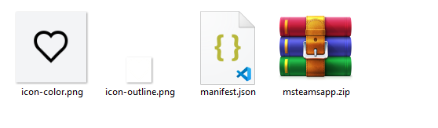

# Microsoft Teams App

To make your Leave Request Bot available as a custom app within Microsoft Teams, you have to upload the required configuration information to your Microsoft Teams organization. This can be done within the Microsoft Teams client or from the Microsoft Teams admin interface. In this documentation, we will show you how to upload the app definition in your Microsoft Teams client. The process consists of three steps:

1 Define your app's manifest file and relevant app icons\
2 Zip your app files and upload them to your Microsoft Teams organization\
3 Add the Microsoft Teams app to your user's Microsoft Teams instance

## 1 Define your app's manifest file and relevant app icons

The definition of your app and the features provided by this app are described in a manifest.json file. This file contains e.g. the Id of your Microsoft Azure application registration, the name and description of your app and further information required by Microsoft Teams to host your app and provide it to other users. The basic version of a manifest.json file required for your Teams app, looks like the following. For further details of the manifest.json file definition, please check the following url: </br>

https://docs.microsoft.com/en-us/microsoftteams/platform/resources/schema/manifest-schema

```json
{
  "$schema": "https://developer.microsoft.com/en-us/json-schemas/teams/v1.8/MicrosoftTeams.schema.json",
  "manifestVersion": "1.8",
  "version": "1.0.0",
  "id": "<microsoft app id>", -- e.g. b52dc093-a1b2-c1c2-c2c3-e155062c4be9
  "packageName": "<package name>", -- e.g. com.mycompany.sfsf.caileaverequest
  "developer": {
      "name": "<company name>", -- e.g. SAP
      "websiteUrl": "<url>", -- e.g. https://www.mycompany.com
      "privacyUrl": "<privacy url>", -- e.g. https://www.mycompany.com/privacy
      "termsOfUseUrl": "<terms-of-use url>" --e.g. https://www.mycompany.com/terms
  },

  "name": {
      "short": "<name of your app (<=30 chars)>", -- e.g. Leave Request
      "full": "<full name of app, if longer than 30 characters (<=100 chars)>" -- e.g. SuccessFactors Leave Request
  },
  "description": {
      "short": "<short description of your app (<= 80 chars)>", -- e.g. Leave Request
      "full": "<full description of your app (<= 4000 chars)>" -- e.g. SuccessFactors Leave Request
  },
  "icons": {
      "color": "<relative path to a transparent .png icon — 32px X 32px>", -- e.g. icon-color.png
      "outline": "<A relative path to a full color .png icon — 192px X 192px>" -- e.g. icon-outline.png
  },
  "accentColor": "<html color code>", e.g. #FFFFFF
  "bots": [
    {
      "botId": "<microsoft app id registered with bot framework>", -- e.g. b52dc093-a1b2-c1c2-c2c3-e155062c4be9
      "scopes": [
        "personal"
      ],
      "supportsFiles": false,
      "isNotificationOnly": false
    }
  ],
  "permissions": [
      "identity",
      "messageTeamMembers"
  ],

  "validDomains": [
      "*.botframework.com"
  ]
}

```

A sample manifest.json and two png files (icons for your app) can be found in this GitHub repository. Please be aware, that you still need to exchange the Microsoft Azure application registration ids within this manifest.json file. You have to insert your own ids here to make your bot work. Simply search for <<MicrosoftAppId>> and replace it with the id of the application registration created for your bot in Part 4 of this mission. 


## 2 Zip your app files and upload them to your Microsoft Teams organization

2.1 Before you upload your manifest.json file and the corresponding png files to your Microsoft Teams organization to make it available for other Microsoft Teams users, you have to zip all three files into one archive. Therefor please go to the folder where you stored your files and zip the three files. The zip file name can be chosen by you. 

 

2.2 Now open Microsoft Teams on your desktop device or go for the web version (https://teams.microsoft.com/) in your browser. Login with your **Microsoft Office 365** user, which you've added to your Microsoft Azure Active Directory. To upload new apps into your Microsoft Teams organization, this user needs the following role assignment in your Microsoft Azure AD. In case of error or missing buttons, check if this role is assigned correctly! 

 

2.3 Within Microsoft Teams or the Microsoft Teams web application, click on **Apps** and then on **Upload a custom app**. Select **Upload for my org**. There are also other approaches for distributing new apps to other Microsoft Teams users, but for a simple demo purpose, you can follow this approach. 

 

2.4 Select your zip archive and confirm to upload the app to your Microsoft Teams organization. 

2.5 Once the upload has finished, you can find your app in the section **Built for your org**. 

 

## 3 Add the Microsoft Teams app to your user's Microsoft Teams instance

3.1 Add the app to your current user's Microsoft Teams instance, by clicking on the app tile and selecting **Add** in the popup. 

 

3.2 The app should become visible in your menu on the left side of the Microsoft Teams application. If it doesn't open automatically, select the app from the menu and pin it using a right-click. You should either see a welcome message sent by the bot or you need to type a message like **Heyhey!** to initialize the conversation.

 

 

3.3 The last two steps (3.1 and 3.2) can now also be performed by other user within your organization, to add the app to their Microsoft Teams instance. 

