# Task Center

**!Important!**

The SAP Task Center service General Availability is planned for the end of November 2021 (subject to change). This mission's primarily purpose is the demonstration of a working end-to-end scenario including the Task Center service. Once the service is available, feel free to try this part of the mission yourself. Until then, you can make sure, that you're fulfilling the prerequisites for the Task Center Integration. In this case, especially the availability and integration of an IAS and IPS instance are relevant and can even be worked on before the actual Task Center provisioning. 

**!Important!**

The new Business Technology Platform Task Center service, allows you to manage tasks of a user in a central place, integrating various LoB solutions like S/4HANA Cloud, SuccessFactors or Ariba, as well as 3rd party task providers in the future (current state of planning which is subject to change).

To make use of the Task Center Service within this Leave Request scenario, some basic requirements have to be fulfilled, before the tasks become visible in your Task Center instance. The following six steps will give you some guidance on how to integrate the Task Center into this mission. As the requirements and configurations steps highly depend on the available landscape components (SuccessFactors instance, IAS tenant, Corporate IdP), you might need to 

- 1 Provision an instance of the Task Center service using the respective booster
- 2 Integration between SuccessFactors and your custom IAS/IPS instance
- 3 Configuration of Task Center settings on SuccessFactors side
- 4 Configuration of Task Center destinations in the Business Technology Platform
- 5 Enable the Push of Tasks from SuccessFactors to SAP Task Center
- 6 Check your integration of Task Center and SuccessFactors
- 7 Test & Demo implementation without IAS/IPS integration in SFSF

As the Task Center services heavily relies on the so called User UUID (a technical id) which uniquely identifies a user across all potential Task Providers, the IAS/IPS integration plays a key role in the Task Center implementation. The User UUID is managed by the IAS and has to be provisioned of all subsequent Task Providers, to ensure a Task is always sent to the correct user, no matter from which system the Task arrives. 

**Please read before you continue:**

The following SAP Note describes the Supported Scenarios, Requirements and Restrictions concerning the Task Center implementation. Concerning SuccessFactors, the availability of the required components is limited to specific data centers. Make sure your data center fulfills the respective requirements!
https://launchpad.support.sap.com/#/notes/2977611

</br> 

## The architecture idea of SAP Task Center

The following simplified architecture describes the process of how the Task Center is integrated with SuccessFactors. A full architecture picture would most likely include further components like a Corporate Identity Provider. As already explained, the central requirement for a smooth Task Center integration is based on a working IAS/IPS integration. 

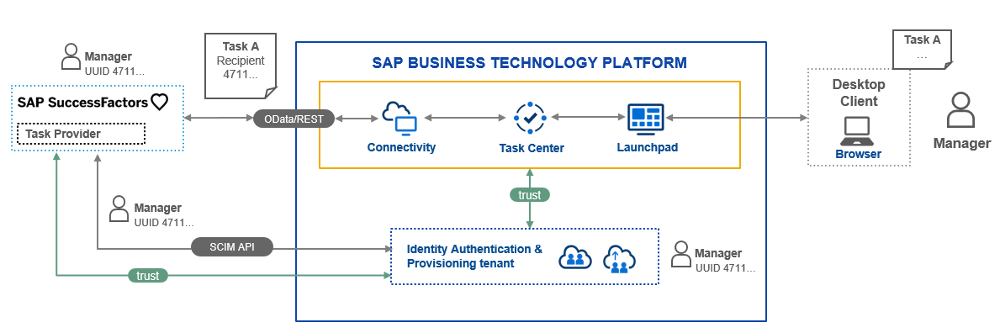

As of today, in case of SuccessFactors the integration starts from the LoB solution itself. Let's assume a new employee called **Manager** is created in SuccessFactors. Once persisted in the database, IPS will fetch the user changes from SuccessFactors on a regular basis. In this case, the **Manager** user will be imported into the IAS, which is the target system of the IPS import process. Once the user is created in IAS, a User UUID is automatically created by IAS. An automated process now ensures, that this User UUID is propagated back to SuccessFactors so after this process, the **Manager** user is know to SuccessFactors and IAS by the same unique identifier. 

After the Task Center service has been successfully configured within BTP, SuccessFactors will push latest task updates in a regular basis to BTP. Beside the Task content, SuccessFactors also sends an information about the target recipient of the task. In this case our **Manager** user identified by his unique User UUID. Here you can see an example for a task being send from SuccessFactors to SAP Task Center service in BTP, which contains the unique User UUID of the recipient.

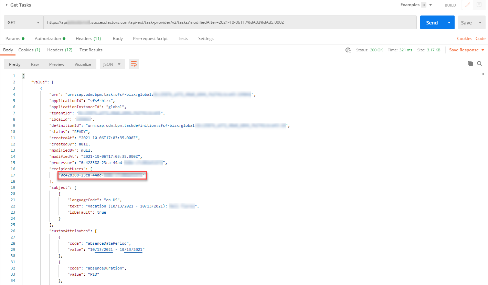

The task information is stored within BTP and once the user with the respective UUID opens the Task Center, the tasks matching his UUID show up. To make this possible, there needs to be a trust between BTP and the custom IAS storing the user with the respective UUID. The user needs to open the Launchpad service using this IAS so the correct UUID assignment is possible. 


## 1 Provision an instance of the Task Center service using the respective booster

To create an instance of the Task Center within your BTP subaccount, you need to fulfill some prerequisites listed below: 
- You require an enterprise BTP account (Task Center is not available in a Trial environment)
- You require a Trust Configuration with your custom IAS instance 
    > Only one trust configuration may be configured in the relevant subaccount!</br>
    > Use the same custom IAS instance which is also used for your SuccessFactors instance!
- You require a SAP Launchpad subscription in your subaccount
- Your subaccount must be enabled for Cloud Foundry usage

Further details can be found in the relevant documentations on the following SAP Help sites. </br>

The Task Center can be easily provisioned into your BTP subaccount be running the available booster. The process is described int the following SAP Help site: </br>
https://help.sap.com/viewer/08cbda59b4954e93abb2ec85f1db399d/Prod/en-US/3a499676e7ae4282af84092f778e3737.html

In case you prefer a manual configuration within your subaccount, please follow the following documentation: </br>
https://help.sap.com/viewer/08cbda59b4954e93abb2ec85f1db399d/Prod/en-US/0f00d3d3e2ab460c856d409c469fb4f1.html

</br> 

## 2 Integration between SuccessFactors and your custom IAS/IPS instance

Your SuccessFactors instance must have a working integration with the same IAS/IPS instance which you've configured as Trusted Identity Provider within your BTP subaccount! The process of integration between SuccessFactors and your custom IAS/IPS is not trivial and also not scope of this mission, we assume, that you've already configured this integration successfully. If not, we strongly recommend, going through the following documentations and KBA to get an idea of the whole process.  

[SAP Help] Setting Up SAP SuccessFactors with Identity Authentication and Identity Provisioning Services
https://help.sap.com/viewer/568fdf1f14f14fd089a3cd15194d19cc/2105/en-US/fb069584363a4df08aad42315cebdd6d.html 

[KBA] Integrating SuccessFactors with Identity Authentication
https://userapps.support.sap.com/sap/support/knowledge/en/2791410 

In case you're using a (demo) landscape in which you haven't configured any IAS/IPS integration at all yet, please check the simplified option linked below, which can be used for testing purposes but is definitely not intended for a productive scenario! In this case, the User UUID is not synced to SuccessFactors via IAS and IPS but is set manually via the SCIM API. 

GitHub Link

</br> 

## 3 Configuration of Task Center settings on SuccessFactors side
The Task Center configuration for SuccessFactors is well described in the following SAP Help documentation. Please be aware, that the documentation is linking to some subsites, which need to be read and processed before you continue with the main documentation. 

[SAP Help] Task Center - SuccessFactors Integration </br>
https://help.sap.com/viewer/DRAFT/08cbda59b4954e93abb2ec85f1db399d/Prod/en-US/eae23f3a679d481295ff05bdb322f859.html 

As described in the documentation, you should stick to the following steps:

3.1 Go through the prerequisites described in the Task Center documentation </br>
https://help.sap.com/viewer/08cbda59b4954e93abb2ec85f1db399d/Prod/en-US/eae23f3a679d481295ff05bdb322f859.html 

> Most of the described prerequisites relate to a working integration between your custom IAS/IPS instance and your SuccessFactors instance. If you cannot provide such an integration within your landscape, only the link to the “Enabling To-Do Task Integration” documentation is relevant for you. 

3.2 Go through the prerequisites described in the relevant “Enabling To-Do Task Integration” documentation linked in step 1. </br>
https://help.sap.com/viewer/568480cc877d4337992a2cd9792fbfed/2105/en-US/c15f23f6f4e24ddea84d5be8e6b935ae.html 

> Again, a working IAS/IPS integration is the most important message described in this step. The prerequisite also links to the required documentations to setup this integration! If you cannot provide an IAS/IPS integration in your landscape, ensure that you at least understand the other prerequisites and limitations! 

> FYI - The following hint relates to the configuration of the IAS/IPS integration.

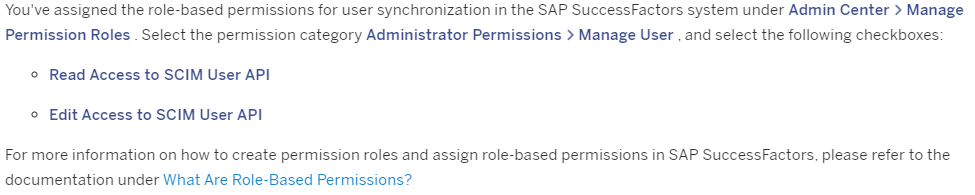
 
3.3 Follow the procedure described to activate the Enhanced To-Do integration
https://help.sap.com/viewer/568480cc877d4337992a2cd9792fbfed/2105/en-US/c15f23f6f4e24ddea84d5be8e6b935ae.html 


3.4 Download the Trust Certificate from your BTP Task Center subaccount
To get your Trust Certificate which is required to configure the respective OAuth Clients within SuccessFactors, please follow the Procedure described in the following SAP Help site:
https://help.sap.com/viewer/08cbda59b4954e93abb2ec85f1db399d/Prod/en-US/eae23f3a679d481295ff05bdb322f859.html </br>

Save the certificate on your local device for later usage. 

3.5 Create the required OAuth Clients in SuccessFactors by logging into your instance as an administrator or another user which is authorized to maintain OAuth Clients. Go to Admin Center -> API Center  -> OAuth Configuration for OData and choose **Register Client Application**. You can also access the tool by searching **Manage OAuth2 Client Applications** in Action Search.

3.6 Create an OAuth Client used for the primary connection between Task Center and SuccessFactors by using the information described on the second section of the following SAP Help site:
https://help.sap.com/viewer/08cbda59b4954e93abb2ec85f1db399d/Prod/en-US/dc5407b42c7e435b8124ee7a0816249c.html 

> Hints: The Application URL shouldn't have any influence on the functionality so please follow the proposal from the documentation. </br>
> The Technical User ID needs to be configured as stated in the documentation! </br>
> The certificate required has been downloaded in Step 4 of this documentation. Please make sure to only Copy & Paste the lines **between** -----BEGIN CERTIFICATE----- and -----END CERTIFICATE-----. 

Once saved, a sample configuration of the first OAuth Client could look like the following:
    
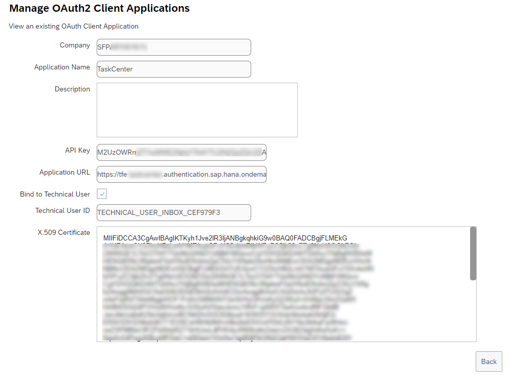

Copy the API Key of this OAuth Client, once you saved it by clicking on **View** next to the Client. 

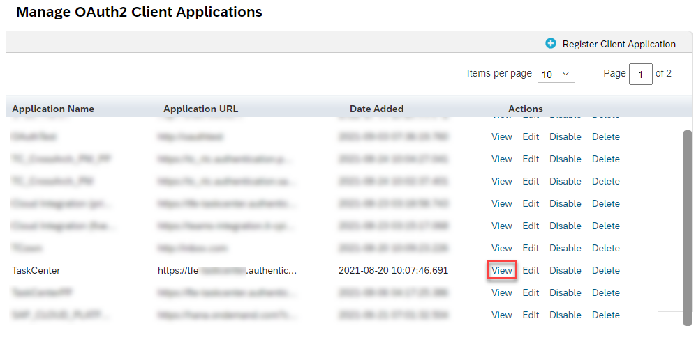


3.7 Create a secondary OAuth Client used for Principal Propagation between Task Center and SuccessFactors by using the information described on the first section of the following SAP Help site:
https://help.sap.com/viewer/08cbda59b4954e93abb2ec85f1db399d/Prod/en-US/bf657f8adefa4a468aa3c71783fca291.html

> Hints: The Application URL shouldn't have any influence on the functionality so please follow the proposal from the documentation. </br>
> The certificate required has been downloaded in Step 4 of this documentation. Please make sure to only Copy & Paste the lines **between** -----BEGIN CERTIFICATE----- and -----END CERTIFICATE-----. 


Once saved, a sample configuration of the second OAuth Client could look like the following:
    
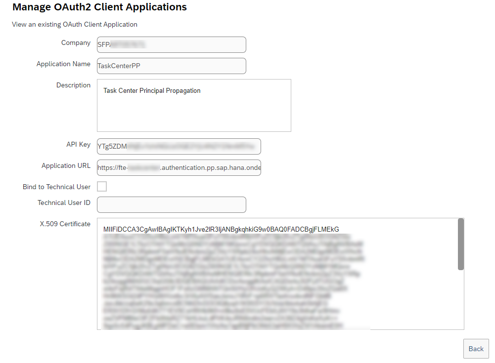

Copy the API Key of this OAuth Client, once you saved it by clicking on **View** next to the Client. 

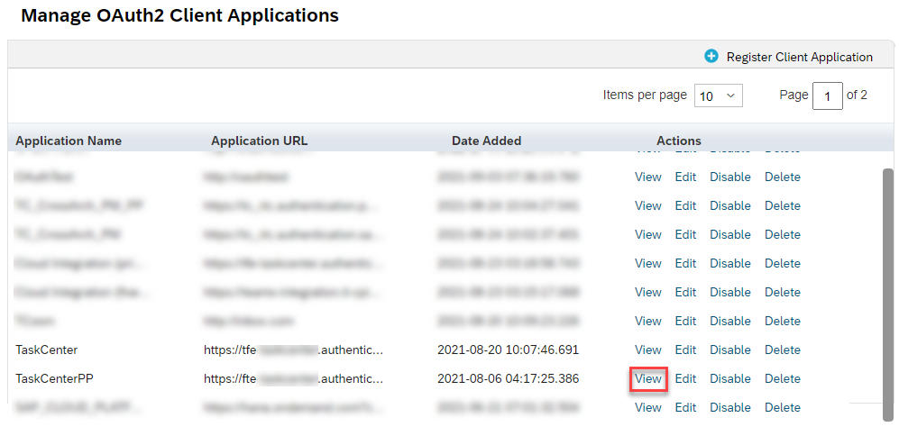


## 4 Configuration of Task Center destinations in the Business Technology Platform

4.1 To create the required destinations in your BTP subaccount, you need to create a new Service Key for your Task Center instance as the Client Credentials need to be provided in the destination. Therefor please go the **Instances and Subscriptions** section of your BTP Subaccount and create a new service key for your Task Center service. Give it a unique name and click on **Create**.

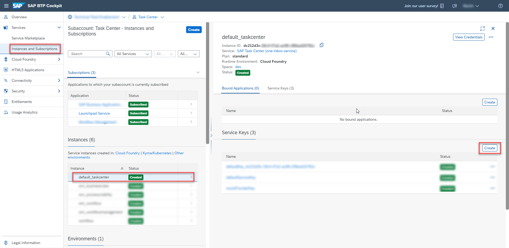

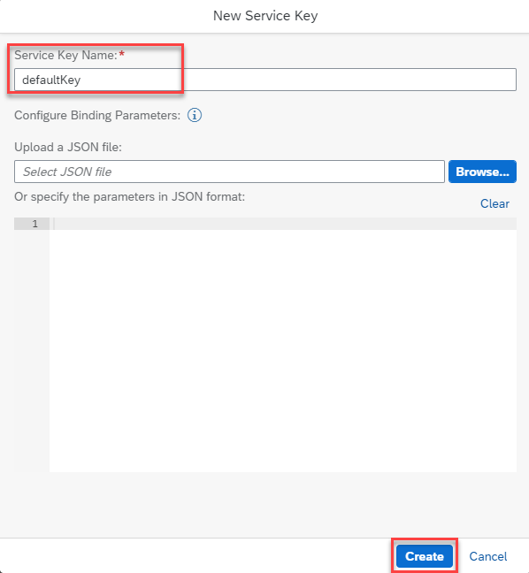

4.2 Once the service key is created, please copy the credentials content of the service key, by clicking on the service key. Save it into a temporary local file (e.g. txt file) for later reference. The following parts of the JSON object will be required in the further steps of this configuration.

> endpoints > inbox_rest_url </br>
> uaa > url </br>
> uaa > clientid </br>
> uaa > clientsecret </br>
    


4.3 In case you've provisioned your Task Center instance using the respective Booster, you should find some sample destinations within your BTP subaccount **Destinations** section. Within these destinations, you can find the **Success_Factors** and **Success_Factors_PP** (Principal Propagation) entries. These destinations will be configured in the following steps. If you haven't used the Booster for provisioning of the Task Center, please find the destination details in the respective documentation. 

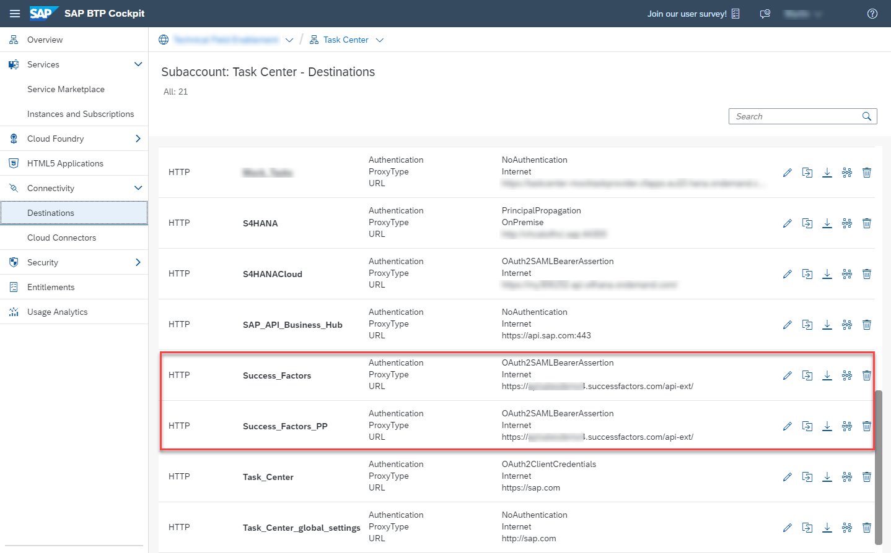


4.4 Configure the primary destination to SuccessFactors by editing the **Success_Factors** entry (or creating a new destination with this name). The configuration is straight forward and the respective details can be found on the following SAP Help site from section three onward:

https://help.sap.com/viewer/08cbda59b4954e93abb2ec85f1db399d/Prod/en-US/dc5407b42c7e435b8124ee7a0816249c.html

> Hints: Be aware you will require the Client Credential information now, which you've saved in Step 4.2.
> You will require the API Key of the first OAuth Client which you've created in SuccessFactors (see Step 3.6). 

A final configuration of your **Success_Factors** destination could look similar to the following:

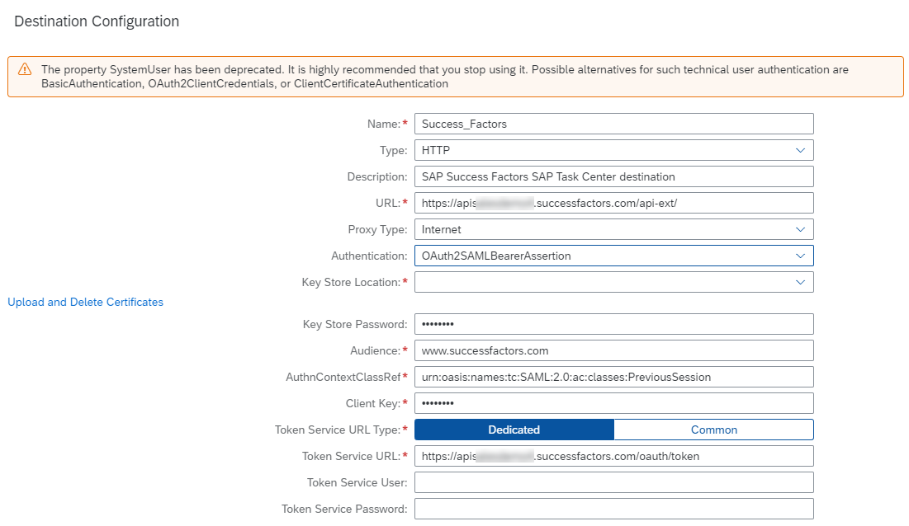
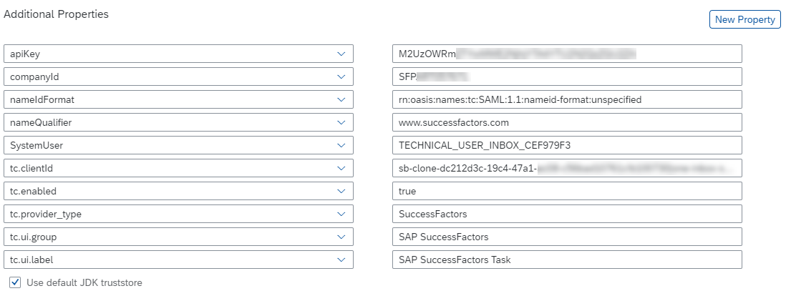


4.5 Configure the secondary destination to SuccessFactors by editing the **Success_Factors_PP** entry (or creating a new destination with this name). The configuration is straight forward and the respective details can be found on the following SAP Help site from section two onward:

https://help.sap.com/viewer/08cbda59b4954e93abb2ec85f1db399d/Prod/en-US/bf657f8adefa4a468aa3c71783fca291.html

> Hints: Be aware you will require the Client Credential information now, which you've saved in Step 4.2.
> You will require the API Key of the first OAuth Client which you've created in SuccessFactors (see Step 3.6). 

A final configuration of your **Success_Factors_PP** destination could look similar to the following:

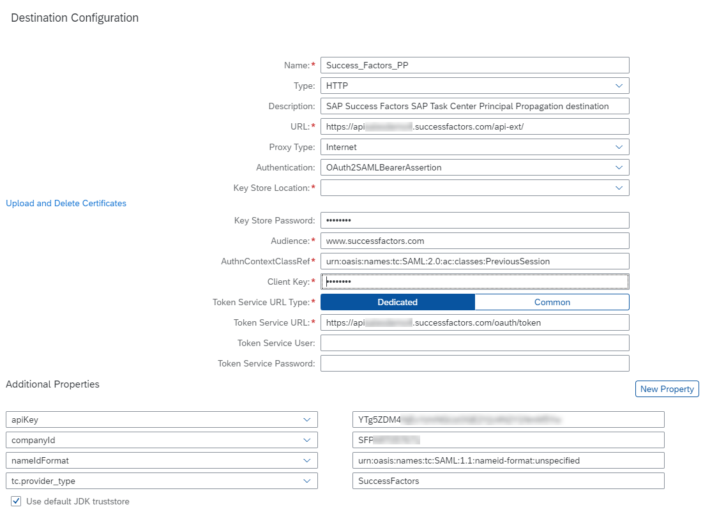


## 5 Enable the Push of Tasks from SuccessFactors to SAP Task Center

5.1 To enable the push of tasks from SuccessFactors to SAP Task Center please follow the following description on SAP Help: 
https://help.sap.com/viewer/568480cc877d4337992a2cd9792fbfed/2105/en-US/f65742cc51034ae595c3e0c688418944.html

> Hint: You will require the Client Credential information of the Service Key you created in Step 4.2.
> Be aware that the Integration Service Registration Center for Task Center is not available in all SuccessFactors landscapes yet.


## 6 Check your integration of Task Center and SuccessFactors

6.1 Login to your SuccessFactors account with a dedicated employee user. Identify a test user for your testing purpose (if not yet done in one of the previous steps). Make sure this user has a manager assigned who is also available in your IAS tenant. In the following example the manager Caroline has a team of five employees of which we've chosen Stephanie for the testing purpose. 

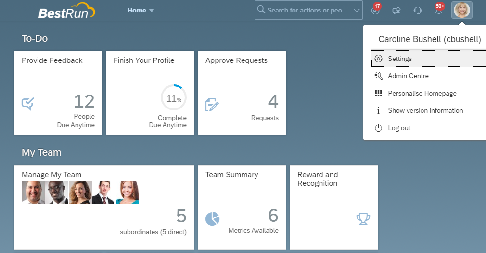

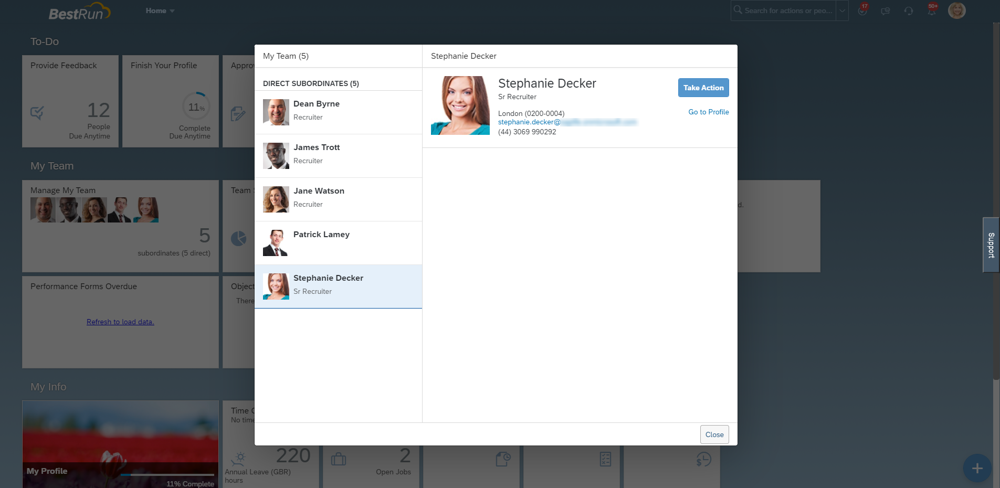

6.2 Your test users also have to exist in your IAS tenant by using IAS/IPS integration with SuccessFactors. Here you can also see the UUIDs of the users.

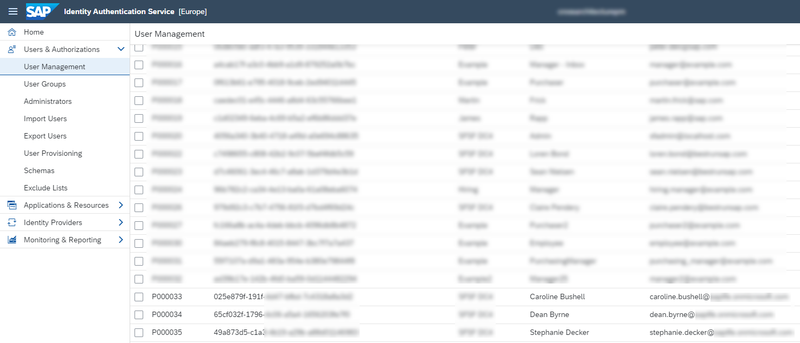

6.3 In case you've successfully completed the previous part of this mission, and your test users are also available within Microsoft Azure, feel free to login to MS Teams and create a new Leave Request with your dedicated employee user. Therefor just start a new conversation with the respective Bot.

6.4 If you haven't finished the previous parts of the mission, you can also login to SuccessFactors with your dedicated employee test user and open the Time Off tile from your Home screen. Here you can create a new Leave Request with your dedicated test user. 

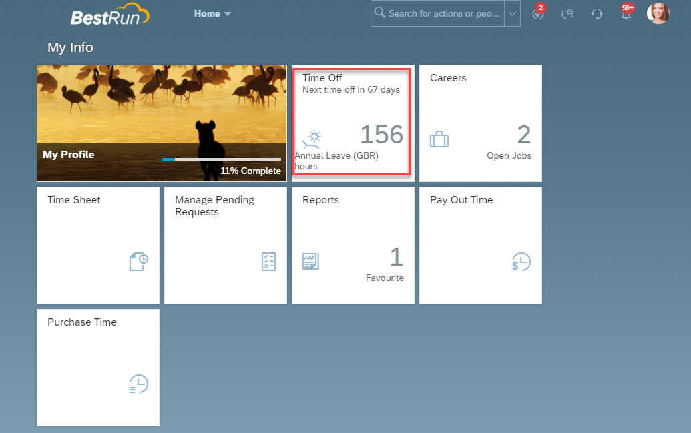

6.5 Open your BTP Launchpad instance, which you've configured in step 1 of this documentation. Your Launchpad Url could look similar to the following:
https://subaccountabc.launchpad.cfapps.eu10.hana.ondemand.com/site?siteId=3b3cdbd3-1234-5678-abcd-6ac28ff692d5#Shell-home

6.5 Now login with your dedicated manager test user (in our case Caroline) using your IAS login. 

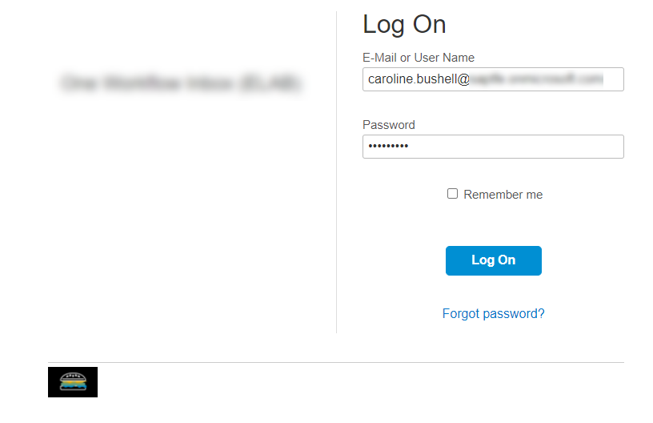

6.2 You should now see the Task Center and the Task Center Administration tile with the user context of Caroline.

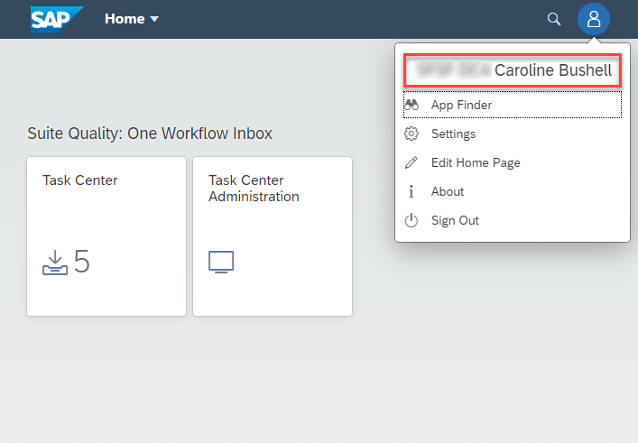

6.3 Open the Task Center application to see the tasks which you created in SuccessFactors

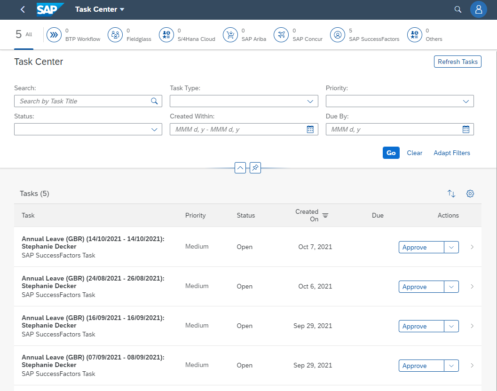


## 7 Test & Demo implementation without IAS/IPS integration in SFSF

7.1 In case you don't have an integration between IAS/IPS and your SFSF instance you can also assign a User UUID manually to your SuccessFactors users. This can be done using the SuccessFactors SCIM API and a user having the required authorizations to make use of the SCIM API. This process is NOT intended for a productive landscape, as the UUID (as of today) can only be set once for a SuccessFactors user. This is why you should only do this in a test oder sandbox environment, assigning a UUID to a test user. This solutions has the disadvantage, that a Single-Sign-On to SuccessFactors from the Task Center is not possible, as the trust between IAS and SuccessFactors does not exist. 


7.2 To add a User UUID to a SuccessFactors user, call the following SCIM API endpoint using Basic Authentication, to read the user id of a specific user. 

**GET**</br>
https://`<SuccessFactors API endpoint>`.successfactors.com/rest/scim/Users?filter=userName eq '&lt;SuccessFactors user name&gt;' </br>
e.g. https://apidemotenant.successfactors.com/rest/scim/Users?filter=userName eq 'cbushell'

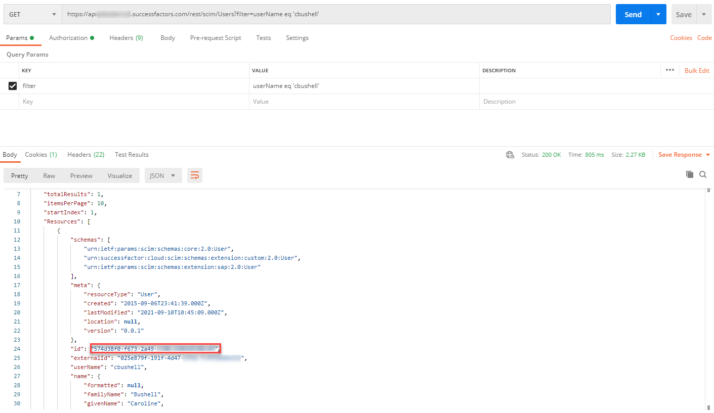

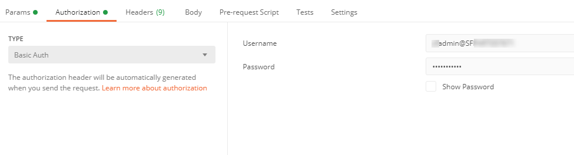

7.3 Copy the user id (marked in read) from the response body of the previous GET request and call another SCIM API endpoint to update the user UUID of this user. Please keep in mind, that this can (as of today), only be done once for a specific user! Once set, the user UUID cannot be changed anymore. 

**PATCH**</br>
https://&lt;SuccessFactors API endpoint&gt;.successfactors.com/rest/scim/Users/<userid from step 7.2> </br>
https://&lt;SuccessFactors API endpoint&gt;.successfactors.com/rest/scim/Users/574d38f0-a1b2-c3d4-e5f6-6302d9188c45

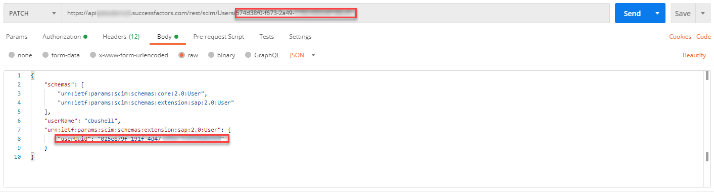

Provide the following body including your UUID, which you can copy from the IAS user management. 

```
{
    "schemas": [
        "urn:ietf:params:scim:schemas:core:2.0:User",
        "urn:ietf:params:scim:schemas:extension:sap:2.0:User"
    ],
    "userName": "<SuccessFactors user name e.g. cbushell>",
    "urn:ietf:params:scim:schemas:extension:sap:2.0:User": {
        "userUuid": "<UserUUID from IAS>"
    }
}
```

Your body should like similar to this:

```
{
    "schemas": [
        "urn:ietf:params:scim:schemas:core:2.0:User",
        "urn:ietf:params:scim:schemas:extension:sap:2.0:User"
    ],
    "userName": "cbushell",
    "urn:ietf:params:scim:schemas:extension:sap:2.0:User": {
        "userUuid": "025e879f-a1b2-c1c2-d1d2-7c4318a8a3d3"
    }
}
```

When your PATCH request returns successfully with a Code 200, your user UUID should be updated. You can check this by doing another GET request like described in step 7.2. In the body of the response, you should now see, that the UUID is now assigned to your user. 

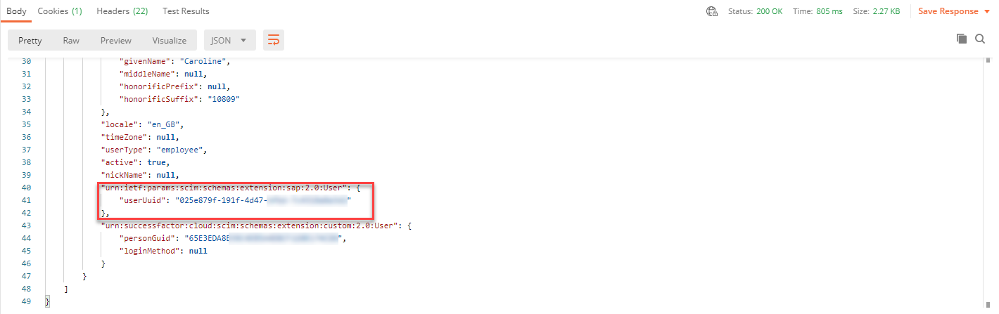