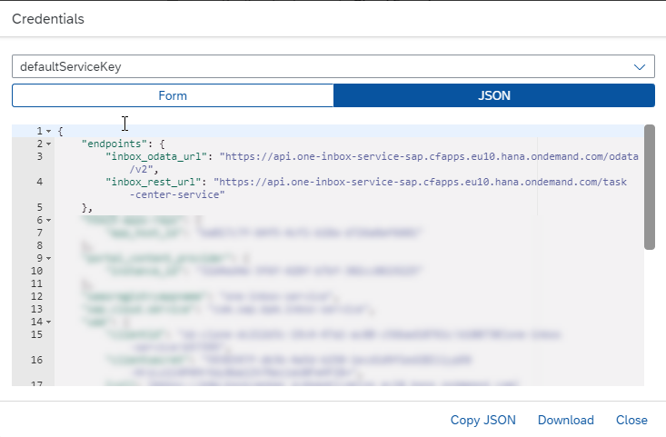

# Task Center

**! Important !**

The SAP Task Center service General Availability is planned for Q4/2021 (subject to change). This mission's primarily purpose is the demonstration of a working end-to-end scenario including the SAP Task Center service. Once the service is available, feel free to try this part of the mission yourself. 

Until then, you can already ensure, that you're fulfilling the prerequisites for the SAP Task Center integration. In this case, foremost the connectivity between your IAS & IPS instance and SAP SuccessFactors as well as your SAP BTP subaccount are mission-critical. This requirement has to be fullfilled, before you start the SAP Task Center provisioning. 

Please be aware, that the main challenge of the SAP Task Center provisioning is not the subscription to SAP Task Center service itself, but the correct connectivity between IAS/IPS and your SAP applications like SAP SuccessFactors. This will probably consume most of your time and effort. 

**! Important !**


The new SAP Task Center service available in SAP Business Technology Platform, allows you to manage tasks of a user in a central place, integrating various LoB solutions like SAP S/4HANA Cloud, SAP SuccessFactors or SAP Ariba, as well as 3rd party task providers in the future (current state of planning - subject to change).

To make use of the SAP Task Center service within this Leave Request scenario, some basic requirements have to be fulfilled, before the tasks are visible in your SAP Task Center instance. The following steps will give you some guidance on how to integrate the SAP Task Center into this mission. As the configurations steps highly depend on the availability and correct configuration of various landscape components (SAP SuccessFactors, IAS/IPS tenant, Corporate IdP), you should also check the linked SAP Help pages in detail when facing any errors!

- 1 Provision an instance of the SAP Task Center service using the respective booster
- 2 Integration between SAP SuccessFactors and your custom IAS/IPS instance
- 3 Configuration of SAP Task Center settings on SAP SuccessFactors side
- 4 Configuration of SAP Task Center destinations in the SAP Business Technology Platform
- 5 Enable the Push of Tasks from SAP SuccessFactors to SAP Task Center
- 6 Check your integration of SAP Task Center and SAP SuccessFactors</br>

APPENDIX
- Implementation without full scope IAS/IPS integration

As the Task Center services heavily relies on the so called user UUID (a unique technical id which uniquely identifies a user across all potential Task Providers), the IAS/IPS integration plays a key role in the Task Center implementation. The user UUID is managed by the IAS and has to be provisioned to all subsequent Task Providers, to ensure a task is always stored and presented to the correct user, no matter from which system the task arrives. 


**Please read before you continue:**

The following SAP Note describes the latest supported scenarios, requirements and restrictions concerning the SAP Task Center implementation. Concerning SAP SuccessFactors, the availability of the required components for SAP Task Center integration, is limited to specific datacenters. Make sure your datacenter fulfills the respective requirements:
https://launchpad.support.sap.com/#/notes/2977611

</br> 

## The architecture of SAP Task Center

The following simplified architecture describes the process of how  SAP Task Center is integrated with SAP SuccessFactors but is also valid for other SAP applications. A full blown architecture picture most likely includes further components like a Corporate Identity Provider. As already explained, the central requirement for a smooth SAP Task Center integration is based on a working IAS/IPS integration.


As of today, **in case of SAP SuccessFactors** the integration starts from the application itself. Let's assume a new employee called **Manager** is created in SAP SuccessFactors. Once persisted in the database, IPS will fetch the users  from SAP SuccessFactors on a regular basis. In this case, the **Manager** will be imported into the IAS, which is the target system of the **IPS import process**. Once the user is created, an user UUID is automatically created by IAS. An automated process now ensures, that this user UUID is propagated back to SAP SuccessFactors. So after this process, the **Manager** user is known to SAP SuccessFactors and IAS by the same unique identifier. 

> Hint: As of today, this is a special behaviour in case of SAP SuccessFactors. For other applications, the users incl. their UUIDs can be created right away in IAS and provisioned to the target system using IPS. In case of SAP SuccessFactors, the users need to come from the application itself. This requirement might change in the future, so you can also provision users including their UUIDs into SAP SuccessFactors which didn't exist before. Please check the appendix, in case you're facing issues while implementing the IPS integration with SAP SuccessFactors. 

After the SAP Task Center service has been successfully configured within SAP BTP, SAP SuccessFactors will push latest task updates in a regular basis to SAP BTP. Beside the task content, SAP SuccessFactors also sends an information about the target recipient of the task. In this case the **Manager** user, who is identified by his unique user UUID. </br>

Here you can see an example for a task being send from SAP SuccessFactors to SAP Task Center service, which contains the unique user UUID of the recipient.


The task is stored within SAP BTP and once the user with the respective user UUID opens the SAP Task Center, the tasks matching his UUID show up. To make this possible, there also needs to be a trust between SAP BTP and the custom IAS storing the user with the respective UUID. The user needs to access the SAP Task Center app within the SAP Launchpad service, using this IAS for login, so the correct UUID assignment is possible. 

This all sounds like a lot of configuration effort and prerequisites, but as you might guess, a working IAS/IPS integration to your SAP applications is not only suitable for the usage of SAP Task Center but is probably part of most cloud landscape architecture requirements. 


## 1 Provision an instance of the SAP Task Center service using the respective booster

To create an instance of the SAP Task Center within your SAP BTP subaccount, you need to fulfill some prerequisites listed below: 
- You require an SAP BTP enterprise account (SAP Task Center is not available in the trial environment)
- You require a trust configuration between your desired subaccount and a custom IAS instance
    > Only one trust configuration may be configured in the relevant subaccount</br>
    > Use the same custom IAS instance which is also used for your SAP SuccessFactors instance
- You require a SAP Launchpad subscription in your subaccount
- Your subaccount must be enabled for Cloud Foundry usage

Further details can also be found in the relevant documentations on the following SAP Help sites. </br>

The SAP Task Center can be easily provisioned into your BTP subaccount be running the available booster. The process is described on the following SAP Help site: </br>
https://help.sap.com/viewer/9112ba33d2aa4109aee34c26adf29cc7/Cloud/en-US (**Public link available soon**)

In case you prefer a manual configuration within your subaccount, please follow the following documentation: </br>
https://help.sap.com/viewer/9112ba33d2aa4109aee34c26adf29cc7/Cloud/en-US (**Public link available soon**)

</br> 

## 2 Integration between SAP SuccessFactors and your custom IAS/IPS instance

Your SAP SuccessFactors instance must have an integration with the same IAS/IPS instance which you've configured as Trusted Identity Provider within your BTP subaccount (see requirement in step 1)! The integration configuration between SAP SuccessFactors and your custom IAS/IPS instance is not trivial and also not scope of this mission. We assume, that you've already configured this integration successfully before you continue with the next steops. If not, we strongly recommend, going through the following documentations and KBA to get an idea of the whole process.

[SAP Help] Setting Up SAP SuccessFactors with Identity Authentication and Identity Provisioning Services
https://help.sap.com/viewer/568fdf1f14f14fd089a3cd15194d19cc/2105/en-US/fb069584363a4df08aad42315cebdd6d.html 

[KBA] Integrating SAP SuccessFactors with Identity Authentication
https://userapps.support.sap.com/sap/support/knowledge/en/2791410 

Some SAP SuccessFactors instances come with a preconfigured IAS/IPS integration. If you want to make use of these instances, make sure you're also using them in your SAP BTP subaccount. If you want to use a custom IAS/IPS instance, please exchange it in your SAP SuccessFactors landscape in this case!

</br> 

## 3 Configuration of SAP Task Center settings on SAP SuccessFactors side
The SAP Task Center configuration for SAP SuccessFactors is well described in the following SAP Help documentation. Please be aware, that the documentation is linking to some sub-sites, which need to be read carefully and which you need to processed before you continue with the main documentation. 

[SAP Help] SAP Task Center - SAP SuccessFactors Integration </br>
https://help.sap.com/viewer/9112ba33d2aa4109aee34c26adf29cc7/Cloud/en-US (**Public link available soon**)

As described in the documentation, you should stick to the following steps:

3.1 Go through the prerequisites described in the SAP Task Center documentation </br>
https://help.sap.com/viewer/9112ba33d2aa4109aee34c26adf29cc7/Cloud/en-US (**Public link available soon**)

> Most of the  prerequisites relate to an existing integration between your custom IAS/IPS instance and your SAP SuccessFactors instance.

3.2 Go through the prerequisites described in the relevant "Enabling To-Do Task Integration" documentation linked in step 1. </br>
https://help.sap.com/viewer/568480cc877d4337992a2cd9792fbfed/2105/en-US/c15f23f6f4e24ddea84d5be8e6b935ae.html 

> Again, an existing IAS/IPS integration is the most important content described in this SAP Help site. You will also find further links to the required documentations, in case you need to setup this integration!

> FYI - The following hint relates to the configuration of the IAS/IPS integration.


 
3.3 Follow the procedure described to activate the **Enhanced To-Do integration**
https://help.sap.com/viewer/568480cc877d4337992a2cd9792fbfed/2105/en-US/c15f23f6f4e24ddea84d5be8e6b935ae.html 


3.4 Download the Trust Certificate from the SAP BTP subaccount which you used for the SAP Task Center provisioning. To get your Trust Certificate (which is required to configure the respective OAuth Clients within SAP SuccessFactors) please follow the procedure described on the following SAP Help site:

https://help.sap.com/viewer/9112ba33d2aa4109aee34c26adf29cc7/Cloud/en-US (**Public link available soon**)

Save the certificate on your local device for later usage. 

3.5 Create the required OAuth Clients in SAP SuccessFactors by logging into your instance as an administrator or an user which is authorized to maintain OAuth Clients. Go to **Admin Center** -> **API Center**  -> **OAuth Configuration for OData** and choose **Register Client Application**. You can also access the tool by searching **Manage OAuth2 Client Applications** in Action Search. 

3.6 Create an OAuth Client used for the primary connection between SAP Task Center and SAP SuccessFactors by using the information described on the second section of the following SAP Help site:
https://help.sap.com/viewer/9112ba33d2aa4109aee34c26adf29cc7/Cloud/en-US (**Public link available soon**)

> Hints: The Application URL shouldn't have any influence on the functionality so please follow the proposal from the documentation. </br>
> The Technical User ID needs to be configured as stated in the documentation! </br>
> The certificate required has been downloaded in Step 4 of this documentation. Please make sure to only Copy & Paste the lines **between** -----BEGIN CERTIFICATE----- and -----END CERTIFICATE-----. 

Once saved, a sample configuration of the first OAuth Client could look like the following:
    


Copy the API Key of this OAuth Client, once you saved it by clicking on **View** next to the client. 


3.7 Create a secondary OAuth Client used for Principal Propagation between SAP Task Center and SPA SuccessFactors by using the information described on the first section of the following SAP Help site:
https://help.sap.com/viewer/9112ba33d2aa4109aee34c26adf29cc7/Cloud/en-US (**Public link available soon**)

> Hints: The Application URL shouldn't have any influence on the functionality so please follow the proposal from the documentation. </br>
> The certificate required has been downloaded in Step 4 of this documentation. Please make sure to only Copy & Paste the lines **between** -----BEGIN CERTIFICATE----- and -----END CERTIFICATE-----. 


Once saved, a sample configuration of the second OAuth Client could look like the following:
    


Copy the API Key of this OAuth Client, once you saved it by clicking on **View** next to the client. 


## 4 Configuration of SAP Task Center destinations in the SAP Business Technology Platform

The SAP Task Center service communicates with your SAP applications like SAP SuccessFactors by using the SAP Connectivity Service. Therefor you need to configure respective destinations within your SAP BTP subaccount, which is hosting your SAP Task Center instance. 

4.1 To create the required destinations in your BTP subaccount, you need to create a new Service Key for your SAP Task Center instance as client credentials need to be provided in the destination. Therefor please go the **Instances and Subscriptions** section of your subaccount and create a new service key for your SAP Task Center service. Give it a unique name and click on **Create**.


4.2 Once the service key is created, please copy the credentials content, by clicking on the service key. Save it into a local file (e.g. txt file) for later reference. The following parts of the JSON object will be required in the further steps of this configuration.

> endpoints > inbox_rest_url </br>
> uaa > url </br>
> uaa > clientid </br>
> uaa > clientsecret </br>
    



4.3 In case you've provisioned your SAP Task Center instance using the respective booster, you should find some sample destinations within your subaccount's **Destinations** section. Within these destinations, you can find the **Success_Factors** and **Success_Factors_PP** (Principal Propagation) entries. These destinations will be configured in the following steps. If you haven't used the booster for provisioning of the SAP Task Center, please find the destination details in the respective documentation. 


4.4 Configure the primary destination to SAP SuccessFactors by editing the **Success_Factors** entry (or creating a new destination with this name). The configuration is straight forward and the respective details can be found on the following SAP Help site from section three onward:

https://help.sap.com/viewer/9112ba33d2aa4109aee34c26adf29cc7/Cloud/en-US (**Public link available soon**)

> Hints: Be aware you will require the client credential information now, which you've saved in Step 4.2.
> You will require the API Key of the first OAuth Client which you've created in SAP SuccessFactors (see Step 3.6). 

A final configuration of your **Success_Factors** destination could look similar to the following:


4.5 Configure the secondary destination to SAP SuccessFactors by editing the **Success_Factors_PP** entry (or creating a new destination with this name). The configuration is straight forward and the respective details can be found on the following SAP Help site from section two onward:

https://help.sap.com/viewer/9112ba33d2aa4109aee34c26adf29cc7/Cloud/en-US (**Public link available soon**)

> Hints: Be aware you will require the client credential information now, which you've saved in Step 4.2.
> You will require the API Key of the first OAuth Client which you've created in SAP SuccessFactors (see Step 3.6). 

A final configuration of your **Success_Factors_PP** destination could look similar to the following:


## 5 Enable the push of tasks from SAP SuccessFactors to SAP Task Center

To enable the push of tasks from SAP SuccessFactors to SAP Task Center please follow the description on this SAP Help site: 
https://help.sap.com/viewer/568480cc877d4337992a2cd9792fbfed/2105/en-US/f65742cc51034ae595c3e0c688418944.html

> Hint: You will require the client credential information of the Service Key you created in Step 4.2.
> Be aware that the Integration Service Registration Center for SAP Task Center is not available in all SAP SuccessFactors landscapes yet. Refer to the SAP Note linked in the beginning of this tutorial. 


## 6 Check your integration of SAP Task Center and SAP SuccessFactors

To check the SAP Task Center integration with SAP SuccessFactors, you now need to login to SAP BTP Launchpad service using a manager user, which received the leave request of an employee of your choice. As already explained, you will only see tasks in your SAP Task Center instance, if your SAP SuccessFactors users have the correct user UUIDs assigned and your IAS/IPS integration has been successfully established. 

6.1 Login to your SAP SuccessFactors instance (e.g. with an admin user) and identify a test user for your testing purpose (if not yet done in one of the previous steps). Make sure this user has a manager assigned, who is also available in your IAS tenant (which should be the case if IAS/IPS integration is configured correctly). In the following example the manager Caroline has a team of five employees of which we've chosen employee Stephanie for the testing purpose. 


6.2 As already said, your test users also have to exist in your IAS tenant (by using IAS/IPS integration with SAP SuccessFactors). Here you can also see the UUIDs of the users.


6.3 In case you've successfully completed the previous part of this mission and your test users are also available within Microsoft Azure, feel free to login to MS Teams and create a new Leave Request with your dedicated employee user. Therefor just start a new conversation with the respective Bot.

6.4 If you haven't finished the previous parts of the mission, you can also login to SAP SuccessFactors with your dedicated employee test user and open the **Time Off** tile from your **Home** screen. Here you can create a new Leave Request with your dedicated test user. 


6.5 Open your **SAP BTP Launchpad instance**, provisioned by the booster in step 1 of this documentation. You can access the Launchpad from your SAP BTP subaccount cockpit in the **Instances and Subscriptions** section. Your Launchpad url should look similar to the following:
https://&lt;subaccount&gt;.launchpad.cfapps.&lt;region&gt;.hana.ondemand.com/site?siteId=3b3cdbd3-1234-5678-abcd-6ac28ff692d5#Shell-home

6.5 Now login with your dedicated manager test user (in our case Caroline) using your SAP IAS login. 


6.2 You should now see the **SAP Task Center** and the **SAP Task Center Administration** tiles with the user context of Caroline.


6.3 Open the SAP Task Center app to see the tasks which you created in SAP SuccessFactors


### APPENDIX

## Implementation without full scope IAS/IPS integration

In case you don't have a full scope integration between IAS/IPS and your SAP SuccessFactors instance, you can also assign a user UUID manually to your SAP SuccessFactors users. As this approach was also used during the evaluation phase of the use case, we would like to share it with you. 

This concept might be suitable for a test system for which e.g. you have configured an integration between IAS and SAP SuccessFactors but you haven't configured IPS integration. Or in case you're facing issues when provisioning users between SAP SuccessFactors and IAS.

Setting the required user UUID mapping for an SAP SuccessFactors user, can be done manually by using the respective SCIM API and a user having the required authorizations to call it (e.g. SAP SuccessFactors admin user). 

**! Important !**

This process is **NOT** intended for a productive landscape, as the user UUID can only be set once for an SAP SuccessFactors user (as of today). This is why you should only try this within a test oder sandbox environment, in which you assign an UUID to a test user. 

**! Important !**

7.1 To add an user UUID to a SuccessFactors user, call the following SCIM API endpoint using Basic Authentication, to read the user id of a specific SAP SuccessFactors user. 

**GET**</br>
https://&lt;SuccessFactors API endpoint&gt;.successfactors.com/rest/scim/Users?filter=userName eq '&lt;SuccessFactors user name&gt;' </br>
e.g. https://apidemotenant.successfactors.com/rest/scim/Users?filter=userName eq 'cbushell'


7.2 Copy the user id (marked in red) of the previous response body and call another SCIM API endpoint to update the user UUID of this user. Please keep in mind, this can only be done once for a specific user (as of today)! Once set, the user UUID cannot be changed anymore. It is planned to change this behaviour in the future, so the user UUID can be updated whenever necessary within SAP SuccessFactors. 

**PATCH**</br>
https://&lt;SuccessFactors API endpoint&gt;.successfactors.com/rest/scim/Users/&lt;userid from step 7.2&gt; </br>
https://&lt;SuccessFactors API endpoint&gt;.successfactors.com/rest/scim/Users/574d38f0-a1b2-c3d4-e5f6-6302d9188c45


Provide the following request body including the respective user uuid UUID, which you can copy from the IAS user management. 

```
{
    "schemas": [
        "urn:ietf:params:scim:schemas:core:2.0:User",
        "urn:ietf:params:scim:schemas:extension:sap:2.0:User"
    ],
    "userName": "<SuccessFactors user name e.g. cbushell>",
    "urn:ietf:params:scim:schemas:extension:sap:2.0:User": {
        "userUuid": "<UserUUID from IAS>"
    }
}
```

Your body should like similar to this:

```
{
    "schemas": [
        "urn:ietf:params:scim:schemas:core:2.0:User",
        "urn:ietf:params:scim:schemas:extension:sap:2.0:User"
    ],
    "userName": "cbushell",
    "urn:ietf:params:scim:schemas:extension:sap:2.0:User": {
        "userUuid": "025e879f-a1b2-c1c2-d1d2-7c4318a8a3d3"
    }
}
```

When your PATCH request returns with a Code 200, the respective user UUID should have been updated. You can check this by doing another GET request like described in step 7.1. The body of the response should now contain the UUID assigned to your test user. 

