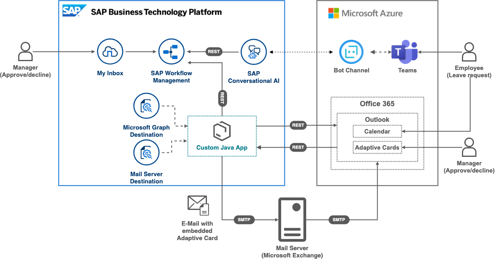

# Extend your business workflow with Microsoft Teams and Microsoft Outlook

This repository contains code samples and step by step instructions 

## Description
Extend productivity beyond SAP ecosystem using MS Teams and Outlook as engagement channels for workflows

Sample project where an employee can create a leave request via chatbot from Microsoft Teams integrated with SAP Conversational AI which triggers an SAP Workflow. The manager of the employee can approve or reject the leave request via a My Inbox app or directly from Microsoft Outlook inbox via Microsoft actionable messages. As soon as the request is approved, a calendar entry will be created in the employee’s Microsoft Outlook triggered via Microsoft Graph APIs

## Requirements

The required systems and components are:

- SAP Business Technology Platform trial or enterprise account
- Microsoft Azure subscription
- Microsoft 365 developer subscription​

Entitlements/Quota required in your SAP Business Technology Platform Account:

| Service                | Plan             | Nr. of instances |
| ---------------------- | ---------------- | ---------------- |
| Workflow Service       | lite   | 1       |
| Workflow Management    | lite   | 1       |
| Destination            | lite   | 1       |
| Cloud Foundry runtime  | MEMORY | 1       |

Subscriptions required in your SAP Business Technology Platform Account:

| Subscription                    | Plan                      |
| ------------------------------- | ------------------------- |
| SAP Business Application Studio | trial or standard-edition |
| Workflow Management             | saas-application          |

## Setup and Configuration

### [Part 1: Setting up for Workflow Management on SAP Business Technology Platform](./Part1/README.md)
### [Part 2: SAP Workflow Management: create leave request workflow](./Part2/README.md)

### [Part 3: Triggering an SAP workflow from an SAP Conversational AI bot](./Part3/README.md)

### [Part 4: Sending adaptive cards from an SAP workflow](./Part4/README.md) 

### [Part 5: Create calendar entry using Microsoft Graph](./Part5/README.md)

## Further Information

The scenario is based on a Blog Post: *[Integrating SAP Workflow Management with Microsoft Outlook](https://blogs.sap.com/2020/04/14/integrating-sap-cloud-platform-workflow-with-microsoft-outlook/)*  by [Harald Schubert](https://people.sap.com/harald.schubert) and is extended with SAP CAI, Microsoft Teams and Graph API capabilities.

## Known Issues

No known issues at this time
## How to obtain support

[Create an issue](https://github.com/SAP-samples/btp-extend-workflow-cai-msteams/issues) in this repository if you find a bug or have questions about the content.
 
For additional support, [ask a question in SAP Community](https://answers.sap.com/questions/ask.html).

## Contributing

If you would like to contribute, please submit a pull request in the usual fashion.

## License
Copyright (c) 2021 SAP SE or an SAP affiliate company. All rights reserved. This project is licensed under the Apache Software License, version 2.0 except as noted otherwise in the [LICENSE](LICENSES/Apache-2.0.txt) file.
