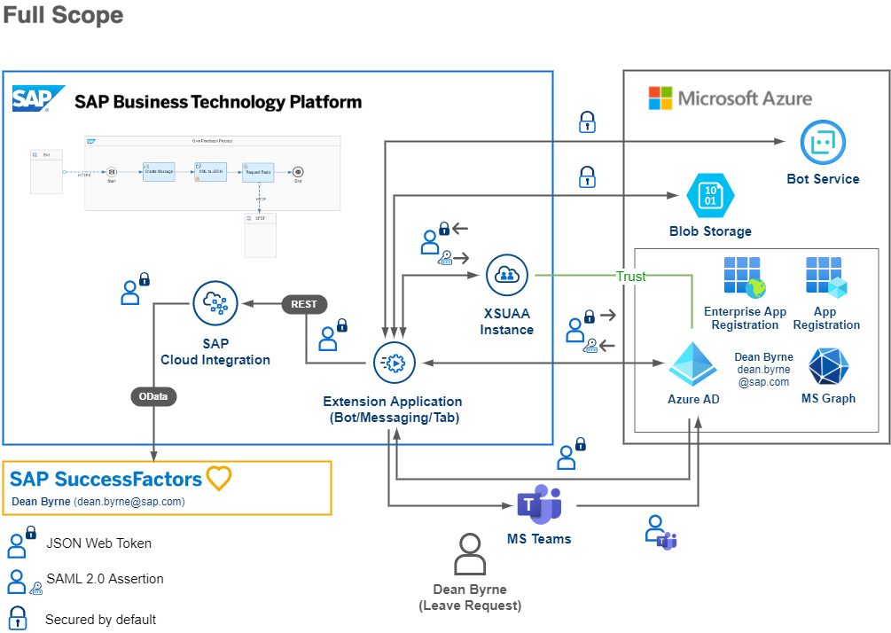

# Extend your business workflows with Microsoft Teams (Full Scope)

## Description

>**Important**: Please be aware that this GitHub is still work in progress. This includes refactoring and potential changes/improvements for to the known issues. Make sure you're pulling the repository from time to time and do a redeployment to SAP Business Technology Platform. 

This repository contains code samples for a native Microsoft Teams application, extending SAP SuccessFactors Time Off / Leave Request workflows. The detailed instructions on how to implement this sample application will be published in a blog post series following the below steps. 

1.	Preface and scenario introduction [(click here)](https://blogs.sap.com/2022/02/03/sap-ms-teams-1-preface-and-scenario-introduction)
2.	Target application features [(click here)](https://blogs.sap.com/2022/02/08/sap-ms-teams-2-target-application-features/)
    - What to expect once you implemented all blog posts
    - Samples of the Microsoft Teams extension application
3.	Requirements and application architecture [(click here)](https://blogs.sap.com/2022/02/10/sap-ms-teams-3-requirements-and-application-architecture/)
    - Check the availability of this scenario’s system requirements
        - SAP SuccessFactors instance
        - SAP Business Technology Platform services
        - Microsoft Azure and Teams subscriptions
    - Understand the detailed architectures
        - Communication from Microsoft Teams to SAP SuccessFactors
        - Communication from SAP SuccessFactors to Microsoft Teams
        - Security aspects of the architecture design
4.	SAP BTP subaccount configuration and test users [(click here)](https://blogs.sap.com/2022/02/10/sap-ms-teams-3-requirements-and-application-architecture/)   
    - Set up your SAP Integration Suite for integration capabilities
    - Create a Process Integration Runtime instance for API access
    - Configure a XSUAA instance to handle security
    - Set up trust between Azure Active Directory and SAP BTP
    - Create test users in Azure Active Directory
5.	SAP SuccessFactors instance setup [(click here)](https://blogs.sap.com/2022/02/17/sap-ms-teams-5-sap-successfactors-instance-setup/)
    - Set up OAuth2 clients for Principal Propagation and technical API access
    - Configure the Intelligent Services Center for notification handling
6.	Set up your SAP Cloud Integration instance [(click here)](https://blogs.sap.com/2022/02/22/sap-ms-teams-6-set-up-your-sap-cloud-integration-instance/)
    - Configure your security settings for Principal Propagation 
    - Provide your security settings for technical API access
    - Setup the security details for notification handling
    - Upload and deploy the integration flows
7.	Get your Microsoft Azure settings ready [(click here)](https://blogs.sap.com/2022/02/28/sap-ms-teams-7-get-your-microsoft-azure-settings-ready/)
    - Configure a new application registration for your extension application
    - Integrate your application with the SAP BTP enterprise application
    - Configure a Bot Service instance for your extension application
    - Create a Storage Account to store bot related data
8.	Deploy your Microsoft Teams extension [(click here)](https://blogs.sap.com/2022/03/01/sap-ms-teams-8-deploy-your-microsoft-teams-extension/)
    - Maintain the extension app details in the manifest file
    - Provide the environment variables of your landscape
    - Deploy the extension application to SAP BTP
    - Upload the application manifest file to Microsoft Teams
9.	Improvement ideas and further topics [(click here)](https://blogs.sap.com/2022/03/15/sap-ms-teams-9-improvement-ideas-and-further-topics/)
    - Access on-premise systems like SAP S/4HANA
    - Scope of the current solution approach
    - Other enhancement scenarios

## Good to know

This project has been implemented based on the following Microsoft BotBuilder and Microsoft Office Developer sample repositories. 
- https://github.com/microsoft/BotBuilder-Samples/tree/main/samples/typescript_nodejs/13.core-bot
- https://github.com/OfficeDev/Microsoft-Teams-Samples/tree/main/samples/app-sso/nodejs

Another source of inspiration is the following blog post series by Martin Raepple, in which a Microsoft Teams extension for SAP S/4HANA is developed. 
- https://blogs.sap.com/2020/07/17/principal-propagation-in-a-multi-cloud-solution-between-microsoft-azure-and-sap-cloud-platform-scp/

In contrast to the current repository, the approach presented by Martin Raepple is primarily based on Microsoft Azure instead of SAP BTP and requires C# knowledge instead of JavaScript. Nevertheless, it will give you additional insights on how to configure essential settings on the SAP BTP and Microsoft Azure side, as this is technology-independent. 

## Known Issues

As this is a very comprehensive and complicated solution, not all parts could be implemented to a full extend. While we're still working on improving the sample application here and there, please be aware of some known issues. Once these issues are fixed, feel free to pull the latest version of the repository and redeploy the application to your SAP BTP subaccount.

### Multiple logins in messaging extension

Currently the user needs to login multiple times on first usage of the messaging extension feature. This is caused by two different OAuth connections used by the Azure Bot Service. Evaluation is ongoing if this can be prevented as this is working properly for the chat bot where only one initial login is required. 

### Usage of application permissions

The "Leave Request" tab of the extension application makes use of application permissions to access the Microsoft Graph API. This is required as only one OAuth connection of the Bot Service can be used in the tab implementation. In this case the usage of the SAP BTP OAuth connection is unavoidable to obtain a valid SAP BTP access token. Evaluation is ongoing if this can be changed.

### React component for task module

To make use of Principal Propagation for approving and rejecting Leave Requests from the notification, a custom React component was used instead of updating the status right from the bot activity handler. This is caused by the fact, that the respective invoke action (when clicking on the Approve or Reject button), is only called once. In case a valid access token is missing and needs to be obtained (e.g., via an OAuthCard), the invoke action is not called again. This results in a valid token but a missing re-execution of the invoke action. Evaluation is ongoing if this can be changed. 

### Leave Request comments

In the current implementation there is a field for a potential Leave Request comment. This field is not yet transferred to SAP SuccessFactors. Could be your first challenge when enhancing the current solution.

### View existing leave requests

A feature to display existing leave requests has been planned but not implemented yet. The respective buttons have already been included in the UI, so feel free to implement this feature yourself when enhancing the solution. 

### Mobile device optimization

The adaptive cards are not yet optimized for a picture-perfect mobile rendering. Whereas the functionality is given, the appearance of the mobile interface could be improved. This could be another challenge when optimizing the extension app for your personal needs. 

### User and admin consent

User and a potential admin consent have not been in scope for this application. Please ensure you're granting admin consent in Azure Active Directory for the application registration to prevent potential consent issues when calling APIs. 

### Approve or reject leave requests on iOS

Currently it is not possible to approve or reject leave requests on iOS. This issue is currently being evaluated. Please follow this GitHub issue for updates. 

https://github.com/OfficeDev/microsoft-teams-library-js/issues/794

### Message duplication for long-running API calls

When requesting SAP SuccessFactors information for the first time (or after not using the extension application for a longer time), it might happen that the API calls run longer than expected. In this case, Microsoft Teams triggers another call of the executed step in which the API call takes place. This leads to a duplication of messages and might lead to consecutive errors when the system tries to create the same leave request twice. This issue is known so please follow this GitHub issue for updates. 

https://github.com/MicrosoftDocs/msteams-docs/issues/4592

### Time balance recalculation

The available time type balance will be recalculated once a leave request has been approved. Leave requests in status pending will not be deducted from the available balance. Please keep this in mind in case you're facing errors while creating new leave requests. Feel free to develop the respective calculation logic in the integration flow which is fetching the balance of the selected time type. 

## Useful links

### Build apps for Microsoft Teams
- [Documentation](https://docs.microsoft.com/en-us/microsoftteams/platform/overview)
- [Code samples](https://github.com/OfficeDev/Microsoft-Teams-Samples)

### Microsoft Graph API
- [Documentation](https://docs.microsoft.com/en-us/graph/)

### Bot Framework
- [Documentation](https://docs.microsoft.com/en-us/azure/bot-service/index-bf-sdk)
- [Send proactive notifications to users](https://docs.microsoft.com/en-us/azure/bot-service/bot-builder-howto-proactive-message)
- [Write directly to storage](https://docs.microsoft.com/en-us/azure/bot-service/bot-builder-howto-v4-storage)
- [Save user and conversation data](https://docs.microsoft.com/en-us/azure/bot-service/bot-builder-howto-v4-state)
- [Code samples](https://github.com/microsoft/BotBuilder-Samples)

### Adaptive Cards
- [https://adaptivecards.io/](https://adaptivecards.io/)
- [Designer](https://adaptivecards.io/designer/)

## Disclaimer

This project has been a PoC including several limitations and prerequisites. The objective was to build a Microsoft Teams extension for an existing SAP SuccessFactors instances. For this reason, the coding should not be seen as any kind of recommendation for a productive implementation. It fulfills the purpose and requirements of a PoC scope and is not intended for productive usage! It has been declared as pure PoC only, to give potential development teams some first ideas on how to solve potential challenges when integrating Microsoft Teams and SAP SuccessFactors using SAP Business Technology Platform. We do not recommend to making use of any parts of this coding within a productive implementation without further review or validation! 

## How to obtain support

[Create an issue](https://github.com/SAP-samples/btp-extend-workflow-cai-msteams/issues) in this repository if you find a bug or have questions about the content.
 
For additional support, [ask a question in SAP Community](https://answers.sap.com/questions/ask.html).

## Contributing

If you would like to contribute, please submit a pull request in the usual fashion.

## License
Copyright (c) 2022 SAP SE or an SAP affiliate company. All rights reserved. This project is licensed under the Apache Software License, version 2.0 except as noted otherwise in the [LICENSE](LICENSE) file.