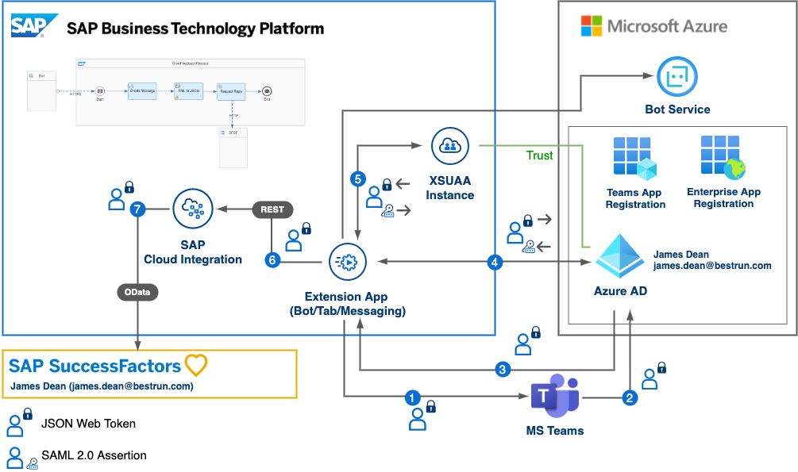

# Extend your business workflow with Microsoft Teams and Outlook (Advance Scope)

This repository contains code samples and step by step instructions 

## Description

The Objective of the advanced scope is similar to basic scope and the idea is to extend productivity beyond SAP ecosystem by using Microsoft Teams and Outlook as engagement channels. In advanced scope instead of using the custom Java application and SAP Workflow Management we are demonstrating how to connect SAP SuccessFactors System for requesting the leave by using Cloud Integration as an integration layer.

This mission requires you to have access to a SuccessFactors system. This includes administrative privileges to define settings like OAuth clients or to assign test users the relevant privileges to access OData APIs. This mission was created based on a SuccessFactors Salesdemo environment instance. A productive landscape might differ in configuration options.

1. [Cloud Integration ](./Part1-CloudIntegration/README.md)
   - Import Cloud Integration Flow
   - Configure Cloud Integration Flows

2. [API Management](./Part2-APIManagement/README.md)
   - Create the API Endpoint
   - Enable Actionable Messages (Adaptive Cards)
   - Configure the Cloud Integration Flow

3. [SuccessFactors](./Part3-SuccessFactors/README.md)
   - Configure SuccessFactors - CI integration
   - Dummy User requirements (matching mail address)
   - OAuth Client configuration

4. [Conversational AI](./Part4-ConversationalAI/README.md)
   - Create an account for SAP Conversational AI and get started
   - Configure the Action to trigger Leave Request
   - APPENDIX: Getting the correct Time Types for your test user

5. [Microsoft Azure Bot](./Part5-MSAzureBot/README.md)
   - Create Azure Bot instance
   - Configure CAI - Azure integration

6. [Microsoft Teams App](./Part6-MSTeamsApp/README.md)
   - Create Teams app manifest

7. [Task Center](./Part6-MSTeamsApp/README.md)
   - Create Task Center instance
   - Configure TC - SuccessFactors integration
   - Destination Configuration
   - Simplified approach without IAS/IPS?!
   - SCIM API for setting User UUID

## Known Issues

No known issues at this time
## How to obtain support

[Create an issue](https://github.com/SAP-samples/btp-extend-workflow-cai-msteams/issues) in this repository if you find a bug or have questions about the content.
 
For additional support, [ask a question in SAP Community](https://answers.sap.com/questions/ask.html).

## Contributing

If you would like to contribute, please submit a pull request in the usual fashion.

## License
Copyright (c) 2021 SAP SE or an SAP affiliate company. All rights reserved. This project is licensed under the Apache Software License, version 2.0 except as noted otherwise in the [LICENSE](LICENSES/Apache-2.0.txt) file.
