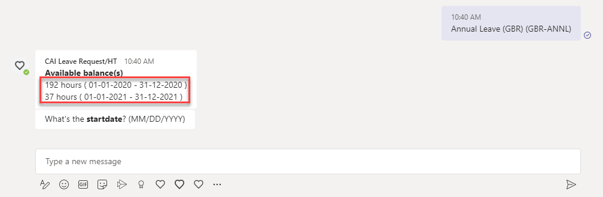

# Extend your business workflow with Microsoft Teams and Outlook (Advance Scope)

This repository contains code samples and step by step instructions 

## Updates

* 2021-11-21 - Now the available balances also show the assigned start and end date  
   Please download and deploy the latest Integration Flows & update your SAP CAI bot

   

## Description

**Important**
The advanced scope of this scenario requires **advanced knowledge** in related environments like (SAP Business Technology Platform, Microsoft Azure, SAP SuccessFactors, SAP Conversational AI). Basic requirements for this scope will not be described in detail anymore (like how to subscribe to SAP Integration Suite). Please find respective descriptions (if required), in the Basic scope or by searching for relevant **SAP Help / SAP Blog / SAP Community** pages. 

The Objective of the advanced scope is similar to basic scope and the idea is to extend productivity beyond SAP ecosystem by using Microsoft Teams and Microsoft Outlook as engagement channels. In advanced scope instead of using the custom Java application and SAP Workflow Management we are demonstrating how to connect SAP SuccessFactors system for requesting the time off by using SAP Cloud Integration as an integration layer.

This mission requires you to have access to a SAP SuccessFactors system. This includes administrative privileges to define settings like OAuth clients or to assign test users the relevant privileges to access OData APIs. This mission was created based on an SAP SuccessFactors Salesdemo environment instance. A productive landscape might differ in configuration options.

1. [SAP Cloud Integration ](./Part1-CloudIntegration/README.md)
   - Import the required Cloud Integration Flows

2. [SAP API Management](./Part2-APIManagement/README.md)
   - Create the required API Management endpoint
   - Enable Actionable Messages (Adaptive Cards)
   - Configure the Cloud Integration Flow

3. [SAP SuccessFactors](./Part3-SuccessFactors/README.md)
   - Configure the SAP SuccessFactors - SAP CI integration
   - Apply dummy user requirements (matching mail address)
   - Create the required OAuth client configurations

4. [SAP Conversational AI](./Part4-ConversationalAI/README.md)
   - Create an account for SAP Conversational AI and get started
   - Update your SAP CAI environment with your SAP Cloud Integration credentials
   - Load your custom time type entities from SAP SuccessFactors 

5. [Microsoft Azure Bot](./Part5-MSAzureBot/README.md)
   - Create an Azure trial and Microsoft365 account
   - Create an Microsoft Azure Bot Channel instance
   - Configure the Conversational AI - Microsoft Azure integration

6. [Microsoft Teams App](./Part6-MSTeamsApp/README.md)
   - Create an Microsoft Teams app manifest definition
   - Upload the manifest file to your Teams organization

7. [SAP Task Center](./Part7-TaskCenter/README.md)
   - Create an SAP Task Center instance
   - Configure SAP Task Center - SAP SuccessFactors integration
   - Apply your SAP Task Center destination settings
   - APPENDIX: Manual setting of the user UUID in SAP SuccessFactors

## Demo Video

The following demo video shows an end-to-end scenario in which a leave request is created in Microsoft Teams by the sample employee **Stephanie Decker**. The leave request is then available in the ToDo list of Stephanie's manager within SAP SuccessFactors. Furthermore the sample manager **Caroline Bushell** can open the leave request within the new SAP Task Center. 

https://user-images.githubusercontent.com/24495229/142203891-8abbd765-8017-4ea9-b88b-0d6bdafe90f3.mp4

The following video shows and end-to-end scenario in which a leave request is approved via an adaptive card, which is automatically send to to **Caroline Bushell** who is the manager of our sample employee **Stephanie Decker**. 

https://user-images.githubusercontent.com/24495229/142458692-8da06102-ec5f-48c3-8223-464de72a514c.mp4

## Known Issues

No known issues at this time
## How to obtain support

[Create an issue](https://github.com/SAP-samples/btp-extend-workflow-cai-msteams/issues) in this repository if you find a bug or have questions about the content.
 
For additional support, [ask a question in SAP Community](https://answers.sap.com/questions/ask.html).

## Contributing

If you would like to contribute, please submit a pull request in the usual fashion.

## License
Copyright (c) 2021 SAP SE or an SAP affiliate company. All rights reserved. This project is licensed under the Apache Software License, version 2.0 except as noted otherwise in the [LICENSE](LICENSES/Apache-2.0.txt) file.
