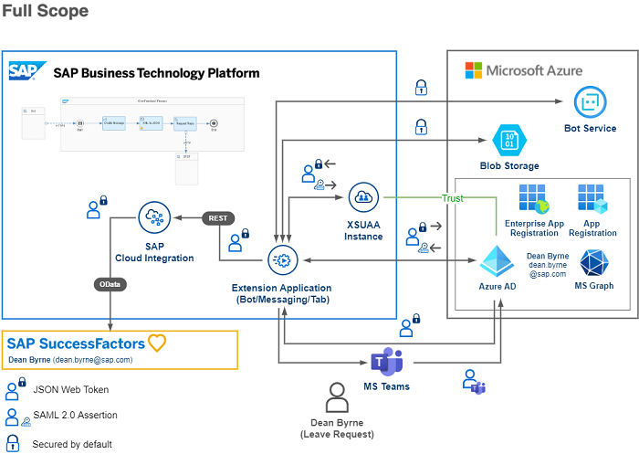

# Extend your business workflow with Microsoft Teams and Microsoft Outlook

## Description
Extend SAP productivity by leveraging Microsoft Teams and Outlook as engagement channels for workflows. This scenario demonstrates how the Leave Request process of SAP SuccessFactors can be seamlessly integrated with business functions such as chat, email, and calendar, all relying on the SAP BTP integration capabilites. By bringing contextually relevant information to users, you enable them to focus on priority tasks with an improved business process experience. This use case illustrates numerous integration points for increased productivity with Microsoft applications, such as SAP Conversational AI, SAP Workflow Management, and SAP Integration Suite. It showcases the intelligent enterprise by leveraging BTP kernel services for a frictionless and secure end to end experience.

## Scopes

This mission consists of three different evolution steps, which get more and more comprehensive from a Basic, an Advanced up to a Full implementation scope. By following the Basic scope, you will learn how to use SAP Workflow Management, a CAP application and SAP Conversational AI to integrate with Micrsoft Outlook and Microsoft Teams. 

In the Advanced scope you will see how to fit an SAP SuccessFactors instance into the architecture, using SAP Integration Suite and your existing SAP Conversational AI implementation. This will allow you to interact with a real business workflow in the SAP SuccessFactors application environment. 

The Full scope architecture will cover the implementation of a native Micrsoft Teams app and will make your scenario enterprise ready, by using end-to-end Principal Propagation from Microsoft Teams to SAP SuccessFactors. Furthermore the Advanced and Full scopes will include an SAP Task Center instance integration, which is one of the latest SAP Business Technology Platform services, planned to be released in Q4/2021. 

The scopes have been realized by different branches of this GitHub repository. So feel free to checkout the respective branches to your local device or click on the following links to open the relevant branches in your browser.   

### **Basic Scope** (OpenSAP)
### [SAP Workflow Management & SAP CAP application](https://github.com/SAP-samples/btp-extend-workflow-cai-msteams/tree/basic-scope)   

   

### **Advanced Scope** (TechEd 2021)
### [SAP Integration Suite & SAP SuccessFactors](https://github.com/SAP-samples/btp-extend-workflow-cai-msteams/tree/advance-scope)   

   

### **Full Scope** (Available soon)
### [Native Microsft Teams app & Principal Propagation](https://github.com/SAP-samples/btp-extend-workflow-cai-msteams/tree/full-scope)   

   

## Known Issues

No known issues at this time

## How to obtain support

[Create an issue](https://github.com/SAP-samples/btp-extend-workflow-cai-msteams/issues) in this repository if you find a bug or have questions about the content.
 
For additional support, [ask a question in SAP Community](https://answers.sap.com/questions/ask.html).

## Contributing

If you would like to contribute, please submit a pull request in the usual fashion.

## License
Copyright (c) 2021 SAP SE or an SAP affiliate company. All rights reserved. This project is licensed under the Apache Software License, version 2.0 except as noted otherwise in the [LICENSE](LICENSES/Apache-2.0.txt) file.
